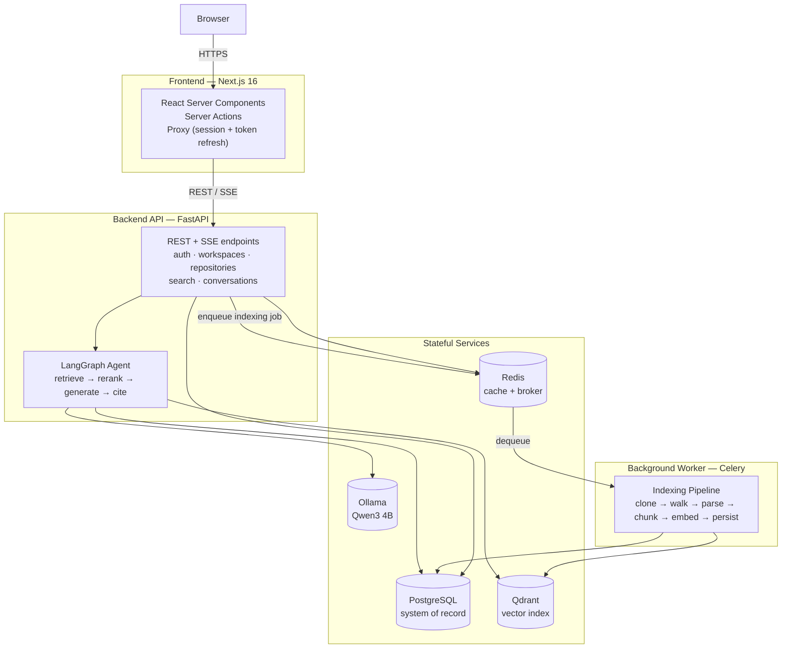
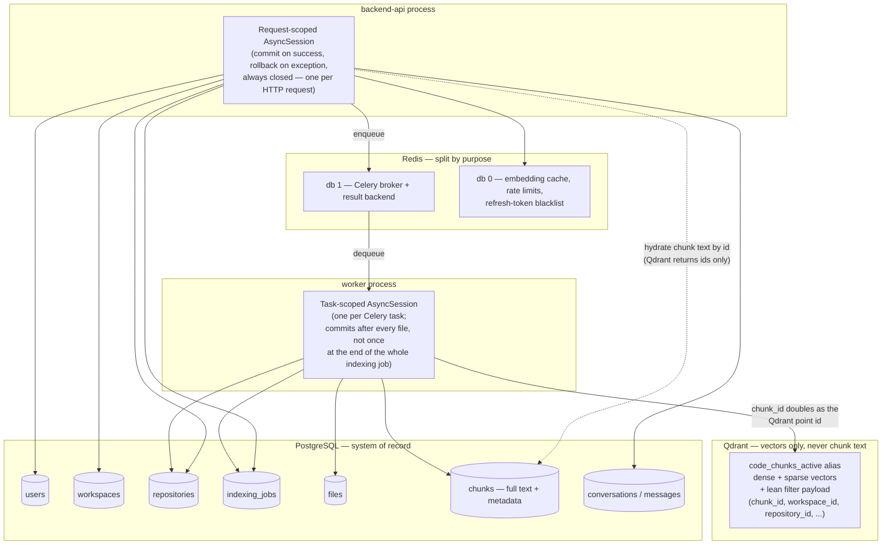

# CodeAtlas

**An AI Software Engineering Copilot that makes a codebase interrogable** — index a real repository, then search it semantically, ask questions about it in plain English, and get answers grounded in the actual current code, with exact file and line citations. Powered end-to-end by Retrieval-Augmented Generation (RAG), self-hosted, with no source code ever leaving your own infrastructure.

See [docs/design/DESIGN.md](docs/design/DESIGN.md) for the full architecture and module-by-module implementation plan, and [docs/](docs/) for per-module documentation.

**Models, self-hosted end to end:**
- **LLM (chat/generation):** [Qwen3 4B](https://ollama.com/library/qwen3) via Ollama (`qwen3:4b`)
- **Embedding model (dense + sparse):** [BAAI/bge-m3](https://huggingface.co/BAAI/bge-m3), run in-process via FlagEmbedding
- **Reranker:** [BAAI/bge-reranker-base](https://huggingface.co/BAAI/bge-reranker-base), a cross-encoder scoring `(query, chunk)` pairs

No source code, query, or generated answer is ever sent to a third-party model API — every model above runs inside your own Docker stack.

## Overview

Large, real-world codebases don't fit in any LLM's context window, change continuously, and are structurally rich in ways that "paste the whole repo into a prompt" approaches ignore. CodeAtlas addresses this by treating the repository itself as a living, queryable knowledge base:

1. **Clone** a repository (from a Git URL) into an isolated workdir.
2. **Parse** every source file with a language-aware, AST-based parser (tree-sitter) — not naive text splitting.
3. **Chunk** along function/class/module boundaries (AST-aware for code, heading-aware for Markdown), merging undersized fragments up to a useful token budget.
4. **Embed** each chunk with a dense + sparse embedding model (BGE-M3).
5. **Persist** chunk text/metadata in PostgreSQL (the system of record) and vectors in Qdrant (the search index).
6. **Retrieve** with hybrid dense+sparse search, fused via Reciprocal Rank Fusion, then reranked by a cross-encoder for precision.
7. **Answer**, grounded in the retrieved chunks, streamed token-by-token with deterministic file+line citations — never a citation the model invented.

## Objective

Give any authorized developer, new hire, or engineering manager a fast, accurate, and traceable way to understand an unfamiliar or large codebase — without waiting on a teammate's time, trusting a stale wiki, or pasting proprietary code into a third-party chat product. Concretely:

- Answer natural-language questions about a repository, grounded in its actual current source.
- Support multi-language, multi-repository, multi-workspace usage with per-tenant isolation.
- Run entirely self-hosted — indexing, embedding, and LLM inference all happen inside your own infrastructure.
- Make indexing an asynchronous background process so large repositories never block interactive use.

## Feature list

**Indexing**
- Repository registration via Git URL, with SSRF-hardened cloning (private/loopback/cloud-metadata IP ranges blocked, redirect-safe)
- Multi-language AST-aware parsing (Python, JavaScript, TypeScript, Go, Java) via a plugin parser registry
- AST-aware chunking for code + heading-aware semantic chunking for Markdown, with a token-budget merge pass
- Per-symbol metadata extraction: imports, git blame, line ranges
- Background indexing via Celery, with real-time, per-file progress tracking and per-file failure isolation (one bad file never sinks the whole job)
- Incremental re-indexing — unchanged files (by content hash) are skipped entirely
- Crash-safe durability — progress commits per file, not once at the end of a job

**Retrieval & search**
- Hybrid retrieval: dense vector search + sparse/lexical search, fused via Reciprocal Rank Fusion
- Cross-encoder reranking for final relevance ordering
- Standalone semantic code search (no LLM involved) with syntax-highlighted, cited results
- Mandatory workspace-scoped tenant isolation on every vector query, enforced at the adapter layer

**Conversational Q&A**
- Multi-turn chat with persisted history and rolling summarization
- LangGraph-orchestrated agent: intent classification → query rewrite → retrieve → rerank → sufficiency check (widens search if needed) → tool use → generate → deterministic citations
- Token-by-token streaming (SSE) with citation and progress events
- Debugging-assist mode (paste an error/stack trace, get relevant code + call sites)
- Documentation-generation and architecture-explanation modes

**Platform**
- JWT auth with rotating refresh tokens and access-token blacklisting
- Multi-workspace, multi-repository support with owner-scoped access control
- Rate limiting, structured logging with correlation IDs, Prometheus metrics, liveness/readiness health checks
- Fully Dockerized: one `docker compose up` for the whole stack

## Core tech stack

**Backend**
- Python 3.12, FastAPI
- SQLAlchemy (async) + Alembic
- PostgreSQL
- Qdrant (vector store)
- Redis
- Celery (background jobs)
- LangGraph (agent orchestration)
- **LLM:** Ollama, serving `qwen3:4b`
- **Embedding model:** BAAI/bge-m3 (dense + sparse, run via FlagEmbedding)
- **Reranker model:** BAAI/bge-reranker-base (cross-encoder)
- tree-sitter (multi-language parsing)
- structlog
- argon2 (password hashing)
- PyJWT
- Prometheus

**Frontend**
- Next.js 16 (App Router, React Server Components + Server Actions)
- React 19
- TypeScript
- Tailwind CSS v4
- shadcn/ui
- Zustand
- next-themes
- react-syntax-highlighter
- Vitest + Playwright

**Infrastructure**
- Docker & Docker Compose
- uv (Python package/dependency manager)
- GitHub Actions–style CI (lint, type-check, test)

## System architecture



The API process never does CPU-heavy work inline — cloning, parsing, and embedding a whole repository always goes through the Celery worker. The chat/RAG path runs synchronously in the API process (streamed via SSE) since it must return a first token quickly; it only ever touches Qdrant, Postgres, and Ollama, never the indexing pipeline directly.

## Database connection architecture



Postgres is the only source of truth for chunk text; Qdrant holds only vectors plus a lean, filterable payload, keyed by the same UUID as the Postgres `chunks.id` row — so a chunk's search hit is hydrated back to its real text with a single indexed lookup, and the vector index can be fully rebuilt from Postgres alone if ever needed.

## Prerequisites

- Docker + Docker Compose
- [uv](https://docs.astral.sh/uv/) (Python package manager)

## Local dev quickstart

```bash
./scripts/bootstrap.sh                                  # copies .env.example -> .env, installs deps + git hooks
docker compose -f infra/docker/docker-compose.yml up     # starts api, worker, postgres, redis, qdrant, ollama
curl http://localhost:8000/health                        # {"status": "ok", "version": "0.1.0"}
```

Or run the API directly on the host:

```bash
cd backend
uv sync --all-groups
uv run uvicorn app.main:create_app --factory --reload
```

## Tests and linting

```bash
cd backend
uv run pytest tests -m "not integration"   # unit tests
uv run mypy app                            # type-check
uv run pre-commit run --all-files          # ruff + black + mypy + hygiene hooks
```

## Directory layout

Each top-level folder maps to a layer in the backend's Clean Architecture, or to a project-wide concern:

| Path | Purpose |
|---|---|
| `backend/app/domain/` | Entities, value objects, port interfaces — zero framework dependencies |
| `backend/app/application/` | Use cases / services / DTOs — depends only on `domain` |
| `backend/app/infrastructure/` | Adapters (DB, vector store, LLM, parsing, chunking, cache, storage, queue) implementing `domain` ports |
| `backend/app/agent/` | LangGraph state graph, nodes, tools |
| `backend/app/api/` | FastAPI routers, schemas, middleware, SSE streaming |
| `backend/app/workers/` | Celery worker entrypoint + tasks |
| `backend/tests/` | `unit/`, `integration/`, `e2e/` — mirrors `app/` |
| `frontend/` | Next.js App Router frontend |
| `docs/` | MkDocs site, including the full design document |
| `infra/docker/` | Dockerfiles and Compose files |
| `scripts/` | Dev convenience scripts |

## Documentation

Full docs are built with MkDocs from the `docs/` directory — see [docs/index.md](docs/index.md).
