# CodeAtlas — Design Document

> **Status:** Phase 1 (System Design) — approved. This is the canonical architecture reference for all subsequent module implementation work (Modules 1–20, see "Module Planning" below).

## Architectural Contract (fixed — all sections must align to this)

**Monorepo layout:**
```
CodeAtlas/
├── backend/
│   ├── app/
│   │   ├── core/            # config, logging, security, DI providers
│   │   ├── domain/          # entities, value objects, repository interfaces (ports), domain exceptions
│   │   ├── application/     # use cases / services, DTOs
│   │   ├── infrastructure/  # adapters implementing domain ports
│   │   │   ├── db/          # SQLAlchemy models, repo impls
│   │   │   ├── vectorstore/ # Qdrant adapter
│   │   │   ├── embeddings/  # BGE-M3 adapter
│   │   │   ├── llm/         # Ollama adapter
│   │   │   ├── parsing/     # tree-sitter parsers per language
│   │   │   ├── chunking/    # AST-aware + semantic chunkers
│   │   │   ├── reranker/    # reranker adapter
│   │   │   ├── cache/       # Redis adapter
│   │   │   ├── storage/     # local storage + abstract interface (future S3)
│   │   │   └── queue/       # Celery app & task registration
│   │   ├── agent/           # LangGraph graph, nodes, state, tools
│   │   ├── api/              # FastAPI routers, schemas, middleware, streaming (SSE)
│   │   ├── workers/         # Celery worker entrypoint + tasks (calls application layer)
│   │   └── main.py          # FastAPI app factory
│   ├── tests/                # unit / integration / e2e, mirrors app/
│   └── alembic/               # migrations
├── frontend/                  # Next.js App Router, shadcn/ui
├── docs/                      # MkDocs site
├── infra/docker/              # Dockerfiles + docker-compose*.yml
├── scripts/
└── .github/workflows/
```

**Module → package ownership map** (used by module-planning section):
1. Project Initialization → repo scaffolding, tooling configs
2. Configuration System → `app/core/config`
3. Logging → `app/core/logging`
4. Database → `app/infrastructure/db`, `alembic/`
5. Authentication → `app/core/security`, `app/api/routers/auth`
6. Repository Management → `app/domain` (Project/Repository entities) + `app/application/use_cases/repository_management`
7. Parser Engine → `app/infrastructure/parsing`
8. Chunking Engine → `app/infrastructure/chunking`
9. Embedding Pipeline → `app/infrastructure/embeddings`
10. Vector Store → `app/infrastructure/vectorstore`
11. Retriever → `app/application/use_cases/retrieval` + infra adapters
12. Reranker → `app/infrastructure/reranker`
13. LangGraph Agent → `app/agent`
14. LLM Service → `app/infrastructure/llm`
15. Conversation Service → `app/application/use_cases/conversation` + `app/domain` (Session/Message)
16. Streaming → `app/api/streaming`
17. REST API → `app/api`
18. Frontend → `frontend/`
19. Deployment → `infra/docker`, `.github/workflows`
20. Monitoring → `app/core/observability` (metrics/tracing hooks)

---

## 1. Project Overview

CodeAtlas is a production-grade AI Software Engineering Copilot that lets development teams understand, navigate, and reason about large, real-world codebases through Retrieval-Augmented Generation (RAG). Rather than pasting files into a chat window or relying on an LLM's fixed context window, CodeAtlas indexes an entire repository — parsing source into AST-aware and semantically coherent chunks, extracting structural metadata (symbols, imports, call graphs, file paths, language), embedding those chunks with BGE-M3, and storing them in Qdrant for hybrid (lexical + vector) retrieval. When a developer asks a question, CodeAtlas retrieves the most relevant, precisely-scoped pieces of the codebase, reranks them for relevance, and grounds the LLM's answer in those retrieved passages with explicit source citations (file + line ranges).

This RAG-first approach is the right architecture for code specifically because codebases are too large to fit in any practical context window, change continuously (so answers must reflect current state, not a stale snapshot baked into model weights or a one-time prompt), and are structurally rich (functions, classes, modules, call graphs) in ways that naive "stuff the whole repo into the prompt" approaches ignore and that plain long-context LLM usage cannot cheaply or reliably exploit at scale. CodeAtlas is built for engineering teams — from individual contributors onboarding onto unfamiliar services to engineering managers who need architecture documentation — who need fast, accurate, and traceable answers about their actual code, not generic programming advice. It is designed from day one as a real product: multi-project workspaces, authenticated multi-user access, background indexing pipelines, streaming chat, and a Dockerized, testable, documented Clean Architecture codebase.

## 2. Real-world problem

- **Onboarding is slow and expensive.** New hires typically take 4-12 weeks to become productive in a mid-to-large codebase. They rely on scheduling time with senior engineers, reading outdated wikis, and grepping through code with no structural understanding — a cost that compounds every time a team hires.
- **Tribal knowledge lives in people's heads, not in the repo.** Why a module is structured the way it is, which service owns a piece of business logic, or what a cryptic abbreviation means is often known only by the two or three engineers who wrote it. When they leave or move teams, that knowledge is effectively lost.
- **Documentation rots.** READMEs, architecture diagrams, and wiki pages are written once during a burst of enthusiasm and then drift out of sync with the code within a few sprints. Nobody trusts docs enough to rely on them, which becomes a self-fulfilling reason not to maintain them.
- **Code review and cross-cutting changes are slow.** Reviewing a PR that touches a subsystem you don't own, or making a refactor that spans dozens of files across services, requires reconstructing context (call sites, related tests, downstream consumers) that isn't visible from a diff alone.
- **Debugging across large repos is a search problem as much as a logic problem.** Engineers spend a disproportionate amount of time locating "where is this actually implemented," "who calls this," and "what changed recently in this area" before they can even begin reasoning about a bug.
- **Generic LLM chat tools don't solve this.** Copy-pasting snippets into ChatGPT/Claude loses repo-wide context, can't cite exact locations, has no persistent understanding of the codebase across sessions, and doesn't scale past a handful of files — and most teams cannot paste proprietary code into a third-party consumer chat product for compliance reasons.

CodeAtlas addresses these by turning the repository itself into a continuously indexed, queryable knowledge base with grounded, cited answers — owned and deployable inside the team's own infrastructure.

## 3. Goals

- **G1.** Enable any authorized developer to ask natural-language questions about an indexed repository and receive accurate, cited answers grounded in the actual current source code.
- **G2.** Support multi-language codebases with AST-aware and semantic chunking that preserves structural meaning (functions, classes, modules) rather than naive fixed-size text splitting.
- **G3.** Provide hybrid retrieval (dense + lexical/sparse) with reranking to maximize retrieval precision for code-specific queries (exact symbol names, fuzzy conceptual questions, cross-file relationships).
- **G4.** Support conversational, multi-turn interactions with memory, so follow-up questions ("what calls that?", "show me the tests for it") work naturally.
- **G5.** Generate on-demand documentation and architecture explanations (module overviews, "explain this service," "how does auth flow through this repo") derived directly from indexed code.
- **G6.** Assist with debugging by retrieving relevant call sites, related error-handling code, and recent context for a symptom description or stack trace.
- **G7.** Support multiple isolated projects/workspaces per user or team, each with its own indexed repository state, access control, and conversation history.
- **G8.** Run indexing as an asynchronous background job so large repositories can be ingested without blocking the user or the API.
- **G9.** Be deployable end-to-end via Docker Compose for local/self-hosted use, with clean separation of concerns (Clean Architecture) enabling future scaling and component swaps (e.g., storage backend, embedding model).
- **G10.** Provide complete, versioned documentation (via MkDocs) of the system's architecture, APIs, and operational runbooks alongside the code.
- **G11.** Stream responses token-by-token with low time-to-first-token, so the tool feels responsive during interactive use.

## 4. Non-goals

- **NG1.** CodeAtlas v1 is **not** a fully autonomous coding agent that writes, modifies, or commits code to a repository unsupervised. It answers questions and explains code; it does not perform automated code changes in v1.
- **NG2.** CodeAtlas is **not** a replacement for human code review. It may assist reviewers with context, but it does not approve, block, or gate PRs in v1.
- **NG3.** CodeAtlas is **not** optimized for general, non-code document types (PDFs, Confluence/wiki pages, Slack history) in v1. Indexing is scoped to source repositories and their in-repo documentation (README, Markdown, docstrings, comments).
- **NG4.** CodeAtlas does **not** aim to be a general-purpose LLM chat product; it is scoped to codebase understanding and will not attempt to answer unrelated general-knowledge questions as a core feature.
- **NG5.** v1 does not include IDE plugin/extension integration (VS Code, JetBrains) — access is via the CodeAtlas web frontend and API only.
- **NG6.** v1 does not include CI/CD pipeline integration (e.g., automated PR review bots, CI-triggered re-indexing on every commit) — indexing is triggered manually or on a schedule, not on every push.
- **NG7.** v1 does not support real-time/live collaborative multi-user editing of the same chat session; conversations are per-user.
- **NG8.** v1 targets a single deployment scale tier (small-to-mid team, single organization); multi-tenant SaaS-grade isolation, billing, and org-level RBAC are out of scope for v1.
- **NG9.** v1 does not fine-tune the LLM or embedding model on customer code; it uses off-the-shelf Qwen3 4B (via Ollama) and BGE-M3 as-is.

## 5. User Personas

**Persona 1 — Amina, New-Hire Backend Engineer**
- Role: Recently joined a 40-engineer company, assigned to a payments microservice she's never seen.
- Goals: Get productive within her first two weeks; understand how the service fits into the broader system; avoid repeatedly interrupting senior teammates with basic questions.
- Pain points: Onboarding docs are three versions out of date; she doesn't know which of five similarly-named modules is actually in production use; she's afraid to ask "dumb" questions in Slack.

**Persona 2 — Marcus, Senior Engineer doing a cross-cutting refactor**
- Role: 8 years experience, tasked with migrating a shared internal library's API across ~30 call sites in multiple services.
- Goals: Quickly find every call site and usage pattern; understand edge cases and non-obvious dependencies before changing an interface; avoid breaking downstream consumers.
- Pain points: `grep` finds text matches but not semantic usages or intent; IDE "find references" only works within a single repo/module boundary he has open; institutional knowledge about "why this was built this way" isn't written down anywhere.

**Persona 3 — Priya, Engineering Manager**
- Role: Manages three teams, needs to communicate system architecture to stakeholders, auditors, and new hires without pulling senior engineers off feature work.
- Goals: Get up-to-date architecture documentation and diagrams on demand; understand system-level risk areas (e.g., "which services have no tests," "where is auth logic centralized"); prepare onboarding material.
- Pain points: Architecture docs are stale PowerPoint decks from 18 months ago; no single source of truth reflects the current state of the code; writing docs manually competes with shipping deadlines.

**Persona 4 — Diego, Open-Source Maintainer**
- Role: Maintains a mid-size open-source project with sporadic contributors and limited personal bandwidth.
- Goals: Help new contributors self-serve answers about the codebase instead of maintainer time; keep contribution barriers low; triage incoming bug reports faster.
- Pain points: Constant repeat questions in issues/Discord that are already "answerable" from the code, but contributors don't know where to look; no bandwidth to write and maintain a comprehensive contributor guide.

## 6. User Stories

**Indexing & Setup**
1. As Priya (manager), I want to register a Git repository and trigger indexing, so that the codebase becomes queryable without manual documentation effort.
2. As Amina (new hire), I want to see the indexing status (queued/in-progress/complete/failed) of a project, so that I know when I can start asking questions.
3. As Marcus (senior engineer), I want indexing to run as a background job that doesn't block me from using other projects, so that large monorepos don't freeze the tool.
4. As a platform admin, I want re-indexing to pick up incremental changes rather than reprocessing the entire repo every time, so that updates are fast and cheap.

**Q&A / Chat**
5. As Amina, I want to ask "what does the PaymentReconciliationService do?" in plain English and get an answer grounded in the actual code, so that I don't have to reverse-engineer it myself.
6. As Amina, I want every answer to cite the specific files and line ranges it's based on, so that I can verify the answer and go read the real source.
7. As Marcus, I want to ask follow-up questions in the same conversation ("and what calls that function?") and have the assistant remember prior context, so that I can explore iteratively without repeating myself.
8. As any user, I want responses to stream in token-by-token, so that I get immediate feedback instead of waiting for a full answer to be generated.

**Semantic Search**
9. As Marcus, I want to semantically search for "code that validates credit card numbers" even if it doesn't literally contain those words, so that I can find relevant logic regardless of naming.
10. As Diego (maintainer), I want to search across the whole indexed project for usages of a deprecated API, so that I can assess the blast radius of removing it.

**Documentation Generation**
11. As Priya, I want to generate an up-to-date architecture overview document for a service, so that I can share it with stakeholders without writing it by hand.
12. As Diego, I want to auto-generate a contributor-facing "how this module works" doc from the current code, so that I don't have to hand-write and maintain onboarding docs.

**Architecture Explanation**
13. As Amina, I want to ask "how does authentication flow through this system end-to-end," so that I can understand a cross-cutting concern spanning multiple files/services.
14. As Priya, I want to ask which modules have the most inter-dependencies, so that I can identify architectural risk areas.

**Debugging Assistance**
15. As Marcus, I want to paste an error message or stack trace and have CodeAtlas retrieve the relevant code and related error-handling logic, so that I can diagnose the root cause faster.
16. As Amina, I want to ask "why might this function throw a NullPointerException here," so that I get a plausible, code-grounded explanation instead of a generic answer.

**Multi-Project Workspaces**
17. As Marcus, I want to switch between multiple indexed projects (workspaces) I have access to, so that I can work across different repos without losing my per-project conversation history.
18. As a platform admin, I want to control which users can access which project workspaces, so that sensitive codebases aren't exposed to unauthorized users.

**Auth & Account**
19. As any user, I want to sign in securely and have my sessions and conversation history persisted per account, so that my work isn't lost between sessions.
20. As a platform admin, I want to revoke a user's access to a workspace, so that I can manage access when team membership changes.

## 7. Functional Requirements

**Repository Ingestion & Parsing**
- **FR-1.** The system shall allow an authorized user to register a source code repository (local path or Git URL) as a "project" for indexing.
- **FR-2.** The system shall support parsing of multiple programming languages (at minimum: Python, JavaScript/TypeScript; extensible to others) using language-aware parsers (AST-based).
- **FR-3.** The system shall extract structural metadata per code unit, including file path, symbol name, symbol type (function/class/method/module), line ranges, containing module/namespace, and detected imports/dependencies.
- **FR-4.** The system shall chunk source files using AST-aware boundaries (e.g., whole functions/classes where possible) combined with semantic chunking for oversized units, rather than fixed-size character/token splitting alone.
- **FR-5.** The system shall support incremental re-indexing that detects changed/added/removed files (e.g., via content hash or Git diff) and re-processes only the affected chunks.

**Embedding & Storage**
- **FR-6.** The system shall generate vector embeddings for each chunk using the BGE-M3 embedding model.
- **FR-7.** The system shall persist embeddings and associated metadata in Qdrant, scoped per project/workspace (e.g., per-collection or filtered namespace).
- **FR-8.** The system shall persist project, user, conversation, message, and job metadata in PostgreSQL via SQLAlchemy models with Alembic-managed migrations.

**Retrieval & Reranking**
- **FR-9.** The system shall support hybrid retrieval combining dense vector similarity search and lexical/sparse (keyword) search over indexed chunks.
- **FR-10.** The system shall rerank the combined retrieval candidates by relevance to the query before passing them to the LLM context.
- **FR-11.** The system shall allow retrieval to be filtered/scoped to a specific project/workspace so that queries never leak results across unrelated projects.

**Conversation & Generation**
- **FR-12.** The system shall support multi-turn conversations with persisted conversation memory, allowing follow-up queries to be interpreted in context of prior turns.
- **FR-13.** The system shall generate LLM responses (via Ollama running Qwen3 4B) grounded in retrieved chunks, using a LangGraph-orchestrated retrieval-generation pipeline.
- **FR-14.** The system shall stream generated responses to the client incrementally (token/chunk streaming) rather than only returning a complete response.
- **FR-15.** The system shall attach source citations (file path + line range, and project reference) to generated answers wherever the answer is derived from retrieved code.
- **FR-16.** The system shall support a documentation-generation mode that produces structured Markdown output (e.g., module overview, architecture summary) derived from retrieved code context.
- **FR-17.** The system shall support an architecture-explanation mode capable of synthesizing cross-file/cross-module relationships (e.g., call chains, dependency flows) into a natural-language explanation.
- **FR-18.** The system shall support a debugging-assist mode that accepts an error message/stack trace/description as input and retrieves related code, call sites, and error-handling logic.

**Auth & Multi-Project Workspaces**
- **FR-19.** The system shall require authentication for all API access; unauthenticated requests to protected resources shall be rejected.
- **FR-20.** The system shall support multiple independent project workspaces per organization/user, each with isolated indexed data and conversation history.
- **FR-21.** The system shall enforce authorization such that a user can only query, view, or manage projects they have been granted access to.

**Background Jobs**
- **FR-22.** The system shall execute repository indexing and re-indexing as asynchronous background jobs (via Celery) rather than blocking the requesting HTTP call.
- **FR-23.** The system shall expose job status (queued, running, succeeded, failed, progress percentage) queryable by the client.
- **FR-24.** The system shall log and surface indexing errors (e.g., unparseable files, unsupported languages) without failing the entire indexing job for the whole repository.

**Storage**
- **FR-25.** The system shall persist uploaded/cloned repository artifacts and generated documentation through an abstract storage interface, with a local filesystem implementation in v1 and forward compatibility for an S3-compatible implementation.

## 8. Non-functional Requirements

**Performance**
- **NFR-1.** For an indexed repository of up to ~50k files, a retrieval query (hybrid search + rerank) shall return candidate chunks within 1.5 seconds at p95 on reference hardware.
- **NFR-2.** Time-to-first-token for a streamed chat response shall be under 3 seconds at p95, given retrieval has already completed.
- **NFR-3.** Indexing throughput shall process at least 500 files per minute per worker on reference hardware for typical file sizes (excluding embedding model cold-start).

**Scalability**
- **NFR-4.** The system shall support repositories up to at least 1 million lines of code / ~50k files without requiring architectural changes (may degrade gracefully in latency beyond this).
- **NFR-5.** The background job system (Celery) shall support horizontal scaling of worker processes to parallelize indexing across multiple large repositories concurrently.
- **NFR-6.** The API layer shall support at least 100 concurrent authenticated users issuing chat/search requests without request failures, assuming adequate worker/resource scaling.

**Reliability**
- **NFR-7.** A failed indexing job shall be retryable without requiring a full re-index from scratch (idempotent chunk-level processing).
- **NFR-8.** The system shall degrade gracefully if the LLM (Ollama) or vector DB (Qdrant) is temporarily unavailable, returning a clear error rather than hanging indefinitely (with request timeouts).
- **NFR-9.** All background job state shall survive application restarts (persisted in PostgreSQL/Redis, not in-memory only).

**Security**
- **NFR-10.** All authentication credentials and tokens shall be securely hashed/stored; passwords shall never be stored in plaintext.
- **NFR-11.** All inter-service and client-facing communication shall support TLS in production deployment configurations.
- **NFR-12.** Access control checks shall be enforced at the API/service layer for every project-scoped resource, not solely relied upon at the UI layer.
- **NFR-13.** Source code content shall never be sent to any third-party external API; all LLM inference and embedding generation shall run within the self-hosted stack (Ollama, BGE-M3 locally).

**Observability**
- **NFR-14.** The system shall emit structured logs for indexing jobs, retrieval calls, and LLM generation calls, including latency and success/failure status.
- **NFR-15.** The system shall expose health-check endpoints for each major component (API, Celery workers, Qdrant, PostgreSQL, Redis) suitable for container orchestration probes.
- **NFR-16.** The system shall track and expose basic metrics (indexing job duration, retrieval latency, token usage) to support future integration with a metrics backend.

**Maintainability**
- **NFR-17.** The backend codebase shall follow Clean Architecture principles, separating domain logic, application/use-case logic, and infrastructure (DB, vector store, LLM clients) into distinct layers with dependency inversion at boundaries.
- **NFR-18.** All backend code shall pass ruff, black, and mypy checks in CI before merge.
- **NFR-19.** Core business logic (chunking, retrieval orchestration, use cases) shall have automated test coverage via Pytest, targeting critical-path coverage over raw percentage.

**Portability**
- **NFR-20.** The full system (API, workers, Postgres, Redis, Qdrant, Ollama, frontend) shall be runnable locally via a single `docker compose up` command for development and self-hosted deployment.
- **NFR-21.** Configuration (model names, storage backend, DB connection, etc.) shall be externalized via environment variables/config files, not hardcoded, to support future migration to cloud infrastructure without code changes.

## 9. Feature List

| Category | Feature | Status |
|---|---|---|
| **Indexing** | Repository registration (local path / Git clone URL) | v1 (MVP) |
| Indexing | Multi-language AST-aware parsing (Python, JS/TS) | v1 (MVP) |
| Indexing | AST-aware + semantic chunking | v1 (MVP) |
| Indexing | Metadata extraction (symbols, imports, file structure) | v1 (MVP) |
| Indexing | Background indexing jobs (Celery) with status tracking | v1 (MVP) |
| Indexing | Incremental re-indexing (changed files only) | v1 (MVP) |
| Indexing | Additional language parsers (Go, Java, Rust, C#, etc.) | v1.1+ |
| Indexing | Automatic re-indexing on Git webhook/push | v2 |
| **Retrieval / RAG** | Dense vector search (BGE-M3 embeddings via Qdrant) | v1 (MVP) |
| Retrieval / RAG | Hybrid search (dense + lexical/sparse) | v1 (MVP) |
| Retrieval / RAG | Reranking of retrieved candidates | v1 (MVP) |
| Retrieval / RAG | Source citations in generated answers | v1 (MVP) |
| Retrieval / RAG | Retrieval quality evaluation harness | v1.1 |
| Retrieval / RAG | Pluggable/swappable embedding model | v2 |
| Retrieval / RAG | Cross-project / cross-repo search | v2 |
| **Conversation** | Multi-turn chat with persisted memory | v1 (MVP) |
| Conversation | Streaming responses (token/chunk streaming) | v1 (MVP) |
| Conversation | Documentation generation mode | v1 (MVP) |
| Conversation | Architecture explanation mode | v1 (MVP) |
| Conversation | Debugging-assist mode (stack trace input) | v1 (MVP) |
| Conversation | Conversation export (Markdown/PDF) | v1.1 |
| **API / Platform** | Authentication (username/password, session/JWT) | v1 (MVP) |
| API / Platform | Multi-project workspaces with per-project access control | v1 (MVP) |
| API / Platform | Local filesystem storage via abstract storage interface | v1 (MVP) |
| API / Platform | S3-compatible storage backend | v1.1 |
| API / Platform | Team/org-level RBAC | v2 |
| API / Platform | SSO (OAuth/SAML) | v2 |
| **Frontend** | Chat UI with streaming, citations, conversation history | v1 (MVP) |
| Frontend | Project/workspace management UI, indexing status dashboard | v1 (MVP) |
| Frontend | Semantic code search UI (standalone search, not just chat) | v1 (MVP) |
| Frontend | Rendered architecture diagrams | v1.1 |
| **DevOps** | Docker Compose full-stack local deployment | v1 (MVP) |
| DevOps | CI (lint, type-check, test) | v1 (MVP) |
| DevOps | MkDocs documentation site | v1 (MVP) |
| DevOps | Autoscaling / cloud deployment (K8s) | v2 |
| DevOps | CI/CD integration (PR bot, automated review) | v3 |

## 10. Future Roadmap

**v1 — MVP (current phase)**
Core RAG pipeline: repository registration, multi-language AST-aware parsing and chunking, BGE-M3 embeddings into Qdrant, hybrid retrieval with reranking, LangGraph-orchestrated conversational Q&A with streaming and citations, documentation-generation and architecture-explanation modes, debugging assist, authentication, multi-project workspaces, Celery-based background indexing, local storage abstraction, full Docker Compose deployment, MkDocs documentation, CI with ruff/black/mypy/Pytest.

**v1.1 — Hardening & Quality**
- Retrieval quality evaluation harness (golden query sets, precision/recall tracking against retrieval changes).
- S3-compatible storage backend implementation (swap-in via the existing abstract storage interface).
- Incremental indexing performance improvements; conversation export (Markdown/PDF).
- Expanded language parser support (Go, Java, Rust, C#, etc.).
- Basic usage/cost metrics dashboard.

**v2 — Scale & Integration**
- Cross-project / cross-repository semantic search for organizations with many indexed repos.
- IDE extension (VS Code) for in-editor Q&A and citation jump-to-code.
- Team/organization-level RBAC and SSO (OAuth/SAML).
- Automatic re-indexing triggered by Git webhooks on push/merge.
- Cloud-native deployment (Kubernetes) with autoscaling of API and Celery workers.
- Pluggable embedding/LLM model swap (support for larger/production LLMs beyond the dev-time Qwen3 4B, and alternative embedding models).

**v3 — Autonomous & Ecosystem Features**
- CI/CD integration: automated PR review agent that comments on pull requests with retrieval-grounded context and risk flags (human-in-the-loop, not autonomous merge).
- Supervised code-change suggestions (diff proposals) with explicit human approval workflow — still not unsupervised autonomous commits.
- Org-wide knowledge graph across repos, services, and documentation sources (including non-code sources like wikis, revisited from the v1 non-goal).
- Advanced analytics: architectural drift detection, dead-code/ownership mapping, "who understands this code" heatmaps derived from usage and edit history.

---

## 11. High-Level Architecture

CodeAtlas is decomposed into nine cooperating subsystems, all living inside the single `backend/` codebase but running as physically distinct processes in production:

- **API Gateway** (`app/api`) — FastAPI process. Terminates HTTPS, authenticates requests, validates payloads, and either calls an application use case synchronously or enqueues a background job. Owns the SSE streaming endpoints consumed by the Next.js frontend.
- **Application Layer** (`app/application`) — framework-agnostic use cases (ask a question, index a repository, generate docs, manage conversations). Called by both the API process and the Celery workers, so indexing logic is never duplicated between "sync API path" and "async worker path".
- **Agent / RAG Engine** (`app/agent`) — a LangGraph state graph invoked by the `AskQuestionUseCase`. Orchestrates retrieval, reranking, tool calls, and LLM generation for every chat turn.
- **Indexing Pipeline** — not a separate folder, but a pipeline composed from `app/infrastructure/parsing`, `chunking`, and `embeddings`, driven by `app/application/use_cases/run_indexing_pipeline.py`, executed inside Celery workers.
- **Background Workers** (`app/workers`) — Celery workers consuming from a Redis broker; run indexing, documentation generation, and conversation-summarization tasks.
- **Vector Store** — Qdrant, accessed only through the `VectorStorePort` interface, implemented by `app/infrastructure/vectorstore`.
- **Relational Store** — PostgreSQL, the system of record for all structured data (users, workspaces, jobs, chunk text/metadata, conversations).
- **Cache** — Redis, used for token blacklisting, rate limiting, ephemeral job-progress pub/sub, and hot query caching.
- **LLM Service** — Ollama serving Qwen3 4B, accessed via an `LLMPort` adapter so it is swappable for a larger local or cloud model without touching the agent or application code.
- **Embedding / Reranking Services** — BGE-M3 (dense + sparse) and a cross-encoder reranker, each run as adapters behind `EmbeddingPort` / `RerankerPort`; they can be loaded in-process in the Celery/API workers or split into their own model-serving process later without changing any calling code.

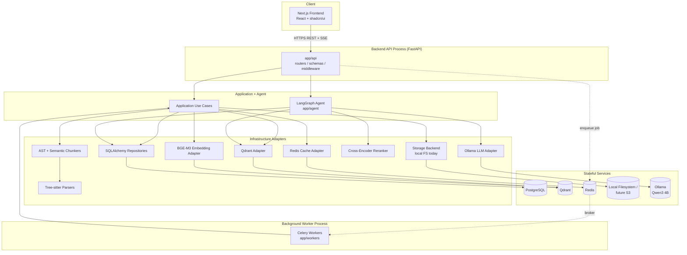

Design intent: the API process must never block on CPU-heavy work (cloning, parsing, embedding a whole repo) — that always goes through Celery. The chat/RAG path, however, runs synchronously inside the API process (streamed via SSE) because it must return the first token in sub-second time; it only touches Qdrant/Postgres/Ollama, never the indexing pipeline directly.

## 12. Low-Level Architecture

CodeAtlas follows Clean Architecture with a strict inward dependency rule: **domain** depends on nothing, **application** depends only on **domain**, and **infrastructure / api / workers / agent** depend on domain + application but never the reverse. Infrastructure *implements* interfaces (`ports`) declared inside `domain`, so the domain layer defines the contract and the outer layer satisfies it (dependency inversion).

- `app/domain` — entities (`Project/Workspace`, `Repository`, `IndexingJob`, `File`, `Chunk`, `Conversation`, `Message`, `User`), value objects (`Language`, `SymbolKind`, `ChunkMetadata`, `Citation`), and ports (`VectorStorePort`, `EmbeddingPort`, `LLMPort`, `RerankerPort`, `StoragePort`, `CachePort`, `GitPort`, and one repository-interface per aggregate, e.g. `ChunkRepository`). Zero imports from FastAPI, SQLAlchemy, Qdrant client, Celery, or LangGraph.
- `app/application` — use cases (`AskQuestionUseCase`, `RunIndexingPipelineUseCase`, `CreateWorkspaceUseCase`, `SearchCodeUseCase`, `GenerateDocumentationUseCase`, `SummarizeConversationUseCase`, ...) and DTOs. Use cases receive their dependencies (ports) via constructor injection; they never instantiate an adapter directly.
- `app/infrastructure` — one sub-package per port family, each implementing the corresponding domain interface (e.g. `infrastructure/vectorstore/qdrant_vector_store.py` implements `VectorStorePort`).
- `app/agent` — the LangGraph graph is orchestration logic that sits on top of the application layer: nodes call use cases/ports, never raw infrastructure classes, so the graph is a consumer of the same contracts the API uses.
- `app/api`, `app/workers` — the two "driving adapters" (interface adapters in Clean Architecture terms) that translate an external trigger (HTTP request, Celery task) into a use-case call.

**Dependency injection.** `app/core/di.py` (or `providers.py`) exposes small factory functions (`get_vector_store()`, `get_llm()`, `get_embedding_service()`, `get_db_session()`, ...). FastAPI routers consume these via `Depends(...)`, composed further into per-use-case factories in `app/api/deps.py` (e.g. `get_ask_question_use_case(...) -> AskQuestionUseCase`). Celery has no request scope, so `app/workers` uses the same `core/di.py` factories but resolves them once per worker process (module-level lazily-initialized singletons), guaranteeing that both the sync API path and the async worker path wire adapters identically — no divergent "worker version" of a use case.

**Example flow — "ask a question about the codebase":**

1. `POST /api/v1/workspaces/{id}/conversations/{cid}/messages` hits `app/api/routers/conversations.py`.
2. Router dependency chain validates the JWT (`app/api/middleware/auth_middleware.py`), parses the body against `app/api/schemas/chat.py`, and resolves `AskQuestionUseCase` via `Depends`.
3. `AskQuestionUseCase.execute(...)` (application layer) loads conversation history through `ConversationRepository`/`MessageRepository` ports, then invokes the LangGraph agent (`app/agent/graph.py`) with an `AgentState`.
4. Agent nodes call `RetrieverPort`/`VectorStorePort` (hybrid retrieval), `RerankerPort`, then `LLMPort` (Ollama), streaming tokens back up as an async generator.
5. The router wraps that generator in an SSE `text/event-stream` response, forwarding token/citation/done events to the frontend as they are produced.
6. On stream completion the use case persists the `Message` entity (with citations) via `MessageRepository`, and — if the turn count crosses a threshold — enqueues a Celery `summarize_conversation` task.

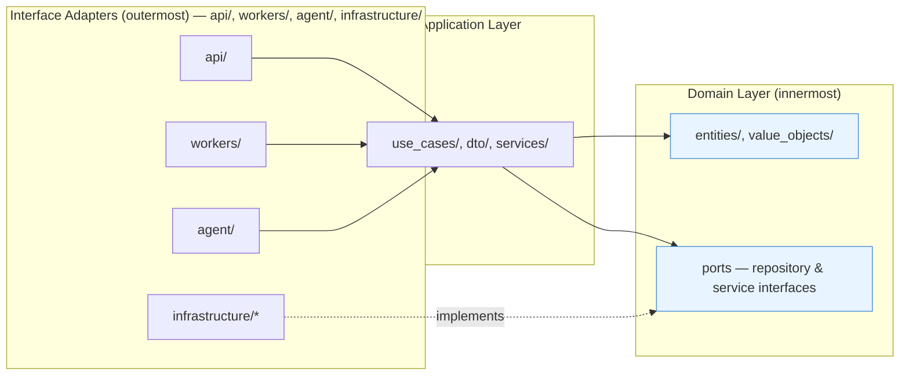

All arrows point toward the domain: outer layers know about inner layers, never vice versa. `INFRA` "implements" `PORTS` rather than calling them — the dotted arrow denotes fulfilling a contract defined inward, which is what makes infrastructure swappable (e.g. Qdrant → another vector DB) without touching `application` or `domain`.

## 13. Folder Structure

```
CodeAtlas/
├── backend/
│   ├── app/
│   │   ├── core/
│   │   │   ├── config.py            # Pydantic Settings: DB/Qdrant/Redis/Ollama URLs, JWT secrets, storage root
│   │   │   ├── logging.py           # structured logging setup
│   │   │   ├── security.py          # password hashing (argon2), JWT encode/decode
│   │   │   ├── di.py                # provider/factory functions used by Depends and by workers
│   │   │   ├── exceptions.py        # AppException base + HTTP status mapping
│   │   │   └── constants.py
│   │   ├── domain/
│   │   │   ├── entities/            # user.py, workspace.py, repository.py, indexing_job.py, file.py, chunk.py, conversation.py, message.py
│   │   │   ├── value_objects/       # language.py, symbol_kind.py, chunk_metadata.py, citation.py
│   │   │   ├── ports/                # vector_store_port.py, embedding_port.py, llm_port.py, reranker_port.py, storage_port.py, cache_port.py, git_port.py, *_repository.py (one per entity)
│   │   │   └── exceptions.py        # WorkspaceNotFound, RepositoryAlreadyIndexing, ...
│   │   ├── application/
│   │   │   ├── use_cases/
│   │   │   │   ├── auth/            # register_user.py, login_user.py, refresh_token.py
│   │   │   │   ├── workspaces/      # create_workspace.py, list_workspaces.py
│   │   │   │   ├── indexing/        # create_repository.py, run_indexing_pipeline.py, get_indexing_status.py
│   │   │   │   ├── chat/            # ask_question.py, manage_conversation.py, summarize_conversation.py
│   │   │   │   ├── search/          # search_code.py
│   │   │   │   └── docs/            # generate_documentation.py
│   │   │   ├── dto/                 # request/response objects internal to use cases (distinct from API schemas)
│   │   │   └── services/            # retrieval_service.py (shared hybrid-retrieve+rerank used by chat AND search)
│   │   ├── infrastructure/
│   │   │   ├── db/
│   │   │   │   ├── base.py          # declarative base, session factory
│   │   │   │   ├── models/          # SQLAlchemy models: users.py, workspaces.py, repositories.py, indexing_jobs.py, files.py, chunks.py, conversations.py, messages.py, refresh_tokens.py
│   │   │   │   └── repositories/    # sqlalchemy_*_repository.py implementing domain ports
│   │   │   ├── vectorstore/
│   │   │   │   ├── qdrant_client_provider.py
│   │   │   │   ├── qdrant_vector_store.py   # implements VectorStorePort
│   │   │   │   └── collection_schema.py     # payload + vector config, index definitions
│   │   │   ├── embeddings/
│   │   │   │   └── bge_m3_adapter.py        # implements EmbeddingPort (dense + sparse)
│   │   │   ├── llm/
│   │   │   │   ├── ollama_adapter.py        # implements LLMPort
│   │   │   │   └── prompt_templates/        # rag_answer.jinja, query_rewrite.jinja, summarize.jinja
│   │   │   ├── parsing/
│   │   │   │   ├── base_parser.py
│   │   │   │   ├── python_parser.py, javascript_parser.py, typescript_parser.py, go_parser.py, java_parser.py
│   │   │   │   ├── language_detector.py
│   │   │   │   └── metadata_extractor.py    # imports, git blame
│   │   │   ├── chunking/
│   │   │   │   ├── ast_chunker.py
│   │   │   │   ├── semantic_chunker.py
│   │   │   │   └── chunk_merger.py          # token-budget merge/split
│   │   │   ├── reranker/
│   │   │   │   └── cross_encoder_reranker.py
│   │   │   ├── cache/
│   │   │   │   └── redis_cache.py           # implements CachePort
│   │   │   ├── storage/
│   │   │   │   ├── storage_port_local.py    # implements StoragePort (local FS)
│   │   │   │   └── (future) s3_storage.py
│   │   │   └── queue/
│   │   │       ├── celery_app.py
│   │   │       └── task_registration.py
│   │   ├── agent/
│   │   │   ├── state.py             # AgentState schema
│   │   │   ├── graph.py             # StateGraph wiring, entry point used by AskQuestionUseCase
│   │   │   ├── nodes/               # classify_intent.py, rewrite_query.py, retrieve_context.py, rerank.py, assess_sufficiency.py, tool_router.py, generate_answer.py, cite_sources.py, finalize.py, error_handler.py
│   │   │   └── tools/               # get_file_tool.py, get_git_blame_tool.py, get_symbol_references_tool.py, run_search_tool.py
│   │   ├── api/
│   │   │   ├── deps.py              # FastAPI Depends wiring → use case factories
│   │   │   ├── routers/             # auth.py, workspaces.py, repositories.py, conversations.py, search.py, docs.py
│   │   │   ├── schemas/             # pydantic request/response models per router
│   │   │   ├── middleware/          # auth_middleware.py, rate_limit.py, error_handler.py, request_logging.py
│   │   │   └── streaming/           # sse.py — SSE event formatting helpers
│   │   ├── workers/
│   │   │   ├── celery_worker.py     # entrypoint
│   │   │   └── tasks/               # indexing_tasks.py, docs_generation_tasks.py, conversation_summary_tasks.py, cleanup_tasks.py
│   │   └── main.py                  # create_app() factory, router mounting, startup/shutdown hooks
│   ├── tests/                        # unit/, integration/, e2e/ — mirrors app/
│   └── alembic/                      # env.py, script.py.mako, versions/
├── frontend/                          # Next.js App Router, shadcn/ui
├── docs/                              # MkDocs site
├── infra/docker/                      # Dockerfile.api, Dockerfile.worker, docker-compose.yml, docker-compose.dev.yml
├── scripts/                           # seed_db.py, wait_for_services.sh, run_migrations.sh
└── .github/workflows/                 # ci.yml (ruff/black/mypy/pytest), docker-build.yml
```

## 14. Database Design

PostgreSQL is the system of record for every structured entity and for the **text and metadata** of every chunk. Qdrant only ever holds vectors plus a lean filtering payload — never the full chunk text. This split exists because:

- **Source of truth vs. index.** Postgres is transactional and durable; Qdrant is an optimized similarity-search index. If Qdrant is ever rebuilt, resharded, or migrated to a new embedding model, the rebuild reads chunk text straight out of Postgres — no need to re-parse/re-chunk the repository.
- **Hydration for citations.** When the retrieval pipeline returns chunk IDs, the API hydrates the actual text/line-range/file-path from Postgres in a single indexed lookup, keeping Qdrant's payload small (better HNSW memory footprint and search latency).
- **Relational querying.** Listing "all chunks in file X", joining chunks to jobs/files/repos for the UI, or running SQL-level analytics is natural in Postgres and awkward in a vector store.

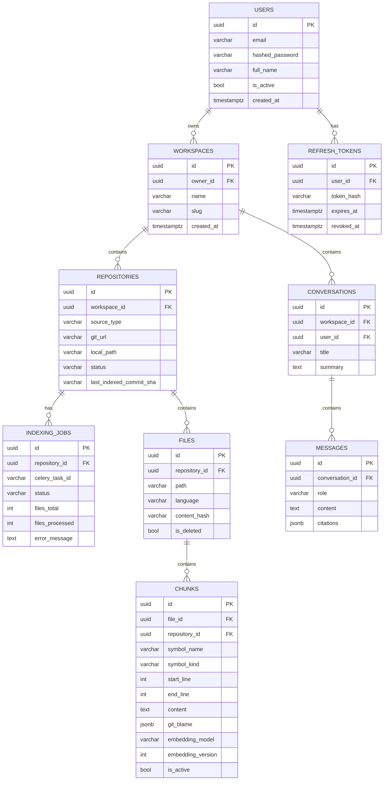

**Key tables, column-level:**

`users` — `id (uuid pk)`, `email (citext, unique)`, `hashed_password (varchar)`, `full_name (varchar)`, `is_active (bool)`, `is_verified (bool)`, `created_at`, `updated_at`.

`workspaces` — `id (uuid pk)`, `owner_id (fk users.id)`, `name (varchar)`, `slug (varchar, unique per owner)`, `description (text, nullable)`, `created_at`, `updated_at`.

`repositories` — `id (uuid pk)`, `workspace_id (fk)`, `source_type (enum: git_url|upload_zip)`, `git_url (varchar, nullable)`, `default_branch (varchar)`, `local_path (varchar — storage backend key)`, `last_indexed_commit_sha (varchar, nullable)`, `status (enum: pending|indexing|ready|failed)`, `created_at`, `updated_at`.

`indexing_jobs` — `id (uuid pk)`, `repository_id (fk)`, `celery_task_id (varchar)`, `status (enum: queued|cloning|walking|parsing|chunking|embedding|upserting|completed|failed|canceled)`, `stage_detail (varchar, nullable)`, `files_total (int)`, `files_processed (int)`, `chunks_total (int)`, `error_message (text, nullable)`, `retry_count (int)`, `started_at`, `finished_at`, `created_at`.

`files` — `id (uuid pk)`, `repository_id (fk)`, `path (varchar, relative)`, `language (varchar, nullable)`, `size_bytes (int)`, `content_hash (varchar, sha256 — drives incremental reindex skip)`, `last_commit_sha (varchar)`, `last_modified_at (timestamptz)`, `is_deleted (bool)`, `indexed_at (timestamptz, nullable)`.

`chunks` — `id (uuid pk, == Qdrant point id)`, `file_id (fk)`, `repository_id (fk, denormalized for filter joins)`, `symbol_name (varchar, nullable)`, `symbol_kind (enum: module|class|function|method|interface|variable|docstring|markdown_section|other)`, `start_line (int)`, `end_line (int)`, `content (text)`, `content_tokens (int)`, `chunk_type (enum: code|prose)`, `imports (jsonb)`, `git_blame (jsonb — {author, commit_sha, commit_date})`, `embedding_model (varchar)`, `embedding_version (int)`, `is_active (bool, default true)`, `created_at`.

`conversations` — `id (uuid pk)`, `workspace_id (fk)`, `user_id (fk)`, `title (varchar, nullable)`, `summary (text, nullable — rolling summary)`, `created_at`, `updated_at`.

`messages` — `id (uuid pk)`, `conversation_id (fk)`, `role (enum: user|assistant|system|tool)`, `content (text)`, `citations (jsonb — [{chunk_id, file_path, start_line, end_line, score}])`, `token_count (int)`, `created_at`.

`refresh_tokens` — `id (uuid pk)`, `user_id (fk)`, `token_hash (varchar)`, `expires_at`, `revoked_at (nullable)`, `user_agent (varchar, nullable)`, `ip (varchar, nullable)`, `created_at`.

Indexes: `files (repository_id, path)` unique; `files (content_hash)`; `chunks (file_id)`, `chunks (repository_id, is_active, embedding_version)`; `messages (conversation_id, created_at)`; `indexing_jobs (repository_id, created_at desc)`.

## 15. Vector Database Design

**Decision: a single Qdrant collection per embedding-model generation (`code_chunks_v1`), with `workspace_id` as an indexed payload field used as a mandatory pre-filter**, rather than one collection per workspace.

Justification: Qdrant applies payload filters *during* HNSW graph traversal when a payload index exists (not a post-filter scan), so a single well-indexed collection scales to hundreds of millions of points while keeping per-query latency low — there is no meaningful recall/latency penalty compared to a dedicated collection. Per-workspace collections would multiply operational overhead linearly with user count (each collection carries its own HNSW graph, memory pages, snapshot/backup unit) and complicate cross-workspace admin operations and model migrations. The only downside — potential "noisy neighbor" resource contention between busy and idle workspaces — is mitigated by Qdrant's filterable-HNSW design and can be revisited (e.g. sharded collections by `hash(workspace_id) % N`) if a future compliance requirement demands physical data isolation.

**Collection naming / versioning.** Physical collections are named `code_chunks_v{n}`; an alias `code_chunks_active` always points at the current generation, enabling atomic, zero-downtime cutover during a full re-embedding (new model) migration: backfill `code_chunks_v{n+1}` from Postgres (source of truth) → validate → repoint alias → drop old collection after a grace period.

**Vector configuration:**
- named vector `dense`: size `1024` (BGE-M3 dense output), distance `Cosine`.
- named vector `sparse`: Qdrant `SparseVectorParams`, populated from BGE-M3's lexical weight output (hybrid dense+sparse retrieval).
- (future) named vector `multi_vector` for BGE-M3's ColBERT-style multi-vector output — reserved but not enabled in v1.

**HNSW/index defaults:** `m=16`, `ef_construct=128`, search-time `ef=64` (raised dynamically to `128` by the agent's "needs more context" retry path for higher recall); payload stored on-disk for larger deployments to bound RAM usage.

**Point payload schema:**

| field | type | purpose |
|---|---|---|
| `chunk_id` | uuid (= point id) | join key back to Postgres `chunks.id` |
| `workspace_id` | uuid (keyword index) | mandatory tenant filter |
| `repository_id` | uuid (keyword index) | scoping filter |
| `file_id` | uuid | join key |
| `file_path` | keyword index | glob/prefix filters |
| `language` | keyword index | language filter |
| `symbol_kind` | keyword index | filter (e.g. only functions) |
| `symbol_name` | text index | keyword-ish boosting |
| `start_line`, `end_line` | integer | line-range filters/citations |
| `chunk_type` | keyword | code vs prose |
| `embedding_model`, `embedding_version` | keyword / integer | generation tracking |
| `is_active` | bool | soft-invalidate stale chunks during reindex |
| `indexed_at` | datetime | freshness / debugging |

Payload indexes are created eagerly on `workspace_id`, `repository_id`, `language`, `symbol_kind`, `file_path`, `is_active`.

**Reindexing/versioning strategy.** On a repository re-index, changed/added chunks are written with the same `embedding_version` as the collection generation and `is_active=true`; superseded chunks for the same `file_id` are flagged `is_active=false` (excluded from search immediately via filter) and physically deleted by a delayed cleanup Celery task filtering on `repository_id + is_active=false`. This gives immediate correctness (no stale hits) without blocking the indexing job on a synchronous delete, and without needing a full collection swap for routine re-indexing — the alias-swap path is reserved specifically for embedding-model migrations.

## 16. API Design

All endpoints are versioned under `/api/v1`. Responses use a consistent envelope (`{"data": ..., "meta": {...}}` for lists with pagination, plain object for single resources) and errors follow RFC 7807 (`{"type", "title", "status", "detail", "code"}`). SSE endpoints return `text/event-stream` with named events (`token`, `citation`, `progress`, `done`, `error`).

**Auth**
| Method | Path | Purpose |
|---|---|---|
| POST | `/auth/register` | create user account |
| POST | `/auth/login` | issue access + refresh token |
| POST | `/auth/refresh` | rotate refresh token, issue new access token |
| POST | `/auth/logout` | revoke refresh token, blacklist access token |
| GET | `/auth/me` | current user profile |

**Workspaces**
| Method | Path | Purpose |
|---|---|---|
| POST | `/workspaces` | create workspace |
| GET | `/workspaces` | list caller's workspaces |
| GET | `/workspaces/{workspace_id}` | get workspace detail |
| PATCH | `/workspaces/{workspace_id}` | rename/update |
| DELETE | `/workspaces/{workspace_id}` | delete workspace + cascade |

**Repositories**
| Method | Path | Purpose |
|---|---|---|
| POST | `/workspaces/{wid}/repositories` | register repo (body: `git_url` or reference to an uploaded archive) |
| POST | `/workspaces/{wid}/repositories/{rid}/upload` | multipart ZIP upload path |
| POST | `/workspaces/{wid}/repositories/{rid}/index` | trigger/re-trigger indexing (202 + job id) |
| GET | `/workspaces/{wid}/repositories` | list repos in workspace |
| GET | `/workspaces/{wid}/repositories/{rid}` | repo detail incl. status |
| DELETE | `/workspaces/{wid}/repositories/{rid}` | remove repo, vectors, files |
| GET | `/workspaces/{wid}/repositories/{rid}/jobs/{job_id}` | poll job status |
| GET | `/workspaces/{wid}/repositories/{rid}/jobs/{job_id}/events` | **SSE** push of indexing progress |
| GET | `/workspaces/{wid}/repositories/{rid}/files` | browse indexed file tree |
| GET | `/workspaces/{wid}/repositories/{rid}/files/{file_id}` | file content + its chunks |

**Chat / Conversations**
| Method | Path | Purpose |
|---|---|---|
| POST | `/workspaces/{wid}/conversations` | start conversation |
| GET | `/workspaces/{wid}/conversations` | list conversations |
| GET | `/workspaces/{wid}/conversations/{cid}` | conversation detail |
| DELETE | `/workspaces/{wid}/conversations/{cid}` | delete conversation |
| GET | `/workspaces/{wid}/conversations/{cid}/messages` | message history |
| POST | `/workspaces/{wid}/conversations/{cid}/messages` | send message — **SSE streamed** agent response with citations |

**Search / one-shot Q&A**
| Method | Path | Purpose |
|---|---|---|
| POST | `/workspaces/{wid}/search` | stateless hybrid semantic code search (no LLM), returns ranked chunks + citations |
| POST | `/workspaces/{wid}/ask` | one-shot Q&A, no persisted conversation, optionally **SSE** |

**Documentation generation**
| Method | Path | Purpose |
|---|---|---|
| POST | `/workspaces/{wid}/repositories/{rid}/docs/generate` | kick off generation (scope: file / symbol / module / whole repo) |
| GET | `/workspaces/{wid}/repositories/{rid}/docs/jobs/{job_id}` | generation job status |
| GET | `/workspaces/{wid}/repositories/{rid}/docs` | list generated docs |
| GET | `/workspaces/{wid}/repositories/{rid}/docs/{doc_id}` | fetch generated markdown |

## 17. Authentication Flow

JWT access tokens (HS256, ~15 minute TTL) carry `sub` (user id), `exp`, and a token version claim. Refresh tokens are opaque random strings; only their SHA-256 hash is persisted in `refresh_tokens`, with rotation on every use (old row revoked, new row inserted) to detect replay of a stolen refresh token. Passwords are hashed with argon2 (via passlib) — never bcrypt-only, to keep pace with future hardware. Redis holds an access-token blacklist keyed by `jti`/token hash with TTL equal to remaining token life, consulted on logout and on suspected compromise.

Authorization ties directly to `workspaces.owner_id`: a `require_workspace_access(workspace_id)` FastAPI dependency loads the workspace and 403s if `current_user.id != workspace.owner_id`. The schema leaves room for a future `workspace_members` table (team RBAC) without changing the API contract — v1 is owner-only.

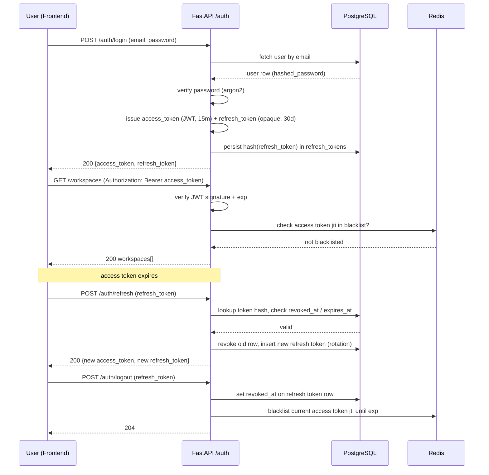

## 18. Repository Indexing Flow

1. `POST /repositories` persists a `repositories` row (`status=pending`); a ZIP upload is stored via `StoragePort` (local filesystem today).
2. `POST /repositories/{id}/index` runs `CreateIndexingJobUseCase`: inserts an `indexing_jobs` row (`status=queued`) and enqueues `index_repository_task(job_id)` on the Celery/Redis broker; the API returns `202` with the job id immediately.
3. A Celery worker picks up the task (`app/workers/tasks/indexing_tasks.py`), which delegates to `RunIndexingPipelineUseCase.execute(job_id)` — the *same* application-layer class the API would call for a synchronous path, so logic isn't duplicated.
4. **Clone/extract** (`status=cloning`): git clone via `GitPort` (gitpython) into a workdir under the storage backend, or unzip an uploaded archive.
5. **Walk** (`status=walking`): traverse the tree respecting `.gitignore` plus built-in excludes (`node_modules`, `.git`, binary/media extensions, per-file size cap); update `files_total`.
6. **Language detection** per file (extension map with a tree-sitter-based fallback).
7. **Change detection**: compute `content_hash`; if it matches the existing `files` row for that path, skip re-parsing/re-embedding that file entirely (incremental reindex).
8. **Parse**: tree-sitter parser selected per language produces an AST.
9. **AST-aware chunk**: cut at function/class/module boundaries; oversized chunks split at nested boundaries; small adjacent chunks merged up to a token budget.
10. **Semantic chunking pass**: applied to markdown files and extracted docstrings/comments — merges/splits by semantic coherence rather than fixed size.
11. **Metadata extraction**: imports/dependencies from the AST, plus git blame (author/sha/date) per chunk's line range.
12. **Embed** (`status=embedding`): batch chunks through the BGE-M3 adapter → dense + sparse vectors.
13. **Persist**: write chunk rows to Postgres first (source of truth), then upsert vectors+payload to Qdrant (`status=upserting`); if the Qdrant upsert fails, a reconciliation task can re-derive it from Postgres since text/metadata already landed there.
14. For changed files, mark their previous chunks `is_active=false` in Postgres and Qdrant payload before/while inserting the new ones, so an edited file never surfaces duplicate stale chunks.
15. Mark `status=completed`, `repositories.status=ready`, update `last_indexed_commit_sha`. On failure, `status=failed` with `error_message`; transient errors (clone/network) auto-retry with backoff, per-file parse errors are logged and skipped (partial success) rather than failing the whole job.
16. The frontend tracks progress either by polling `GET .../jobs/{job_id}` or subscribing to `GET .../jobs/{job_id}/events` (SSE fed by Redis pub/sub messages the worker publishes at each stage transition).

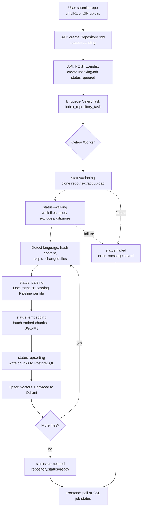

**Document Processing Pipeline** (parse → chunk → extract metadata → embed):

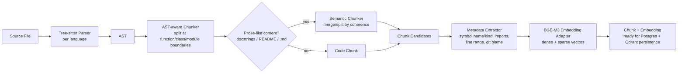

## 19. RAG Pipeline

1. `AskQuestionUseCase` loads the conversation's recent turns + rolling `summary` from Postgres.
2. The agent's `rewrite_query` node contextualizes the raw question against that history (resolving pronouns/references) before retrieval.
3. The rewritten query enters the **Retrieval Pipeline** (§20), filtered by `workspace_id` (and any explicit language/path filters), returning a fused hybrid candidate set.
4. Candidates are reranked by the cross-encoder to a small top-N (e.g. 8–12) that fits the model's context budget.
5. A context builder deduplicates overlapping chunks from the same file, orders them, and trims to the token budget of Qwen3 4B, prefixing each block with its `file_path:start_line-end_line` header.
6. A prompt template combines system instructions (persona + citation-format requirement), the conversation summary, the context blocks, and the user question.
7. The Ollama adapter streams the completion token-by-token over SSE.
8. Citations are produced **deterministically** from the chunks actually included in context (not parsed out of free-form model text) — safer and easier for the frontend to render as clickable source cards.
9. The assistant message + citations are persisted; if the turn count crosses a threshold, a Celery task asynchronously re-summarizes the conversation to bound future prompt growth.

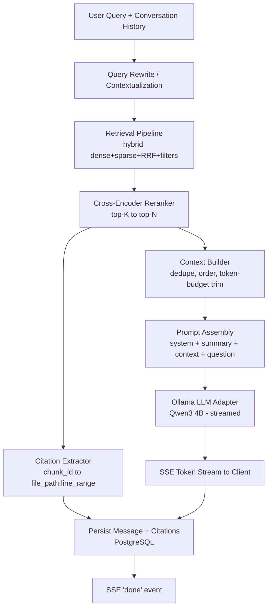

## 20. Retrieval Pipeline

1. **Query encode**: the BGE-M3 adapter produces both a dense vector (1024-d) and sparse lexical weights for the (rewritten) query in one call.
2. **Filter construction**: mandatory `workspace_id`, `is_active=true`, `embedding_version=<active generation>`, plus optional `language`, `path_glob` → keyword/prefix match on `file_path`, `symbol_kind`.
3. **Dense search**: Qdrant search on the `dense` named vector, `top_k=K1` (e.g. 40), with the filter applied during HNSW traversal.
4. **Sparse search**: Qdrant search on the `sparse` named vector, same filter, `top_k=K1`.
5. **Fusion**: Reciprocal Rank Fusion combines the two rank lists — `score(d) = Σ 1/(rank_in_list + k)` with `k=60` — producing a fused top `K2` (e.g. 50) list.
6. **Hydration**: batch `IN` query against Postgres `chunks` to fetch text/metadata by id (Qdrant payload stays lean; text is never duplicated there).
7. **Rerank**: the cross-encoder scores each `(query, chunk_text)` pair for all `K2` candidates and reorders; take top `N` (e.g. 8–12).
8. **Return**: a list of `{chunk_id, file_path, start_line, end_line, symbol_name, score, source: dense|sparse|both}` results to whichever caller invoked retrieval — the RAG pipeline's context builder, an agent tool, or the `/search` endpoint directly.

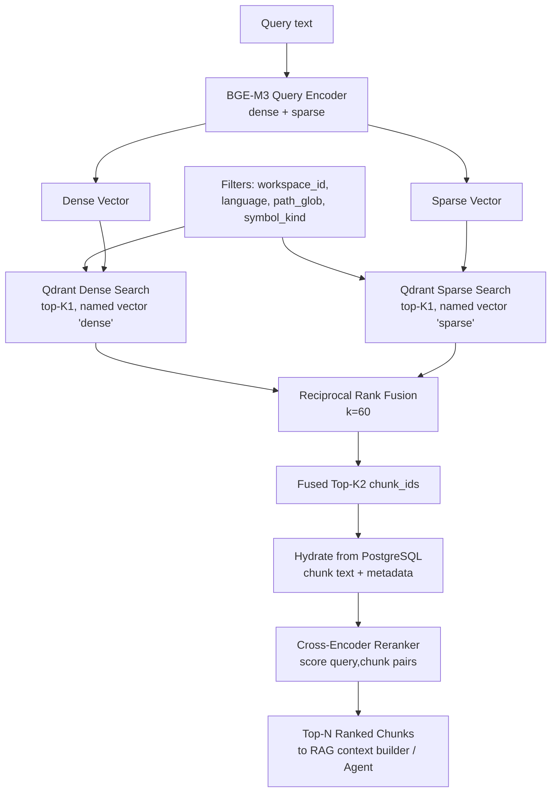

## 21. Agent Workflow

The agent is a LangGraph `StateGraph` invoked by `AskQuestionUseCase`. It owns the decision of *how much* retrieval/tool use a given turn needs, rather than always running a fixed retrieve-once pipeline.

**State schema (`AgentState`):**

| field | type | notes |
|---|---|---|
| `conversation_id`, `workspace_id`, `user_id` | uuid | scoping |
| `messages` | list of prior turns | short conversation window |
| `query` | str | raw user input |
| `rewritten_query` | str \| null | after `rewrite_query` |
| `intent` | enum | `code_qa`, `debugging`, `architecture_explain`, `doc_generation`, `general_chat` |
| `retrieved_chunks` | list | from `retrieve_context` |
| `reranked_chunks` | list | from `rerank` |
| `retrieval_attempts` | int | loop guard, max 2 |
| `needs_more_context` | bool | set by `assess_sufficiency` |
| `tool_calls` | list | audit trail of tool invocations, capped at `max_tool_calls=3` |
| `citations` | list | deterministic, built in `cite_sources` |
| `final_answer` | str \| null | |
| `error` | str \| null | |

**Nodes:**
- `classify_intent` — cheap classification of the query; decides whether retrieval is needed at all (pure greetings skip straight to `generate_answer`).
- `rewrite_query` — contextualizes the query using conversation history.
- `retrieve_context` — calls the hybrid Retrieval Pipeline (§20).
- `rerank` — cross-encoder reranking.
- `assess_sufficiency` (decision node) — checks relevance-score threshold/query-term coverage of `reranked_chunks`; if insufficient and `retrieval_attempts < max`, widens parameters (broader filters, larger `ef`/`top_k`, alternate query rewrite) and loops back to `retrieve_context`.
- `tool_router` (decision node) — chooses among: `get_file_tool` (full file when a chunk lacks needed surrounding context), `get_git_blame_tool` (detailed history for debugging "who changed this"), `get_symbol_references_tool` (cross-file usages via the imports/metadata index), `run_search_tool` (ad-hoc secondary search with different filters).
- `call_tool` — executes the chosen tool, appends its output to context, records it in `tool_calls`; returns to `tool_router` so multiple tools can be chained up to the cap.
- `generate_answer` — assembles the final prompt (system + context + tool outputs + question) and streams from the Ollama `LLMPort`.
- `cite_sources` — deterministic citation list from the chunks/tool outputs actually used.
- `finalize` — persists the message, emits the SSE `done` event.
- `error_handler` — catches exceptions from any node, routes to `finalize` with `state.error` set so the API can emit an `error` SSE event without crashing the stream.

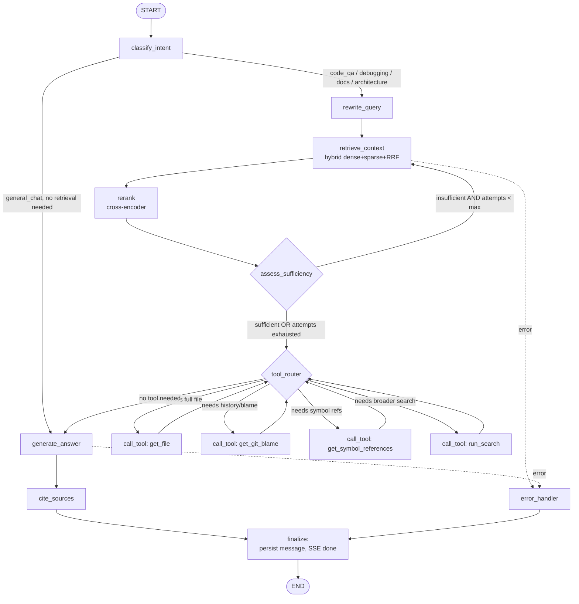

## 22. Deployment Architecture

CodeAtlas ships as a set of independently-versioned containers orchestrated by Docker Compose. All services share one `codeatlas` monorepo image family: `backend` (built once, used by both `backend-api` and `worker` via different container commands) and `frontend`. Three compose files layer on top of each other:

- **`infra/docker/docker-compose.yml`** — base definition: service names, images, networks, named volumes, and health checks. Contains no dev- or prod-specific behavior.
- **`infra/docker/docker-compose.dev.yml`** — overlay for local development: bind-mounts `backend/app` and `frontend` source into containers, runs `uvicorn --reload` and `next dev`, exposes debug ports (5678 for `debugpy`, 9229 for Node inspector), disables resource limits, uses a single-replica Ollama with a small quantized model.
- **`infra/docker/docker-compose.prod.yml`** — overlay for production: uses multi-stage-built immutable images (no source bind mounts), sets CPU/memory `deploy.resources.limits`, `restart: unless-stopped`, log rotation via the `json-file` driver with `max-size`/`max-file`, and pins image tags (never `:latest`).

Invocation: `docker compose -f docker-compose.yml -f docker-compose.dev.yml up` for local dev, `docker compose -f docker-compose.yml -f docker-compose.prod.yml up -d` for production-like runs.

**Named volumes**
| Volume | Mounted by | Purpose |
|---|---|---|
| `postgres_data` | `postgres` | relational data durability |
| `qdrant_data` | `qdrant` | vector index + payload durability |
| `ollama_models` | `ollama` | pulled model weights (avoid re-download on restart) |
| `codeatlas_storage` | `backend-api`, `worker` | local `StorageBackend` file root (repo clones, generated docs, artifacts) |

**Environment variable strategy**: each service reads config through `app/core/config.py` (Pydantic `BaseSettings`), populated from a per-environment `.env` file (`.env.dev`, `.env.prod`, `.env.example` committed as the only tracked template). Compose files reference `env_file:` per service; secrets (`DATABASE_URL` credentials, `JWT_SECRET`, `OLLAMA_*`, `QDRANT_API_KEY`) are never committed — `.env*` (except `.env.example`) is gitignored. In prod, secrets are injected via Docker secrets or the host orchestrator's secret store, not baked into images.

**Health checks** (used by Compose `depends_on: condition: service_healthy` and by the readiness probes in §27):
- `postgres`: `pg_isready -U codeatlas`
- `redis`: `redis-cli ping`
- `qdrant`: `GET /healthz`
- `ollama`: `GET /api/tags`
- `backend-api`: `GET /health/ready` (checks DB, Redis, Qdrant, Ollama reachability)
- `worker`: `celery -A app.workers.celery_app inspect ping`
- `frontend`: `GET /api/health` (Next.js route)

### Deployment Architecture Diagram

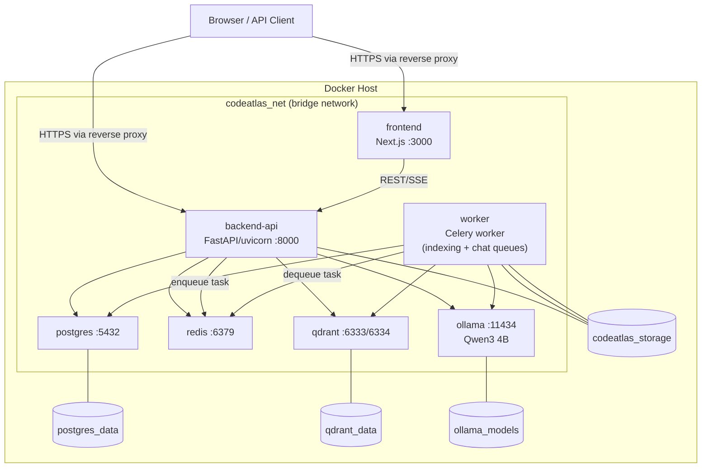

### Docker Network Diagram

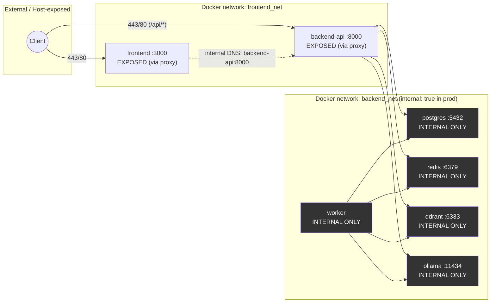

`frontend` and `backend-api` are the only containers with host port bindings (behind an nginx/Traefik reverse proxy terminating TLS, out of scope for Phase 1). `postgres`, `redis`, `qdrant`, and `ollama` publish no host ports in `docker-compose.prod.yml` — they are reachable only by service name on `backend_net`, which is declared `internal: true` in prod so it has no route to the outside world. `worker` sits on `backend_net` only; it never needs to be reached by the client and is never placed on `frontend_net`.

## 23. Security Considerations

**Authentication & session security**
- Access tokens: JWT (RS256 or HS256 with a 256-bit secret), 15-minute expiry, carried in `Authorization: Bearer`.
- Refresh tokens: opaque random 256-bit tokens, stored hashed (SHA-256) in Postgres `refresh_tokens` table, 7-day expiry, **rotated on every use** (old token revoked, new one issued) — detects token replay if an old refresh token is presented after rotation, triggering full session revocation for that user.
- Passwords hashed with **argon2id** (via `passlib`/`argon2-cffi`; bcrypt as fallback for constrained environments), never logged, never returned in any response schema.
- All request/response bodies validated through Pydantic v2 models at the API boundary — no raw `dict` access to untrusted input inside use cases.

**SSRF risk — repository indexing from arbitrary URLs**: indexing accepts a git URL, which is a classic SSRF vector (attacker supplies `http://169.254.169.254/latest/meta-data/` or `http://localhost:6379`).
- Allow only `https://` and `git://` protocols for well-known hosts (github.com, gitlab.com, bitbucket.org) by default; block `file://`, `ftp://`, and raw IP literals unless explicitly enabled per-deployment.
- Resolve the hostname before cloning and reject if it resolves to a private/loopback/link-local/CGNAT range (`10.0.0.0/8`, `172.16.0.0/12`, `192.168.0.0/16`, `127.0.0.0/8`, `169.254.0.0/16`, including the `169.254.169.254` cloud metadata address) — re-check after any redirect, since DNS rebinding can change resolution between check and connect.
- Enforce clone limits: shallow clone (`--depth=1`), max repo size 500 MB, max wall-clock clone time 120s, executed inside the `worker` container with no outbound access except to the allowlisted git hosts (egress policy enforced at the network/firewall layer in prod).

**Secrets management**: all credentials via environment variables sourced from `.env` (gitignored) or Docker/host secret stores — never hardcoded, never committed, never embedded in Docker images. `app/core/config.py` fails fast at startup if a required secret is missing.

**Dependency scanning**: `pip-audit`/`safety` for Python and `npm audit`/`osv-scanner` for the frontend, run as a required CI job (§29) plus a weekly scheduled scan for newly disclosed CVEs.

**Rate limiting**: Redis-backed sliding-window limiter (via `slowapi` or a custom middleware) — auth endpoints (`/auth/login`, `/auth/register`) limited to 5 requests/minute/IP, chat/query endpoints limited to 30 requests/minute/user, indexing-trigger endpoints limited to 3 requests/minute/user to prevent clone-bomb abuse.

**Tenant isolation between workspaces**: every domain entity carries a `workspace_id`; every SQLAlchemy repository query is scoped by `workspace_id` derived from the authenticated JWT claims (never from client-supplied input) — enforced at the repository layer, not just the API layer, so a bug in one router can't leak cross-tenant. On the vector side, every Qdrant point is upserted with a `workspace_id` payload field, and **every** retrieval query attaches a mandatory Qdrant `Filter(must=[FieldCondition(key="workspace_id", match=MatchValue(...))])` — this filter is injected centrally by the vector store adapter itself (not left to call sites) so it is structurally impossible for a use case to issue an unscoped query.

**Least-privilege DB roles**: the application connects as a role with `SELECT/INSERT/UPDATE/DELETE` on its own schema only — no `CREATEDB`, `CREATEROLE`, or superuser. Alembic migrations run under a separate, higher-privileged migration-only role/credential that is not used by the running application.

**CORS**: `CORSMiddleware` allowlists only the known frontend origin(s) per environment (`http://localhost:3000` in dev, the deployed frontend origin in prod), credentials allowed, methods restricted to those actually used — no wildcard `*` origin once credentials are enabled.

## 24. Performance Considerations

**Latency budgets**
| Operation | Target |
|---|---|
| Vector retrieval (top-k from Qdrant) | p50 < 300ms, p95 < 700ms |
| First streamed token on a chat query | < 1.5s |
| Full chat response (short answer) | < 6s |
| Repo indexing throughput | ≥ 1,000 LOC / 10s per worker (parse + chunk + embed + upsert) |
| Embedding batch (BGE-M3, 32 chunks) | < 400ms on CPU-only embedding service, < 150ms on GPU |

**Caching (Redis)**
- **Embedding cache**: key = `sha256(model_id + normalized_text)` → cached vector, TTL 30 days; avoids re-embedding identical chunks across re-indexing runs and identical repeated queries.
- **LLM response cache**: only for deterministic, low-temperature, non-personalized queries (e.g. "explain this exact function signature") keyed on `hash(prompt + context_ids + model_version)`, short TTL (1 hour) and explicitly bypassed whenever the retrieved context set differs — never cache session-dependent or multi-turn chat responses.
- **Session/context cache**: active conversation state and the last retrieved context window cached per `session_id` with a sliding 30-minute TTL, avoiding a Postgres round-trip on every turn of a multi-turn chat.
- Cache-aside pattern throughout: the application layer checks Redis before calling the infra adapter (vector store/LLM) and writes through on miss; cache keys are namespaced by `workspace_id` to preserve tenant isolation.

**Connection & resource management**
- SQLAlchemy **async engine** (`asyncpg` driver) with a bounded pool (`pool_size=10`, `max_overflow=10` per `backend-api` replica), `pool_pre_ping=True`.
- A single long-lived Qdrant `AsyncQdrantClient` per process (constructed once in `app/core` DI providers, injected via FastAPI `Depends`), not re-instantiated per request.
- Embedding generation is always **batched** (default batch size 32) rather than issued per-chunk, both during indexing and for multi-chunk retrieval-time query expansion.
- All I/O — DB, Qdrant, Redis, Ollama HTTP calls — is `async`/`await` end-to-end; no blocking calls on the event loop (CPU-bound parsing/chunking is offloaded to Celery workers, not done inline in `backend-api`).
- Repository methods are written to eager-load required relationships (`selectinload`) to avoid N+1 queries, e.g. loading a workspace's documents together with their latest indexing job status in one query rather than one query per document.

### API Request Lifecycle Diagram

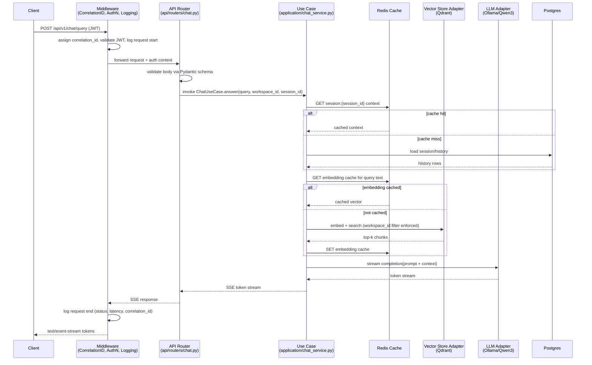

## 25. Scalability Strategy

- **`backend-api`**: fully stateless (no in-process session state — sessions live in Postgres/Redis), so it scales horizontally by adding Compose/K8s replicas behind a future load balancer (nginx/Traefik/ALB). Sticky sessions are not required since SSE connections don't depend on server-local state.
- **`worker`**: scaled independently from `backend-api`, on **separate Celery queues** — `indexing` (long-running, CPU/IO-heavy: clone, parse, chunk, embed, upsert) and `chat` (short-lived: async task fan-out for things like doc-generation triggered from chat) — so a burst of large repo indexing jobs cannot starve latency-sensitive chat-adjacent background work. Queue routing is declared in `app/workers/celery_app.py` via `task_routes`; each queue can be scaled with its own `worker --concurrency` and its own replica count once split into two Celery worker services.
- **Qdrant**: starts single-node; growth path is Qdrant's native **sharding** (split a large workspace's collection across shards) and **replication** (replica sets for read availability) once corpus size or query volume exceeds single-node capacity — collections are already created per-workspace-namespace to make sharding-by-workspace a natural first step.
- **Postgres**: starts single primary; growth path is a **read replica** for read-heavy endpoints (history listing, dashboards) via SQLAlchemy's read/write engine split, with writes always routed to the primary — introduced only when read QPS demonstrably contends with write latency.
- **Storage**: the `StorageBackend` interface (domain port, `infrastructure/storage/`) already isolates all file I/O behind `save`, `read`, `delete`, `get_url`. Local-filesystem is the only implementation now; moving to S3 (`S3StorageBackend`) is a drop-in adapter swap with zero changes to application/domain code, unlocking multi-replica `backend-api`/`worker` without a shared filesystem.
- **LLM**: the adapter pattern (`infrastructure/llm/`, a domain `LLMPort`) means Ollama/Qwen3 4B is one adapter; scaling path is (a) horizontally scaling Ollama instances behind a simple round-robin in the adapter, (b) swapping to a larger local model, or (c) adding a cloud LLM adapter selected per-request via config/feature flag — the LangGraph agent nodes depend only on `LLMPort`, never on Ollama specifics.

## 26. Logging Strategy

- **Format**: structured JSON logs via `structlog` (stdlib `logging` bound through a `structlog` processor chain), one JSON object per line — never bare `print`. Fields on every log entry: `timestamp`, `level`, `logger`, `event`, `correlation_id`, `workspace_id` (when applicable), `user_id` (when authenticated), and service-specific context (`task_id` for Celery, `route` for API).
- **Correlation IDs**: a `CorrelationIdMiddleware` (in `app/api/middleware/`) reads `X-Correlation-ID` from the incoming request or generates a UUIDv4, binds it into `structlog.contextvars` for the lifetime of the request, and returns it in the response header. When a use case enqueues a Celery task, the correlation ID is passed explicitly as a task argument/header and re-bound at the start of the task in `app/workers/tasks.py`, so a single log query for one `correlation_id` shows the full journey from HTTP request → use case → background job.
- **Log level policy**: `DEBUG` for adapter-level request/response payloads (dev only, never enabled in prod by default), `INFO` for request start/end, task lifecycle transitions, and business events (job started/completed), `WARNING` for retried operations and degraded-but-recovered states (e.g. cache miss fallback), `ERROR` for unhandled exceptions and failed external calls, `CRITICAL` reserved for startup failures that prevent serving traffic.
- **What NOT to log**: JWTs/refresh tokens, passwords (hashed or not), full file/source contents (log a path + size + hash instead), raw LLM prompts containing user code beyond a truncated preview unless `DEBUG` is explicitly enabled in a non-prod environment, any field matching a configured PII denylist (email, API keys) — enforced by a `structlog` processor that redacts known-sensitive keys before emission.
- **Shipping**: all services log to `stdout`/`stderr` only (12-factor style); Docker's `json-file` driver (with rotation caps in prod) collects them. Phase 1 requires no dedicated log backend; the documented future path is shipping stdout via a Docker logging driver or a sidecar (Promtail/Fluent Bit) into **Grafana Loki**, or into an **ELK** stack, keyed on the same `correlation_id` field for cross-service search.

### Background Job Flow Diagram

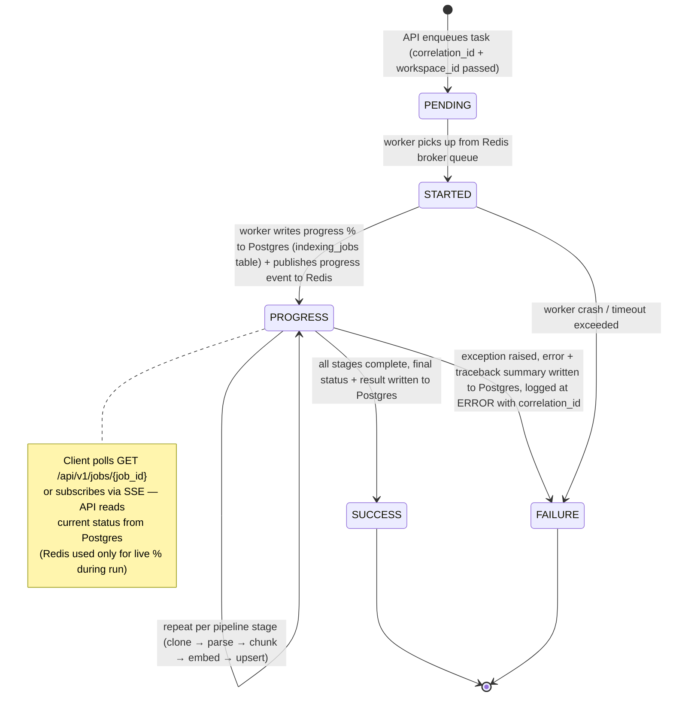

## 27. Monitoring Strategy

- **Metrics** exposed via `prometheus-fastapi-instrumentator` on `backend-api` (`GET /metrics`) and a `celery-prometheus-exporter`-style bridge for `worker`:
  - `http_request_duration_seconds` (histogram, labeled by route + status) — tracks the p50/p95 latency budgets from §24.
  - `retrieval_duration_seconds` (histogram) — Qdrant search latency specifically, separate from total request latency.
  - `indexing_job_duration_seconds` (histogram, labeled by repo size bucket) and `indexing_jobs_total` (counter, labeled by status: success/failure).
  - `celery_queue_depth` (gauge, labeled by queue name: `indexing`/`chat`) — sampled periodically from Redis broker length, the primary signal for §25's worker autoscaling decisions.
  - `llm_tokens_total` (counter, labeled by direction: prompt/completion, and model) and `llm_request_duration_seconds` (histogram) — cost/capacity visibility even though Ollama is local (forward-compatible with a paid cloud adapter).
  - `cache_hit_ratio` (derived from `cache_hits_total` / `cache_lookups_total` counters, labeled by cache type: embedding/llm/session).
- **Health/readiness**: each service exposes both a **liveness** endpoint (process is up, no dependency checks — `/health/live`) and a **readiness** endpoint (`/health/ready`) that actively checks Postgres, Redis, Qdrant, and Ollama connectivity with a short timeout; Compose health checks (§22) and any future orchestrator use readiness, not liveness, to gate traffic.
- **Dashboards**: a Grafana instance (added in a later phase, not part of the Phase-1 compose file but documented as the target) visualizes the Prometheus metrics above — one dashboard for API latency/error rate, one for indexing pipeline throughput and queue depth, one for LLM usage.
- **Alerting** (example thresholds, wired to Alertmanager/Grafana alerting once introduced):
  - API p95 latency > 2s for 5 minutes.
  - `celery_queue_depth{queue="indexing"} > 50` for 10 minutes (signals need to scale workers).
  - `indexing_jobs_total{status="failure"}` rate > 10% over a rolling hour.
  - Any service failing `/health/ready` for > 1 minute.
  - Redis or Qdrant memory usage > 85% of allocated limit.
- **Tracing**: out of scope for Phase 1 implementation but the design reserves the `correlation_id` (§26) as the join key for a future **OpenTelemetry** rollout — instrumenting FastAPI, SQLAlchemy, and the Celery task boundary with OTel spans exported to a collector (Jaeger/Tempo) is the documented next step once multi-service latency debugging becomes a bottleneck.

## 28. Testing Strategy

**Test pyramid**
1. **Unit tests** (majority of the suite, run on every push, target < 30s total): `domain/` and `application/` layers tested with all ports mocked (`unittest.mock`/`pytest-mock` fakes implementing the port `Protocol`s) — no real Postgres, Qdrant, Redis, or Ollama. Pure logic: chunking boundaries, prompt assembly, DTO validation, LangGraph node transition logic given a fixed mocked state.
2. **Integration tests**: exercise real `infrastructure/` adapters against real dependencies started via a dedicated `docker-compose.test.yml` (or `testcontainers-python` for Postgres/Qdrant/Redis) — verifies the SQLAlchemy repository implementations against a real Postgres schema (migrated via Alembic in the test fixture), the Qdrant adapter's actual filter/upsert/search behavior (including the tenant-isolation filter from §23), and Celery tasks run in **eager mode** (`CELERY_ALWAYS_EAGER=True`) to validate task logic without a broker.
3. **End-to-end tests**: spin up the full `backend-api` (real app, real DB/Qdrant/Redis via the test compose stack, LLM adapter swapped for a deterministic mock — see below) and hit real HTTP endpoints with `httpx.AsyncClient`/`pytest-asyncio`, covering the full request lifecycle from §24 including auth, rate limiting, and SSE streaming.
4. **Contract tests**: each `infrastructure/` adapter (e.g. `QdrantVectorStore`, `SQLAlchemyDocumentRepository`) is tested against the same shared test suite defined once per domain **port** (`Protocol`/ABC) — so a fake in-memory implementation used by unit tests and the real adapter used by integration tests both must satisfy identical behavioral contracts, catching drift between mock and reality.

**Fixtures/factories**: `pytest` fixtures for DB session-per-test-with-rollback, `factory_boy` (or plain factory functions) for domain entities (`WorkspaceFactory`, `DocumentFactory`, `ChunkFactory`) to avoid hand-built test data duplication.

**Coverage targets**: ≥ 85% line coverage on `domain/` and `application/` (business logic, cheap to fully cover), ≥ 70% on `infrastructure/` (integration-test-gated, some adapter error paths are hard to trigger), overall repo gate of ≥ 80% enforced in CI (`pytest --cov --cov-fail-under=80`); `agent/` and `api/` measured but not blocking initially given LangGraph/FastAPI wiring code has lower unit-test value.

**LLM-dependent tests**: a `FakeLLMAdapter` (implements `LLMPort`, returns deterministic canned/templated responses keyed on input hash) is the default in unit/integration/e2e suites — this is what makes those suites fast and deterministic and part of the required, blocking CI gate. Separately, a small **golden-set RAG evaluation harness** (~20-50 curated question/expected-answer/expected-source pairs run against the real Ollama/Qwen3 adapter, scored on retrieval recall@k and answer relevance via a rubric or a secondary LLM-judge) runs as a **non-blocking, scheduled/manual** CI job — it reports quality drift but never fails a PR, since real-LLM output is inherently non-deterministic.

## 29. CI/CD Strategy

**Branch strategy**: trunk-based on `main` with short-lived `feature/*` branches; every change lands via PR, no direct pushes to `main`. `main` is always deployable; release tags (`vX.Y.Z`) cut from `main` trigger the deploy pipeline.

**GitHub Actions pipeline** (`.github/workflows/ci.yml`), staged so cheap checks fail fast before expensive ones run:

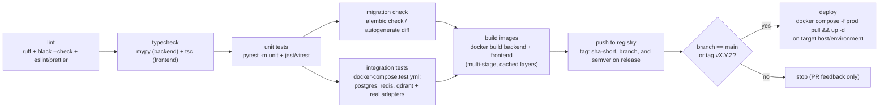

- **Required checks before merge** (branch protection on `main`): `lint`, `typecheck`, `unit tests`, `migration check` must pass; `integration tests` required for changes touching `backend/app/infrastructure/**` or `alembic/**`, otherwise may run non-blocking to save CI minutes on pure frontend/docs PRs (path filtering).
- **Migration safety check**: a dedicated job spins up a throwaway Postgres, applies all existing migrations, then runs `alembic revision --autogenerate` and asserts the resulting diff is **empty** — catches model changes that were made without a corresponding migration, before merge.
- **Versioning/tagging**: images tagged with the short commit SHA on every build (`ghcr.io/org/codeatlas-backend:sha-abc1234`) for traceability, plus the branch name for the latest per-branch image, and semver (`:1.4.0`, `:latest` only on the release tag) on tagged releases — `docker-compose.prod.yml` in each deployed environment pins an explicit semver tag, never `:latest`, so deploys are reproducible and rollback is just re-pinning the previous tag.
- **Deploy** step (Phase 1 scope: single-host Compose deploy) pulls the newly pushed images and runs `docker compose -f docker-compose.yml -f docker-compose.prod.yml pull && up -d` on the target host over SSH from the Actions runner, gated on all upstream jobs succeeding and restricted to `main`/release tags only.

## 30. Coding Standards

**Formatting & static analysis**: `ruff` (lint + import sorting, replacing flake8/isort) and `black` (formatting) run identically in pre-commit hooks and CI — no manual style debates, `ruff format`/`black` is the source of truth. `mypy` runs in a **strict-leaning** mode (`disallow_untyped_defs`, `disallow_incomplete_defs`, `warn_return_any`, `no_implicit_optional` all enabled) on `backend/app` from day one; `domain/` and `application/` are held to full strict mode (zero `Any` leaking across a port boundary — a port's method signature must be fully typed with concrete Pydantic models/dataclasses, never `dict`/`Any`), while `infrastructure/` adapters are allowed narrowly-scoped `# type: ignore[...]` (with the specific error code, never bare) only at the exact line touching an untyped third-party call.

**Typed code everywhere**: every function signature has full type hints; all API request/response bodies, use-case DTOs, and Celery task payloads are Pydantic models — no passing raw dicts between layers. Domain entities are plain dataclasses or Pydantic models with no framework dependencies (no SQLAlchemy `Base`, no FastAPI `BaseModel` request classes) so `domain/` never imports from `infrastructure/` or `api/`.

**Docstrings**: Google-style docstrings, added only where the "why" or the contract isn't obvious from the type signature and name alone — every public method on a domain port/interface gets one (documenting pre/post-conditions, raised domain exceptions), but a trivial one-line getter or an obviously-named private helper does not need one.

**File/class size limits**: flag (via a CI check or PR review convention) any file exceeding **400 lines** or any class exceeding **300 lines** as a signal to split by responsibility — most commonly a use-case class doing too much orchestration that should be decomposed into smaller collaborating services, or a router file that should be split by resource. One class = one responsibility; LangGraph node functions in `agent/nodes/` are kept small and single-purpose, with shared logic extracted into `agent/tools/` or `application/` services rather than duplicated across nodes.

**Naming conventions per layer**: `domain/` — entity nouns (`Workspace`, `Document`, `Chunk`), port interfaces suffixed `...Port` or `...Repository` (`VectorStorePort`, `DocumentRepository`), domain exceptions suffixed `Error` (`WorkspaceNotFoundError`); `application/` — use-case classes suffixed `...UseCase` or `...Service` (`IndexRepositoryUseCase`, `ChatService`), DTOs suffixed `...DTO` or `...Command`/`...Query`; `infrastructure/` — adapters prefixed by technology (`QdrantVectorStore`, `SqlAlchemyDocumentRepository`, `OllamaLLMAdapter`); `api/` — Pydantic schemas suffixed `...Request`/`...Response`, routers named after the resource (`chat.py`, `workspaces.py`); Celery tasks named as imperative verbs (`index_repository`, `generate_documentation`).

**Commit message convention**: Conventional Commits (`feat:`, `fix:`, `refactor:`, `test:`, `docs:`, `chore:`, `perf:`) with an optional scope matching the top-level module (`feat(agent): add debugging tool node`, `fix(api): correct SSE content-type header`) — enables auto-generated changelogs and makes `git log` filterable per layer.

**PR review checklist**: (1) Does this change respect layer boundaries (no `domain/` importing `infrastructure/`, no raw SQL/Qdrant client leaking into `application/`)? (2) Are new ports covered by the shared contract test suite (§28) if an adapter changed? (3) Are all new/changed endpoints validated with Pydantic schemas and covered by an auth/tenant-isolation check if they touch workspace data? (4) Is there a matching Alembic migration for any model change, and does it pass the autogenerate-diff check? (5) Are logs added free of secrets/PII per §26? (6) Is test coverage maintained (unit for new logic, integration if a new adapter behavior was added)? (7) Does the diff avoid unrelated formatting churn?

---

# Module Planning

## Module 1: Project Initialization

### Purpose
Establish the monorepo scaffold, dependency/tooling baseline, and containerized dev environment so that every subsequent module has a consistent place to land code, with linting/type-checking/formatting enforced from commit zero. Contains no business logic.

### Responsibilities
- Create the full directory skeleton under `backend/app/**`, `backend/tests/**`, `backend/alembic/`, `frontend/`, `docs/`, `infra/docker/`, `scripts/`, `.github/workflows/`.
- Define dependency management via `pyproject.toml` (uv).
- Configure pre-commit hooks (ruff, black, mypy, end-of-file-fixer, trailing-whitespace).
- Provide `.env.example` enumerating every environment variable consumed by Module 2's settings hierarchy (placeholders only, no secrets).
- Provide base `Dockerfile` (multi-stage: builder + runtime) and `docker-compose.yml` skeleton wiring `api`, `worker`, `postgres`, `redis`, `qdrant`, `ollama` services (no app logic inside them yet, just health-checked containers and an app image that boots with a health endpoint).
- Provide `main.py` application factory (`create_app()`) registering a bare `/health` router and returning a `FastAPI` instance, plus `run.sh`/`Makefile` convenience targets.
- Set up base CI workflow (`.github/workflows/ci.yml`) running lint + mypy + `pytest` (empty suite passes) on push/PR.

### Dependencies
None on other CodeAtlas modules (this is the root). It is a **prerequisite** for Modules 2–10, all of which assume the directory layout, `pyproject.toml`, and `create_app()` factory exist.

### Directory structure
```
CodeAtlas/
├── backend/
│   ├── app/
│   │   ├── __init__.py
│   │   ├── core/__init__.py
│   │   ├── domain/__init__.py
│   │   ├── application/__init__.py
│   │   ├── infrastructure/__init__.py
│   │   ├── agent/__init__.py
│   │   ├── api/
│   │   │   ├── __init__.py
│   │   │   └── routers/
│   │   │       ├── __init__.py
│   │   │       └── health.py
│   │   ├── workers/__init__.py
│   │   └── main.py
│   ├── tests/
│   │   ├── unit/__init__.py
│   │   ├── integration/__init__.py
│   │   ├── e2e/__init__.py
│   │   └── conftest.py
│   ├── alembic/
│   │   └── .gitkeep
│   ├── pyproject.toml
│   ├── uv.lock
│   └── Dockerfile
├── frontend/
│   └── .gitkeep
├── docs/
│   ├── mkdocs.yml
│   └── index.md
├── infra/
│   └── docker/
│       └── docker-compose.yml
├── scripts/
│   ├── bootstrap.sh
│   └── wait-for-services.sh
├── .github/
│   └── workflows/
│       └── ci.yml
├── .pre-commit-config.yaml
├── .env.example
└── README.md
```

### Interfaces
```python
# backend/app/main.py
def create_app() -> FastAPI: ...

# backend/app/api/routers/health.py
router: APIRouter
@router.get("/health", response_model=HealthResponse)
async def health_check() -> "HealthResponse": ...

class HealthResponse(BaseModel):
    status: Literal["ok"]
    version: str
```

### Implementation plan
1. Create directory skeleton with placeholder `__init__.py`/`.gitkeep` files (no code yet) matching the architecture contract exactly.
2. Author `pyproject.toml`: choose **uv** over Poetry — justification: uv's resolver/install is 10–100x faster (matters for CI + repeated Docker builds), it natively supports `pyproject.toml` PEP 621 without a proprietary lock format, and has first-class `uv run`/`uv sync` parity with Poetry's workflow while being a single static binary (simpler Docker base layer, no separate Poetry install step). Declare runtime deps (fastapi, uvicorn, pydantic, sqlalchemy[asyncio], asyncpg, alembic, celery, redis, qdrant-client, langgraph, structlog, argon2-cffi, pyjwt) as version-pinned ranges; dev deps (pytest, pytest-asyncio, pytest-cov, ruff, black, mypy, pre-commit, testcontainers) in a `[tool.uv]` dev group.
3. Configure `ruff` (lint + import-sort replacing isort), `black` (line-length 100), `mypy` (`strict = true` for `domain`/`application` packages via per-module overrides, relaxed elsewhere) inside `pyproject.toml`.
4. Author `.pre-commit-config.yaml` wiring ruff, black, mypy as local/hosted hooks; run `pre-commit install` documented in README.
5. Author `.env.example` with every var Module 2 will need (`DATABASE_URL`, `QDRANT_URL`, `REDIS_URL`, `OLLAMA_BASE_URL`, `JWT_SECRET_KEY`, `ENVIRONMENT`, etc.) — values are dummy placeholders.
6. Write `main.py::create_app()` returning a `FastAPI` app with CORS middleware stub and the `health` router included; `if __name__ == "__main__": uvicorn.run(...)`.
7. Write multi-stage `Dockerfile` (builder installs deps via uv into a venv; runtime copies venv + app, runs as non-root user, `CMD ["uvicorn", "app.main:create_app", "--factory", ...]`).
8. Write `docker-compose.yml` with services `api`, `worker` (placeholder, no Celery app yet), `postgres:16`, `redis:7`, `qdrant/qdrant`, `ollama/ollama`, each with healthchecks and named volumes; `depends_on: condition: service_healthy`.
9. Write `ci.yml`: matrix job that runs `uv sync`, `pre-commit run --all-files`, `mypy backend/app`, `pytest backend/tests -m "not integration"`.
10. Verify: `docker compose up` boots all containers healthy and `curl localhost:8000/health` returns `{"status": "ok", ...}`.

### Documentation plan
`README.md` (repo root) covers: project one-line pitch, architecture diagram (ASCII or link to `docs/`), prerequisites (Docker, uv), local dev quickstart (`./scripts/bootstrap.sh`, `docker compose up`, `uv run uvicorn ...`), how to run tests/lint, directory-layout explanation mapping each top-level folder to its Clean Architecture layer, and a link into `docs/` (MkDocs site) for deeper module docs. `docs/index.md` seeds the MkDocs nav that later modules will each append a page to.

### Testing plan
- **Unit**: `test_health_endpoint.py` — `GET /health` returns `200` and `{"status": "ok"}`; app factory `create_app()` returns a `FastAPI` instance with the health router registered (assert route exists in `app.routes`).
- **Unit**: `test_app_factory_is_idempotent` — calling `create_app()` twice yields two independent app instances (no shared mutable module-level state).
- **Integration**: CI-level "smoke" job (not pytest) that runs `docker compose config` to validate compose file syntax and `docker compose up -d --wait` then curls `/health` from the host, asserting exit code 0.
- **Static**: pre-commit/CI enforce ruff/black/mypy pass on the (currently minimal) codebase — treated as a testable gate, not skipped.

---

## Module 2: Configuration System

### Purpose
Provide a single, strongly-typed, fail-fast source of truth for all runtime configuration, consumed exclusively through `get_settings()` so that no module reads `os.environ` directly.

### Responsibilities
- Define nested `BaseSettings` classes per concern (`DatabaseSettings`, `QdrantSettings`, `RedisSettings`, `OllamaSettings`, `SecuritySettings`, plus `AppSettings` for generic app-level values like `ENVIRONMENT`, `LOG_LEVEL`, `CORS_ORIGINS`).
- Aggregate them into a top-level `Settings` object composed via nested Pydantic models (not multiple inheritance) so each sub-settings class can be independently unit tested and independently injected where only a slice of config is needed.
- Load from `.env` (via `pydantic-settings`' `SettingsConfigDict(env_file=...)`) with environment-variable override precedence, supporting nested env vars via `env_nested_delimiter="__"` (e.g. `DATABASE__URL`).
- Validate eagerly at process startup: missing required secrets (`JWT_SECRET_KEY`, `DATABASE__URL`, etc.) raise on import/first access, not on first use deep in a request — the app must fail to boot rather than fail a random request later.
- Expose `get_settings() -> Settings`, `lru_cache`-wrapped, as the single injection point for `app/core/di.py` and directly usable in Celery worker bootstrap.

### Dependencies
Depends only on Module 1 (project scaffold/pyproject). Everything else (Modules 3–10) depends on this module for its runtime configuration.

### Directory structure
```
backend/app/core/
├── __init__.py
├── config.py
└── constants.py
backend/tests/unit/core/
└── test_config.py
```

### Interfaces
```python
# app/core/config.py
class DatabaseSettings(BaseSettings):
    model_config = SettingsConfigDict(env_prefix="DATABASE__")
    url: PostgresDsn
    pool_size: int = 10
    max_overflow: int = 5
    echo: bool = False

class QdrantSettings(BaseSettings):
    model_config = SettingsConfigDict(env_prefix="QDRANT__")
    url: AnyHttpUrl
    api_key: SecretStr | None = None
    collection_prefix: str = "code_chunks"
    timeout_seconds: float = 30.0

class RedisSettings(BaseSettings):
    model_config = SettingsConfigDict(env_prefix="REDIS__")
    url: RedisDsn
    cache_ttl_seconds: int = 3600

class OllamaSettings(BaseSettings):
    model_config = SettingsConfigDict(env_prefix="OLLAMA__")
    base_url: AnyHttpUrl
    model_name: str = "qwen3:4b"
    request_timeout_seconds: float = 120.0

class SecuritySettings(BaseSettings):
    model_config = SettingsConfigDict(env_prefix="SECURITY__")
    jwt_secret_key: SecretStr
    jwt_algorithm: Literal["HS256"] = "HS256"
    access_token_expire_minutes: int = 15
    refresh_token_expire_days: int = 30

class Settings(BaseSettings):
    model_config = SettingsConfigDict(env_file=".env", env_nested_delimiter="__", extra="forbid")
    environment: Literal["local", "test", "staging", "production"] = "local"
    log_level: str = "INFO"
    database: DatabaseSettings
    qdrant: QdrantSettings
    redis: RedisSettings
    ollama: OllamaSettings
    security: SecuritySettings

@lru_cache(maxsize=1)
def get_settings() -> Settings: ...

def clear_settings_cache() -> None: ...  # test-only helper
```

### Implementation plan
1. Add `pydantic-settings` to `pyproject.toml` deps (Module 1 follow-up).
2. Implement each sub-settings class independently with its own `env_prefix`, defaults for non-secret fields, and `Field(...)` (no default) for required secrets.
3. Implement top-level `Settings` composing the sub-settings as nested fields; verify `extra="forbid"` catches typoed env vars in dev.
4. Implement `get_settings()` with `functools.lru_cache`; implement `clear_settings_cache()` calling `get_settings.cache_clear()` for test isolation via a fixture.
5. Wire `.env.example` (from Module 1) keys 1:1 against every field so `diff`-style review can confirm nothing is undocumented.
6. Add a startup validation hook in `main.py`'s lifespan (or a `validate_settings()` call at import time in `create_app()`) that calls `get_settings()` once and lets `pydantic.ValidationError` propagate as a loud boot failure with a clear message (aggregate list of missing fields).
7. Add `constants.py` for non-configurable, code-level constants (e.g. `EMBEDDING_DIM = 1024`, `QDRANT_DENSE_VECTOR_NAME = "dense"`) that are architectural facts, not environment-tunable — keeping them separate from `Settings` avoids accidentally making structural invariants configurable.

### Documentation plan
`app/core/README.md` (or a `docs/modules/config.md` page) covering: the settings hierarchy diagram, precedence order (env var > `.env` file > default), the full list of required-vs-optional variables with types and defaults, how to add a new settings field (update the relevant sub-settings class + `.env.example` + this doc in the same PR), and how tests should override settings (`clear_settings_cache()` + monkeypatched env vars, never mutating the cached singleton in place).

### Testing plan
- **Unit**: `Settings` raises `pydantic.ValidationError` when `SECURITY__JWT_SECRET_KEY` is unset (fail-fast contract).
- **Unit**: `Settings` raises when an unknown env var matching no field is supplied under a known prefix (`extra="forbid"` behavior) — guards against silent typos like `DATABASE__URLL`.
- **Unit**: `get_settings()` returns the identical object on repeated calls (cache hit) until `clear_settings_cache()` is invoked, after which a fresh object with updated env values is returned.
- **Unit**: default values are applied correctly when optional env vars are absent (e.g. `pool_size == 10`).
- **Unit**: `DatabaseSettings.url` rejects a non-Postgres DSN scheme (e.g. `mysql://...`) via `PostgresDsn` validation.
- **Unit**: `SecuritySettings.jwt_secret_key` is typed `SecretStr` and never leaks the raw value in `repr()`/`str()` output (regression test against accidental logging).
- **Integration**: loading the actual checked-in `.env.example` (with dummy overrides supplied for secrets) successfully constructs a `Settings` instance end-to-end — catches drift between `.env.example` and the settings schema.

---

## Module 3: Logging

### Purpose
Provide structured, correlation-aware logging consistent across the FastAPI request lifecycle and Celery task boundaries, safe for production (JSON + redaction) and ergonomic for local dev (pretty console).

### Responsibilities
- Configure `structlog` processor chain: add timestamp, log level, logger name, correlation id, then render as JSON (prod/staging) or colorized console (local/test) based on `Settings.environment`.
- Provide a `correlation_id_ctx: ContextVar[str]` bound per request/task and a `bind_correlation_id()` / `get_correlation_id()` helper pair.
- Provide a redaction processor that scrubs known-sensitive keys (`password`, `token`, `access_token`, `refresh_token`, `authorization`, `jwt_secret_key`, email patterns if configured) before any sink emits the event, applied uniformly regardless of environment.
- Provide FastAPI middleware (`CorrelationIdMiddleware`) that reads/generates `X-Request-ID`, binds it into the contextvar, echoes it back in the response header, and clears the binding after the request (avoiding cross-request leakage under async concurrency).
- Provide a Celery signal hook (`task_prerun`/`task_postrun`) that binds `task_id` + a fresh correlation id (or propagated one, if passed in task kwargs) into the same contextvar mechanism.
- Expose `configure_logging(settings: Settings) -> None` called once in `main.py` lifespan and once in `celery_worker.py` bootstrap.

### Dependencies
Depends on Module 2 (needs `Settings.environment`/`log_level` to choose renderer). Consumed by every other module indirectly (they all just call `structlog.get_logger(__name__)`); directly wired into Module 1's `main.py` app factory and Module 4/6/7/8/9/10's Celery task entry points via Module 6's indexing tasks.

### Directory structure
```
backend/app/core/
├── logging.py
backend/app/api/middleware/
├── __init__.py
└── correlation_id.py
backend/tests/unit/core/
└── test_logging.py
backend/tests/unit/api/middleware/
└── test_correlation_id.py
```

### Interfaces
```python
# app/core/logging.py
correlation_id_var: ContextVar[str | None]

def configure_logging(settings: Settings) -> None: ...
def get_correlation_id() -> str | None: ...
def bind_correlation_id(correlation_id: str | None = None) -> str: ...
def clear_correlation_id() -> None: ...
def redact_sensitive_fields(
    logger: structlog.types.WrappedLogger,
    method_name: str,
    event_dict: structlog.types.EventDict,
) -> structlog.types.EventDict: ...

# app/api/middleware/correlation_id.py
class CorrelationIdMiddleware(BaseHTTPMiddleware):
    async def dispatch(
        self, request: Request, call_next: RequestResponseEndpoint
    ) -> Response: ...

# app/workers/celery_worker.py (hook registered here, defined in logging.py)
def register_celery_logging_signals(celery_app: Celery) -> None: ...
```

### Implementation plan
1. Add `structlog` to deps; define `SENSITIVE_KEYS: frozenset[str]` constant and `redact_sensitive_fields` processor that recursively walks `event_dict` masking matched keys with `"***REDACTED***"`.
2. Implement `configure_logging(settings)`: build the shared processor chain (`merge_contextvars`, `add_log_level`, `TimeStamper(fmt="iso")`, `redact_sensitive_fields`, `StackInfoRenderer`, `format_exc_info`) then branch the final renderer — `JSONRenderer()` if `settings.environment in {"production", "staging"}` else `ConsoleRenderer(colors=True)`. Call `structlog.configure(...)` and also configure stdlib `logging.basicConfig` to route third-party library logs (uvicorn, sqlalchemy, celery) through the same processors via `structlog.stdlib.ProcessorFormatter`.
3. Implement `correlation_id_var` as a module-level `ContextVar`, plus `bind_correlation_id`/`get_correlation_id`/`clear_correlation_id`; use `structlog.contextvars.bind_contextvars`/`clear_contextvars` under the hood so the value automatically flows into every log call in that async context.
4. Implement `CorrelationIdMiddleware`: read `X-Request-ID` header or generate `uuid4()`, call `bind_correlation_id(id)`, set response header, `try/finally: clear_correlation_id()`.
5. Register the middleware in Module 1's `create_app()` (ordering: correlation-id middleware must run before any other middleware that logs).
6. Implement Celery signal registration (`task_prerun.connect`, `task_postrun.connect`) binding/clearing correlation id around each task execution, defined here but wired from Module 6's `celery_worker.py`.
7. Call `configure_logging(get_settings())` at the very top of `main.py`'s module scope (before app creation) and at the top of `celery_worker.py`.

### Documentation plan
`docs/modules/logging.md` covers: processor chain diagram, how to emit a log (`structlog.get_logger(__name__).info("event.name", key=value)` — event-name-as-message convention, not f-strings), the list of redacted keys and how to add new ones, how correlation ids propagate from an HTTP request into a Celery task enqueued from within that request (pass `correlation_id` explicitly through task kwargs since Celery workers run in a separate process/contextvar space), and environment-specific renderer behavior with sample output for both JSON and console modes.

### Testing plan
- **Unit**: `redact_sensitive_fields` masks `password`, `access_token`, `refresh_token`, `authorization` keys (including nested dict values) while leaving unrelated keys untouched.
- **Unit**: `configure_logging` selects `JSONRenderer` for `environment="production"` and `ConsoleRenderer` for `environment="local"` (inspect `structlog.get_config()["processors"]` for renderer type).
- **Unit**: `bind_correlation_id()` with no argument generates a valid UUID4 string and subsequent `get_correlation_id()` returns it; `clear_correlation_id()` resets to `None`.
- **Unit**: two concurrent `asyncio` tasks each binding a different correlation id do not leak into each other's context (contextvar isolation test using `asyncio.gather` on two coroutines that bind+assert+return their own id).
- **Integration**: `CorrelationIdMiddleware` — request without `X-Request-ID` gets a generated id echoed back in the response header; request with `X-Request-ID: foo` gets exactly `foo` echoed back; a log emitted inside the route handler during the request contains the same `correlation_id` field (captured via `structlog.testing.capture_logs`).
- **Integration** (Celery eager mode): a task decorated with the logging signals emits logs containing `task_id`; correlation id passed explicitly as a task kwarg appears in the task's log entries.

---

## Module 4: Database

### Purpose
Own all persistence infrastructure for the 9 relational tables (`users`, `workspaces`, `repositories`, `indexing_jobs`, `files`, `chunks`, `conversations`, `messages`, `refresh_tokens`), providing async SQLAlchemy models, Alembic migrations, and concrete repository adapters that implement domain-defined repository ports — this is where Clean Architecture's dependency inversion is realized for storage.

### Responsibilities
- Define the async engine/session factory (`create_async_engine`, `async_sessionmaker`) configured from `DatabaseSettings`.
- Define SQLAlchemy 2.0-style declarative `Base` and ORM models for all 9 tables with correct FKs, indexes (esp. `chunks(workspace_id, repository_id)`, `files(repository_id, content_hash)`, `indexing_jobs(repository_id, status)`), and `chunks.id` as a UUID primary key that is reused verbatim as the Qdrant point id (contract with Module 10).
- Own Alembic configuration (`env.py` wired to async engine via `asyncio.run`/`run_sync`, `script.py.mako`) and the autogenerate workflow/CI check that migrations are in sync with models.
- Implement the base repository pattern: an abstract `SqlAlchemyRepository` base class plus one concrete repository adapter per aggregate (`SqlAlchemyUserRepository`, `SqlAlchemyWorkspaceRepository`, `SqlAlchemyRepositoryRepository`, `SqlAlchemyIndexingJobRepository`, `SqlAlchemyFileRepository`, `SqlAlchemyChunkRepository`, `SqlAlchemyConversationRepository`, `SqlAlchemyMessageRepository`, `SqlAlchemyRefreshTokenRepository`), each implementing the corresponding `Protocol` port defined in `app/domain/ports/`.
- Provide the session lifecycle pattern: **session-per-request** for the API (FastAPI dependency yields a session, commits/rolls back at request end) and **session-per-task** for Celery (a session opened/closed within the task body, since Celery workers are long-lived processes with many discrete tasks, not one-session-per-connection like a request).
- Provide a `unit_of_work.py` abstraction (`UnitOfWork` context manager) so multi-repository writes within one use case (e.g. persisting `files` + `chunks` atomically in the indexing pipeline) share one transaction.

### Dependencies
Depends on Module 2 (`DatabaseSettings`) and Module 3 (logging of SQL errors/slow queries). Domain ports it implements are defined by Module 6 (`WorkspaceRepository`, `RepositoryRepository`), Module 5 (`UserRepository`, `RefreshTokenRepository`), and the chat/indexing use cases (`ChunkRepository`, `FileRepository`, `IndexingJobRepository`, `ConversationRepository`, `MessageRepository`) — those ports themselves live in `app/domain/ports/` and are authored alongside this module since they have no other owner in this 10-module slice; this module treats them as given interfaces to implement, not to design.

### Directory structure
```
backend/app/domain/ports/
├── __init__.py
├── user_repository.py
├── workspace_repository.py
├── repository_repository.py
├── indexing_job_repository.py
├── file_repository.py
├── chunk_repository.py
├── conversation_repository.py
├── message_repository.py
└── refresh_token_repository.py
backend/app/infrastructure/db/
├── __init__.py
├── engine.py
├── session.py
├── unit_of_work.py
├── base.py
├── models/
│   ├── __init__.py
│   ├── user.py
│   ├── workspace.py
│   ├── repository.py
│   ├── indexing_job.py
│   ├── file.py
│   ├── chunk.py
│   ├── conversation.py
│   ├── message.py
│   └── refresh_token.py
└── repositories/
    ├── __init__.py
    ├── base_repository.py
    ├── sqlalchemy_user_repository.py
    ├── sqlalchemy_workspace_repository.py
    ├── sqlalchemy_repository_repository.py
    ├── sqlalchemy_indexing_job_repository.py
    ├── sqlalchemy_file_repository.py
    ├── sqlalchemy_chunk_repository.py
    ├── sqlalchemy_conversation_repository.py
    ├── sqlalchemy_message_repository.py
    └── sqlalchemy_refresh_token_repository.py
backend/alembic/
├── env.py
├── script.py.mako
└── versions/
    └── 0001_initial_schema.py
backend/tests/unit/infrastructure/db/
└── ...
backend/tests/integration/infrastructure/db/
└── ...
```

### Interfaces
```python
# app/domain/ports/chunk_repository.py
class ChunkRepository(Protocol):
    async def add_many(self, chunks: Sequence[Chunk]) -> None: ...
    async def get_by_id(self, chunk_id: UUID) -> Chunk | None: ...
    async def list_by_file(self, file_id: UUID) -> list[Chunk]: ...
    async def delete_by_file(self, file_id: UUID) -> None: ...
    async def delete_by_repository(self, repository_id: UUID) -> None: ...

# app/infrastructure/db/session.py
def get_engine(settings: DatabaseSettings) -> AsyncEngine: ...
def get_sessionmaker(engine: AsyncEngine) -> async_sessionmaker[AsyncSession]: ...
async def get_db_session() -> AsyncIterator[AsyncSession]: ...  # FastAPI dependency

# app/infrastructure/db/unit_of_work.py
class UnitOfWork:
    async def __aenter__(self) -> "UnitOfWork": ...
    async def __aexit__(self, *exc_info: object) -> None: ...
    async def commit(self) -> None: ...
    async def rollback(self) -> None: ...

# app/infrastructure/db/repositories/sqlalchemy_chunk_repository.py
class SqlAlchemyChunkRepository(ChunkRepository):
    def __init__(self, session: AsyncSession) -> None: ...
    async def add_many(self, chunks: Sequence[Chunk]) -> None: ...
    async def get_by_id(self, chunk_id: UUID) -> Chunk | None: ...
    async def list_by_file(self, file_id: UUID) -> list[Chunk]: ...
    async def delete_by_file(self, file_id: UUID) -> None: ...
    async def delete_by_repository(self, repository_id: UUID) -> None: ...
```

### Implementation plan
1. Author `app/domain/ports/*.py` — one `Protocol` per aggregate, method signatures expressed purely in domain entities/value objects (no SQLAlchemy types leak across this boundary).
2. Author `app/infrastructure/db/base.py` (`class Base(DeclarativeBase): ...`) and `models/*.py` for all 9 tables with explicit `Mapped[...]`/`mapped_column(...)` types, FKs (`ondelete="CASCADE"` where cascading delete is intended, e.g. `repository -> files -> chunks`), and indexes matching known query patterns (`workspace_id` on `repositories`/`conversations`, composite `(repository_id, content_hash)` unique on `files` for change detection, `(repository_id, status)` on `indexing_jobs`).
3. Author `engine.py`/`session.py`: `create_async_engine(settings.database.url, pool_size=..., max_overflow=..., echo=settings.database.echo)`; `async_sessionmaker(engine, expire_on_commit=False, class_=AsyncSession)`; `get_db_session()` FastAPI dependency that yields a session and commits on success / rolls back on exception, always closing.
4. Author `unit_of_work.py` wrapping a session with explicit `commit`/`rollback`, used by use cases needing atomic multi-repository writes (indexing persistence step).
5. Author `repositories/base_repository.py` with shared helpers (e.g. generic `_to_entity`/`_to_model` mapping scaffolding) then one concrete repository per aggregate mapping ORM rows to domain entities and back — repositories never leak `Base`-derived model instances past their own module boundary.
6. Initialize Alembic (`alembic init` equivalent structure authored directly): async-aware `env.py` using `asyncio.run(run_migrations_online())` pattern with `run_sync(context.run_migrations)`; configure `target_metadata = Base.metadata`.
7. Generate `0001_initial_schema.py` migration covering all 9 tables (hand-reviewed after autogenerate, since this is the founding migration and must be exactly right — including the `chunks.id` UUID PK convention Module 10 depends on).
8. Add a CI check (`alembic check`/compare-metadata script) that fails the build if models and migrations have drifted.
9. Wire `app/core/di.py` factory functions (`provide_chunk_repository(session: AsyncSession) -> ChunkRepository`, etc.) so API routers and Celery tasks obtain repositories through DI rather than instantiating directly.

### Documentation plan
`docs/modules/database.md` covers: ERD (all 9 tables + FKs), the session-per-request vs session-per-task lifecycle rationale with code snippets for each, how to write a new Alembic migration (`alembic revision --autogenerate -m "..."` then manual review checklist), the repository-pattern convention (`SqlAlchemy{Aggregate}Repository implements {Aggregate}Repository` port, one file each), and the explicit "`chunks.id` == Qdrant point id" contract flagged prominently since it's a cross-module invariant that must never be violated by future migrations (e.g. never regenerate chunk UUIDs on reindex without also updating Qdrant).

### Testing plan
- **Unit** (mocked session/no DB): `SqlAlchemyChunkRepository.add_many` builds correct ORM instances from domain `Chunk` entities and calls `session.add_all` with matching field mapping; repository `get_by_id` returns `None` when `session.get` returns `None` rather than raising.
- **Unit**: `UnitOfWork.__aexit__` calls `rollback()` when an exception propagates out of the `async with` block and does not call `commit()`.
- **Integration** (testcontainers Postgres): running `alembic upgrade head` against a fresh container creates all 9 tables with expected columns/constraints (introspect via `sqlalchemy.inspect`).
- **Integration**: FK cascade — deleting a `repository` row cascades to delete its `files` and `chunks` rows (validates the delete-cascade contract Module 6 relies on).
- **Integration**: unique constraint on `files(repository_id, content_hash)` rejects a duplicate insert (supports incremental-reindex change detection in Module 6/9 pipeline).
- **Integration**: `SqlAlchemyChunkRepository.add_many` followed by `get_by_id` round-trips a `Chunk` entity with all metadata fields intact (symbol_kind, start_line, end_line, embedding_version).
- **Contract test**: parametrized test asserting both `SqlAlchemyChunkRepository` and an in-memory `FakeChunkRepository` (used by other modules' unit tests) satisfy identical behavior for the same `ChunkRepository` Protocol test suite (e.g. `delete_by_file` removes only chunks for that file, not sibling files) — this fixture/suite is defined once here and imported by Modules 6/8/9/10 unit tests.
- **Integration**: session-per-request dependency (`get_db_session`) commits after a successful request-scoped operation and rolls back after a raised exception (simulate via a throwaway FastAPI test route).

---

## Module 5: Authentication

### Purpose
Provide secure user identity, session, and access-control primitives: registration, login, JWT access tokens, rotating opaque refresh tokens, logout/revocation via blacklist, and the FastAPI dependencies that gate every protected route.

### Responsibilities
- Domain entity `User` (id, email, hashed_password, created_at) and value object `TokenPair` (access_token, refresh_token).
- `app/core/security.py`: argon2 password hashing/verification, JWT encode/decode (HS256, 15 min access token) using `SecuritySettings`, opaque refresh-token generation (`secrets.token_urlsafe`) and its SHA-256 hash for at-rest storage.
- Use cases in `app/application/use_cases/auth/`: `RegisterUserUseCase`, `LoginUseCase`, `RefreshTokenUseCase` (validate + rotate: issue new pair, invalidate the old refresh token record), `LogoutUseCase` (revoke refresh token row + blacklist current access token's `jti` in Redis until its natural expiry).
- `app/api/routers/auth.py`: `POST /auth/register`, `POST /auth/login`, `POST /auth/refresh`, `POST /auth/logout`.
- FastAPI dependencies: `require_current_user` (decodes JWT, checks Redis blacklist for `jti`, loads `User` via port) and `require_workspace_access` (delegates to Module 6's workspace-membership check, layered on top of `require_current_user`).
- Redis-backed access-token blacklist keyed by `jti` with TTL equal to remaining token lifetime (auto-expires, no manual cleanup needed).

### Dependencies
Module 2 (`SecuritySettings`), Module 3 (audit logging of auth events, redaction of tokens/passwords), Module 4 (`UserRepository`, `RefreshTokenRepository` ports + SQLAlchemy adapters), and a Redis cache port (introduced here as `TokenBlacklistPort`/reuses the cache infra that Module 9 also uses — this module defines the minimal Redis-backed blacklist adapter itself since no other module owns generic caching in this slice).

### Directory structure
```
backend/app/domain/
├── entities/user.py
├── value_objects/token_pair.py
└── ports/token_blacklist.py
backend/app/application/
├── dto/auth_dto.py
└── use_cases/auth/
    ├── __init__.py
    ├── register_user.py
    ├── login.py
    ├── refresh_token.py
    └── logout.py
backend/app/core/
└── security.py
backend/app/infrastructure/cache/
└── redis_token_blacklist.py
backend/app/api/
├── deps.py
├── routers/auth.py
└── schemas/auth.py
backend/tests/unit/application/use_cases/auth/
backend/tests/unit/core/test_security.py
backend/tests/integration/api/test_auth_routes.py
```

### Interfaces
```python
# app/core/security.py
def hash_password(plain: str) -> str: ...
def verify_password(plain: str, hashed: str) -> bool: ...
def create_access_token(user_id: UUID, settings: SecuritySettings) -> tuple[str, str]: ...  # (token, jti)
def decode_access_token(token: str, settings: SecuritySettings) -> AccessTokenClaims: ...
def generate_refresh_token() -> tuple[str, str]: ...  # (plaintext, sha256_hash)

# app/domain/ports/token_blacklist.py
class TokenBlacklistPort(Protocol):
    async def blacklist(self, jti: str, ttl_seconds: int) -> None: ...
    async def is_blacklisted(self, jti: str) -> bool: ...

# app/application/use_cases/auth/login.py
class LoginUseCase:
    def __init__(
        self, user_repo: UserRepository, refresh_token_repo: RefreshTokenRepository, settings: SecuritySettings
    ) -> None: ...
    async def execute(self, email: str, password: str) -> TokenPair: ...

class RefreshTokenUseCase:
    async def execute(self, refresh_token: str) -> TokenPair: ...  # raises InvalidRefreshTokenError on reuse/expiry

# app/api/deps.py
async def require_current_user(
    token: Annotated[str, Depends(oauth2_scheme)],
    user_repo: Annotated[UserRepository, Depends(provide_user_repository)],
    blacklist: Annotated[TokenBlacklistPort, Depends(provide_token_blacklist)],
) -> User: ...

async def require_workspace_access(
    workspace_id: UUID, user: Annotated[User, Depends(require_current_user)],
) -> Workspace: ...
```

### Implementation plan
1. Define `User` entity and `TokenPair`/`AccessTokenClaims` value objects in `domain/`.
2. Define `UserRepository`, `RefreshTokenRepository` ports (methods: `get_by_email`, `add`, `get_by_hashed_token`, `revoke`, `revoke_all_for_user`) — implemented concretely in Module 4.
3. Implement `security.py`: argon2 via `argon2-cffi` (`PasswordHasher().hash/verify`), JWT via `pyjwt` with `jti` = `uuid4()` embedded in claims, refresh token = `secrets.token_urlsafe(32)` hashed with `hashlib.sha256` before persistence (never store plaintext).
4. Implement `RegisterUserUseCase` (email uniqueness check → hash password → persist `User`).
5. Implement `LoginUseCase` (lookup by email → `verify_password` → issue access JWT + refresh token, persist hashed refresh token row with expiry).
6. Implement `RefreshTokenUseCase`: hash incoming plaintext, look up row, reject if not found/expired/already-rotated, then in one transaction revoke the old row and insert a new refresh token row + issue a new access token (rotation-on-use, detects token replay since a reused old token will already be revoked).
7. Implement `LogoutUseCase`: revoke the refresh token row; blacklist the current access token's `jti` in Redis with TTL = remaining seconds until its `exp` claim.
8. Implement `RedisTokenBlacklistAdapter` (`SETEX jti:<jti> ttl "1"`, `EXISTS` check).
9. Implement `api/routers/auth.py` endpoints delegating to use cases, translating domain exceptions (`InvalidCredentialsError`, `InvalidRefreshTokenError`, `EmailAlreadyExistsError`) to appropriate HTTP status codes (401/409) in a shared exception handler (Module-1-registered in `main.py`).
10. Implement `require_current_user`/`require_workspace_access` dependencies; wire `provide_*` factories into `app/core/di.py`.

### Documentation plan
`docs/modules/auth.md` covers: token lifecycle diagram (register → login → protected request → refresh → logout), why refresh tokens are opaque+hashed vs JWT (revocability, no client-side decodability of a long-lived secret), rotation-on-use semantics and replay-detection behavior, blacklist TTL strategy (bounded by access-token lifetime — never grows unbounded), and a curl-based walkthrough of all four endpoints.

### Testing plan
- **Unit**: `hash_password`/`verify_password` round-trip; wrong password fails; hashing the same password twice yields different hashes (argon2 salting).
- **Unit**: `create_access_token` produces a token whose decoded claims contain `sub`, `jti`, `exp` ≈ now+15min; `decode_access_token` raises on expired/tampered/wrong-signature tokens.
- **Unit**: `LoginUseCase` — wrong email raises `InvalidCredentialsError`; wrong password raises the same generic error (no user-enumeration signal); correct credentials return a `TokenPair` and persist exactly one refresh-token row via a fake repository.
- **Unit**: `RefreshTokenUseCase` — valid token rotates (old row revoked, new row inserted, new pair returned); reused already-revoked token raises `InvalidRefreshTokenError`; expired token raises the same.
- **Unit**: `LogoutUseCase` calls `blacklist.blacklist(jti, ttl)` with a TTL matching the token's remaining lifetime (mock `TokenBlacklistPort`).
- **Unit**: `require_current_user` dependency raises `401` when `is_blacklisted(jti)` is `True` even though the JWT signature/expiry are otherwise valid (blacklist takes precedence).
- **Integration** (real Postgres + Redis via testcontainers): full register → login → access a protected endpoint → refresh → logout → attempt reuse of old refresh token (rejected) → attempt reuse of blacklisted access token (rejected with 401) end-to-end flow through actual HTTP routes.
- **Integration**: two concurrent `RefreshTokenUseCase.execute()` calls with the same refresh token — only one succeeds, the other gets `InvalidRefreshTokenError` (race/replay protection under the DB's row-level constraints).

---

## Module 6: Repository Management

### Purpose
Model workspaces and their linked source repositories, and provide the safe, SSRF-hardened Git access layer that the indexing pipeline uses to obtain source code — this module owns registration/lifecycle, not the parse/chunk/embed stages themselves.

### Responsibilities
- Domain entities `Workspace` (id, owner_id, name, created_at) and `Repository` (id, workspace_id, url, default_branch, status, last_indexed_at) plus `WorkspaceRepository`/`RepositoryRepository` domain ports (implemented in Module 4).
- `app/application/use_cases/workspaces/`: `CreateWorkspaceUseCase`, `ListWorkspacesUseCase`, `GetWorkspaceUseCase`, plus a workspace-membership check consumed by Module 5's `require_workspace_access`.
- The repository-registration half of `indexing/`: `CreateRepositoryUseCase` (validates URL, persists `Repository` row, enqueues the first `indexing_jobs` row + Celery indexing task), `ListRepositoriesUseCase`, `GetRepositoryUseCase`, `DeleteRepositoryUseCase` (cascading delete of `files`/`chunks`/`indexing_jobs` via Module 4's FK cascades, plus a Qdrant `delete_by_filter(repository_id=...)` call via Module 10's port).
- `GitPort` interface (`clone(url, dest, shallow=True) -> ClonedRepo`, `list_files`, `get_blame`) and its `gitpython`-backed `GitPythonAdapter`, including the SSRF-safe URL validator: protocol allowlist (`https`, `ssh` only — no `file://`, no `git://`), DNS-resolution + private/link-local/loopback IP-range rejection (RFC 1918, 127.0.0.0/8, 169.254.0.0/16, ::1, fc00::/7) performed *before* the clone, a redirect re-check (re-validate the resolved IP after any HTTP redirect during a pre-flight `HEAD`/protocol handshake, since DNS rebinding can occur between validation and connection), and shallow-clone (`--depth=1`) plus enforced size/time limits (max repo size in MB, max clone duration) that abort and clean up on breach.

### Dependencies
Module 2 (git clone limits/timeouts config), Module 3 (audit log of clone attempts, especially rejected SSRF attempts — security-relevant events), Module 4 (`WorkspaceRepository`, `RepositoryRepository`, `IndexingJobRepository` ports + adapters), Module 5 (`require_current_user`/`require_workspace_access` gate the routers; owner_id comes from the authenticated user), and Module 10 (`VectorStorePort.delete_by_filter` invoked from `DeleteRepositoryUseCase`). It is upstream of Modules 7/8/9 (they consume the cloned filesystem path this module produces) but does not itself perform parsing/chunking/embedding.

### Directory structure
```
backend/app/domain/
├── entities/
│   ├── workspace.py
│   └── repository.py
├── value_objects/
│   └── clone_result.py
└── ports/
    ├── workspace_repository.py
    ├── repository_repository.py
    └── git_port.py
backend/app/application/
├── dto/
│   ├── workspace_dto.py
│   └── repository_dto.py
└── use_cases/
    ├── workspaces/
    │   ├── create_workspace.py
    │   ├── list_workspaces.py
    │   └── get_workspace.py
    └── indexing/
        ├── create_repository.py
        ├── list_repositories.py
        ├── get_repository.py
        └── delete_repository.py
backend/app/infrastructure/
└── vcs/
    ├── __init__.py
    ├── git_python_adapter.py
    └── url_validator.py
backend/app/api/
├── routers/
│   ├── workspaces.py
│   └── repositories.py
└── schemas/
    ├── workspace.py
    └── repository.py
backend/tests/unit/infrastructure/vcs/
├── test_url_validator.py
└── test_git_python_adapter.py
backend/tests/integration/api/
├── test_workspace_routes.py
└── test_repository_routes.py
```

### Interfaces
```python
# app/domain/ports/git_port.py
class GitPort(Protocol):
    async def clone(self, url: str, dest_dir: Path, *, shallow: bool = True) -> ClonedRepo: ...
    async def get_blame(self, repo_path: Path, file_path: str, start_line: int, end_line: int) -> list[BlameEntry]: ...

@dataclass(frozen=True)
class ClonedRepo:
    local_path: Path
    commit_sha: str
    default_branch: str
    size_bytes: int

# app/infrastructure/vcs/url_validator.py
class RepositoryUrlValidationError(Exception): ...

def validate_repository_url(url: str, *, allowed_schemes: frozenset[str] = frozenset({"https", "ssh"})) -> None: ...
async def resolve_and_check_ip(hostname: str) -> None: ...  # raises RepositoryUrlValidationError if private/loopback/link-local

# app/application/use_cases/indexing/create_repository.py
class CreateRepositoryUseCase:
    def __init__(
        self, repo_repo: RepositoryRepository, job_repo: IndexingJobRepository, task_dispatcher: IndexingTaskDispatcherPort
    ) -> None: ...
    async def execute(self, workspace_id: UUID, url: str, requested_by: UUID) -> Repository: ...

class DeleteRepositoryUseCase:
    def __init__(self, repo_repo: RepositoryRepository, vector_store: VectorStorePort) -> None: ...
    async def execute(self, repository_id: UUID, workspace_id: UUID) -> None: ...
```

### Implementation plan
1. Define `Workspace`/`Repository` entities, `ClonedRepo`/`BlameEntry` value objects, and the `WorkspaceRepository`/`RepositoryRepository`/`GitPort` ports.
2. Implement `url_validator.py`: scheme allowlist check via `urllib.parse.urlsplit`; hostname resolution via `asyncio`-friendly DNS lookup (`socket.getaddrinfo` in a thread executor) checked against `ipaddress.ip_address(...).is_private/is_loopback/is_link_local/is_reserved`; explicitly reject any URL containing an embedded credential or unexpected port unless allowlisted.
3. Implement `GitPythonAdapter.clone`: pre-flight validate URL → resolve+check IP → for HTTPS, perform a redirect-following pre-check (`httpx.head(follow_redirects=True)` capturing the final resolved host) and re-run `resolve_and_check_ip` on the *post-redirect* host before invoking `git.Repo.clone_from(url, dest, depth=1 if shallow else None)` — clone into a per-job temp directory under configured storage root; enforce a wall-clock timeout via `asyncio.wait_for` around the blocking clone (run in executor) and a post-clone size check (`du`-equivalent walk) that deletes the directory and raises if it exceeds the configured max.
4. Implement `get_blame` shelling to `git blame -L start,end --line-porcelain` per file (used by Module 7's metadata extractor) parsed into `BlameEntry` (author, commit_sha, timestamp) records.
5. Implement `workspaces/` use cases (straightforward CRUD delegating to `WorkspaceRepository`, enforcing owner-only visibility for `list`/`get`).
6. Implement `CreateRepositoryUseCase`: validate URL (fail fast before persisting anything), persist `Repository(status="pending")`, persist an `indexing_jobs` row (`status="queued"`), dispatch a Celery task via an injected `IndexingTaskDispatcherPort` (kept abstract here so this module doesn't hard-depend on Celery's wire format — satisfied by a thin adapter Module 9's pipeline registers).
7. Implement `DeleteRepositoryUseCase`: delete the `Repository` row (Postgres cascades remove `files`/`chunks`/`indexing_jobs`), then call `vector_store.delete_by_filter(repository_id=...)` to purge Qdrant points — ordering matters (Postgres delete first is safe since chunk text isn't in Qdrant payload; if Qdrant delete fails, log+retry via a cleanup task rather than blocking the user-facing delete).
8. Implement `api/routers/workspaces.py` and `repositories.py` with `require_workspace_access` gating every route; map `RepositoryUrlValidationError` to `400`.

### Documentation plan
`docs/modules/repository_management.md` covers: workspace/repository data model, the full SSRF defense checklist with a rationale for each control (protocol allowlist, private-IP rejection, redirect re-check, shallow clone, size/time limits) written explicitly for security review, the repository lifecycle state machine (`pending → queued → indexing → completed/failed`, cross-referenced with the indexing pipeline's `indexing_jobs` status enum), and the cascade-delete contract (what gets deleted where, Postgres vs Qdrant, and the eventual-consistency caveat on Qdrant cleanup failure).

### Testing plan
- **Unit**: `validate_repository_url` rejects `file:///etc/passwd`, `git://insecure`, and URLs with embedded `http://` scheme; accepts `https://github.com/org/repo.git` and a well-formed `ssh://git@host/path`.
- **Unit**: `resolve_and_check_ip` rejects hostnames resolving to `127.0.0.1`, `10.0.0.5`, `169.254.169.254` (cloud metadata endpoint — critical case), and `::1`; accepts a public IP (mock DNS resolution in all cases, no real network in unit tests).
- **Unit**: redirect re-check — given a mocked HTTP client where the initial URL resolves to a public IP but the redirect target resolves to a private IP, `GitPythonAdapter.clone` raises `RepositoryUrlValidationError` and never invokes `git.Repo.clone_from`.
- **Unit**: `GitPythonAdapter.clone` enforces the size limit — mock a cloned directory exceeding `max_repo_size_mb`, assert the directory is removed and an error is raised.
- **Unit**: `CreateRepositoryUseCase.execute` with an invalid URL never persists a `Repository` row (fail-fast ordering) — verify via a fake repository's call count.
- **Unit**: `DeleteRepositoryUseCase.execute` calls `vector_store.delete_by_filter(repository_id=...)` exactly once with the correct id, after the repository row delete.
- **Integration** (testcontainers Postgres + local temp git server or `file://`-served bare repo fixture used *only* as the clone target in a controlled test network, not as an attack vector): cloning a small real repository succeeds, returns correct `commit_sha`/`default_branch`, and respects `depth=1`.
- **Integration**: end-to-end SSRF regression suite hitting a local test HTTP server that issues a redirect to `169.254.169.254` — the clone attempt is rejected before any clone occurs.
- **Integration** (API): `DELETE /workspaces/{id}/repositories/{repo_id}` as a non-member of the workspace returns `403`/`404` (via `require_workspace_access`); as the owner, cascades correctly and leaves zero rows in `files`/`chunks`/`indexing_jobs` for that repository.

---

## Module 7: Parser Engine

### Purpose
Turn raw source files into language-aware syntax trees and extracted metadata (symbols, imports, blame) via tree-sitter, in a plugin-registered, Open/Closed-compliant architecture so new languages are added without touching existing parser code.

### Responsibilities
- `base_parser.py`: abstract `LanguageParser` interface all concrete parsers implement.
- `language_detector.py`: maps file extension/shebang/heuristics to a registered language identifier, consulting the same registry the parsers register into (single source of truth).
- Concrete parsers: `python_parser.py`, `javascript_parser.py` (also handles `.jsx`), `typescript_parser.py` (also handles `.tsx`) built on `tree-sitter` + language grammar packages (`tree-sitter-python`, `tree-sitter-javascript`, `tree-sitter-typescript`); `go_parser.py`/`java_parser.py` stubbed as extension-point examples (registered but can raise `NotImplementedError` initially or be deferred to a later phase — documented either way).
- `metadata_extractor.py`: given a parsed AST node range, extracts symbol name/kind (`function`, `class`, `method`, `module`), import statements, and delegates per-line-range git blame lookups to Module 6's `GitPort.get_blame`.
- A `ParserRegistry` (plugin-style): parsers self-register via a decorator against one or more file extensions/language ids at import time; `language_detector.py` and the chunking engine (Module 8) resolve a parser purely through the registry, never via an `if/elif` chain over language names — adding language N+1 means adding one new file plus one import line in a registry-bootstrap module, with zero edits to existing parser files.

### Dependencies
Module 2 (parser timeout/config if any), Module 3 (logging parse failures), Module 6 (`GitPort.get_blame` for metadata extraction — files must already be cloned to local disk by that point). Consumed by Module 8 (chunking engine operates on `ParsedFile`/AST nodes this module produces) and by the indexing pipeline orchestration (which calls this module during the "parse" stage).

### Directory structure
```
backend/app/infrastructure/parsing/
├── __init__.py
├── base_parser.py
├── registry.py
├── language_detector.py
├── metadata_extractor.py
├── parsers/
│   ├── __init__.py          # imports all parser modules to trigger registration
│   ├── python_parser.py
│   ├── javascript_parser.py
│   ├── typescript_parser.py
│   ├── go_parser.py         # extension-point stub
│   └── java_parser.py       # extension-point stub
└── models.py                 # ParsedFile, SymbolInfo, ImportInfo, dataclasses
backend/tests/unit/infrastructure/parsing/
├── test_registry.py
├── test_language_detector.py
├── test_python_parser.py
├── test_javascript_parser.py
├── test_typescript_parser.py
└── test_metadata_extractor.py
```

### Interfaces
```python
# app/infrastructure/parsing/base_parser.py
class LanguageParser(Protocol):
    language_id: ClassVar[str]
    file_extensions: ClassVar[frozenset[str]]
    def parse(self, source: bytes) -> "ParsedFile": ...
    def extract_symbols(self, parsed: "ParsedFile") -> list["SymbolInfo"]: ...
    def extract_imports(self, parsed: "ParsedFile") -> list["ImportInfo"]: ...

# app/infrastructure/parsing/registry.py
def register_parser(parser_cls: type[LanguageParser]) -> type[LanguageParser]: ...  # class decorator
class ParserRegistry:
    @classmethod
    def get_by_language_id(cls, language_id: str) -> LanguageParser: ...
    @classmethod
    def get_by_extension(cls, extension: str) -> LanguageParser | None: ...
    @classmethod
    def supported_languages(cls) -> frozenset[str]: ...

# app/infrastructure/parsing/language_detector.py
def detect_language(file_path: Path, content_sample: bytes | None = None) -> str | None: ...

# app/infrastructure/parsing/metadata_extractor.py
class MetadataExtractor:
    def __init__(self, git_port: GitPort) -> None: ...
    async def extract(
        self, parsed: ParsedFile, repo_path: Path, relative_file_path: str
    ) -> list["ChunkMetadataCandidate"]: ...

# app/infrastructure/parsing/models.py
@dataclass(frozen=True)
class ParsedFile:
    language_id: str
    tree: "tree_sitter.Tree"
    source: bytes

@dataclass(frozen=True)
class SymbolInfo:
    name: str
    kind: Literal["function", "class", "method", "module"]
    start_line: int
    end_line: int
```

### Implementation plan
1. Define `models.py` dataclasses (`ParsedFile`, `SymbolInfo`, `ImportInfo`, `ChunkMetadataCandidate`) — pure data, no tree-sitter types leak beyond `ParsedFile.tree` which stays internal to this module (Module 8 consumes `SymbolInfo` ranges, not raw tree-sitter nodes, keeping the tree-sitter dependency contained here).
2. Implement `registry.py`: a module-level dict keyed by `language_id` and a second dict keyed by extension, populated by the `@register_parser` decorator at class-definition time; `ParserRegistry.get_by_extension` raises a clear `UnsupportedLanguageError` if nothing matches.
3. Implement `base_parser.py` `LanguageParser` Protocol plus a small `BaseTreeSitterParser` abstract class handling the common tree-sitter boilerplate (grammar loading, `Parser().parse(source)`), which concrete parsers subclass to avoid duplication while still each being independently registered.
4. Implement `python_parser.py`: load `tree_sitter_python` grammar; `extract_symbols` walks the tree for `function_definition`/`class_definition` nodes recording name (via child `identifier` node text) and line range; `extract_imports` walks `import_statement`/`import_from_statement` nodes.
5. Implement `javascript_parser.py`/`typescript_parser.py` analogously using `tree_sitter_javascript`/`tree_sitter_typescript`, covering `function_declaration`, `class_declaration`, `method_definition`, arrow functions assigned to `const`, and `import`/`require` forms.
6. Add `go_parser.py`/`java_parser.py` as registered-but-minimal stubs (register the language id/extensions, `parse()` works via tree-sitter grammar if the grammar dependency is added, but `extract_symbols`/`extract_imports` may return `[]` initially) — explicitly demonstrating the plugin mechanism scales without touching Python/JS/TS parser files.
7. Implement `language_detector.py`: primary lookup by extension via `ParserRegistry.get_by_extension(path.suffix)`; fallback shebang sniffing (`#!/usr/bin/env python3` etc.) for extensionless scripts.
8. Implement `metadata_extractor.py`: for each `SymbolInfo`, call `git_port.get_blame(repo_path, relative_file_path, start_line, end_line)` and assemble `ChunkMetadataCandidate(symbol, imports_in_scope, blame_entries)`.
9. Ensure `parsers/__init__.py` imports every concrete parser module so registration decorators run on package import (single import site the indexing pipeline depends on: `import app.infrastructure.parsing.parsers  # noqa: F401` triggers all registrations).

### Documentation plan
`docs/modules/parser_engine.md` covers: the plugin registration pattern with a worked "adding Go support in 5 steps" example (add grammar dependency → create `go_parser.py` subclassing `BaseTreeSitterParser` → implement 2 methods → decorate with `@register_parser` → add one import line to `parsers/__init__.py` — explicitly no edits elsewhere), the `SymbolInfo.kind` taxonomy and how it maps to Qdrant's `symbol_kind` payload field, and known per-language extraction limitations (e.g. TS generics/decorators edge cases) tracked as follow-ups.

### Testing plan
- **Unit**: `ParserRegistry.register_parser` populates both the language-id and extension lookup maps; registering two parsers claiming the same extension raises a clear conflict error (guards against silent override bugs).
- **Unit**: `detect_language` resolves `.py` → `"python"`, `.tsx` → `"typescript"`, an unknown extension → `None`, and a shebang-only extensionless file → correct language.
- **Unit**: `PythonParser.extract_symbols` on a fixture source string containing a top-level function, a class with two methods, and a nested function correctly returns 4 `SymbolInfo` entries with correct `kind` and line ranges (module-level scope excluded or represented as `"module"` per spec).
- **Unit**: `PythonParser.extract_imports` correctly distinguishes `import os` vs `from typing import Protocol` forms.
- **Unit**: `TypeScriptParser.extract_symbols` correctly handles an arrow function assigned via `const foo = () => {}` as a function-kind symbol, and a `class Foo { method() {} }` method as a method-kind symbol.
- **Unit**: a syntactically invalid source (unterminated string) does not crash the parser — tree-sitter's error-recovery node is handled gracefully, returning a `ParsedFile` with a tree containing `ERROR` nodes rather than raising, and `extract_symbols` skips/flags malformed regions rather than crashing the whole file's parse.
- **Unit** (`MetadataExtractor`): given a fake `GitPort` returning canned blame entries, `extract()` correctly zips each `SymbolInfo`'s line range to the corresponding blame call arguments.
- **Integration**: parsing a realistic multi-hundred-line real-world Python/TypeScript file fixture (checked into `tests/fixtures/`) produces a plausible, manually-verified symbol count and no exceptions — a regression fixture guarding against grammar-version upgrades silently changing node shapes.

---

## Module 8: Chunking Engine

### Purpose
Convert parsed files (Module 7's output) into token-budgeted chunk candidates suitable for embedding (Module 9) and retrieval, respecting AST boundaries for code and semantic coherence for prose (markdown/docstrings), while never producing chunks that are too large for the embedding model's context or so small they're retrieval-noise.

### Responsibilities
- `ast_chunker.py`: cuts code along function/class/module boundaries using Module 7's `SymbolInfo` ranges; splits any single oversized unit (e.g. a 2000-line function) into sub-chunks at the next-best AST boundary (nested blocks/statements) within a token budget, falling back to line-window splitting only as a last resort.
- `semantic_chunker.py`: for markdown files and extracted docstrings, chunks by heading/paragraph boundaries first, then merges/splits adjacent sections based on a coherence heuristic (e.g. header hierarchy + length) so related prose isn't split mid-thought and unrelated short sections aren't force-merged.
- `chunk_merger.py`: a token-budget-aware pass that merges small adjacent chunks from the same file/symbol scope (e.g. several one-line helper functions) up to a configured target token count, so retrieval doesn't return uselessly tiny fragments.
- Defines the shared `ChunkCandidate` data structure — the contract handed to Module 9 (embedding) and eventually persistence — carrying text, token count, file/symbol metadata, and provenance (which chunker produced it and why, for debuggability).

### Dependencies
Module 7 (consumes `ParsedFile`, `SymbolInfo`, `ChunkMetadataCandidate`) and Module 2 (chunk size/token-budget config, e.g. `max_chunk_tokens`, `min_chunk_tokens`, `merge_target_tokens`). Produces input for Module 9 (embedding pipeline) and indirectly Module 4/10 (final chunk persistence/upsert, orchestrated by the indexing pipeline).

### Directory structure
```
backend/app/infrastructure/chunking/
├── __init__.py
├── models.py             # ChunkCandidate
├── token_counter.py      # tokenizer-based counting shared by all chunkers
├── ast_chunker.py
├── semantic_chunker.py
└── chunk_merger.py
backend/tests/unit/infrastructure/chunking/
├── test_ast_chunker.py
├── test_semantic_chunker.py
├── test_chunk_merger.py
└── test_token_counter.py
```

### Interfaces
```python
# app/infrastructure/chunking/models.py
@dataclass(frozen=True)
class ChunkCandidate:
    text: str
    token_count: int
    file_path: str
    language: str
    symbol_kind: Literal["function", "class", "method", "module", "markdown_section", "docstring"]
    symbol_name: str | None
    start_line: int
    end_line: int
    source_stage: Literal["ast", "semantic", "merged"]

# app/infrastructure/chunking/token_counter.py
def count_tokens(text: str) -> int: ...

# app/infrastructure/chunking/ast_chunker.py
class AstChunker:
    def __init__(self, max_chunk_tokens: int, min_chunk_tokens: int) -> None: ...
    def chunk(self, parsed: ParsedFile, symbols: list[SymbolInfo], file_path: str) -> list[ChunkCandidate]: ...

# app/infrastructure/chunking/semantic_chunker.py
class SemanticChunker:
    def __init__(self, max_chunk_tokens: int, min_chunk_tokens: int) -> None: ...
    def chunk(self, markdown_text: str, file_path: str) -> list[ChunkCandidate]: ...

# app/infrastructure/chunking/chunk_merger.py
class ChunkMerger:
    def __init__(self, merge_target_tokens: int) -> None: ...
    def merge(self, candidates: list[ChunkCandidate]) -> list[ChunkCandidate]: ...
```

### Implementation plan
1. Implement `token_counter.py` using a lightweight local tokenizer consistent with BGE-M3's tokenizer (`transformers.AutoTokenizer.from_pretrained(<bge-m3-tokenizer-id>)`, cached at module load) so chunk sizing matches the actual embedding model's token accounting rather than an approximation — exposed as a single `count_tokens` function so both chunkers and Module 9 share one source of truth.
2. Define `ChunkCandidate` as an immutable dataclass; this is the explicit hand-off contract to Module 9 (which adds embeddings) and eventually persistence (which adds a UUID `id`, `workspace_id`, `repository_id`, `embedding_version`).
3. Implement `AstChunker.chunk`: iterate `symbols` sorted by `start_line`; for each symbol whose extracted text (source lines slice) fits under `max_chunk_tokens`, emit one `ChunkCandidate(source_stage="ast")`; for an oversized symbol, recursively descend into its immediate child statement/block boundaries (walking the tree-sitter node's named children within that range, obtained via a helper that re-consults `parsed.tree` for that line range) splitting until each piece is under budget, only falling back to naive fixed-line-window slicing if no further AST boundary exists (e.g. one giant single expression) — always attach `source_stage` accurately for debuggability. Emit a top-level chunk for module-level code not covered by any symbol (imports, module docstring, constants) as `symbol_kind="module"`.
4. Implement `SemanticChunker.chunk`: parse markdown into a heading-tree (via a simple line-based heading scanner, not a full parser, to keep this module dependency-light) producing initial per-section candidates; apply a coherence pass merging a heading with no body content into its next sibling, and splitting any section still over `max_chunk_tokens` at the next-lower heading level or paragraph boundary; docstrings extracted by Module 7 are handed to the same `chunk()` method after being wrapped as a virtual single-section markdown-like text.
5. Implement `ChunkMerger.merge`: single pass over chunks grouped by `(file_path,)` in original order; greedily concatenate consecutive chunks whose `symbol_kind` is compatible (won't merge across a `class` boundary into unrelated top-level functions) while their combined token count stays ≤ `merge_target_tokens`, re-tagging merged output `source_stage="merged"` and recomputing `start_line`/`end_line` as the encompassing span; chunks already at/above `merge_target_tokens` pass through untouched.
6. Wire an orchestration function (consumed by the indexing pipeline outside this module's direct scope, but defined here as the module's public entry point) `def chunk_file(parsed: ParsedFile, metadata: list[ChunkMetadataCandidate], file_path: str) -> list[ChunkCandidate]` that dispatches to `AstChunker` for code files and `SemanticChunker` for markdown, then always runs the result through `ChunkMerger`.

### Documentation plan
`docs/modules/chunking_engine.md` covers: the `ChunkCandidate` field reference (explicitly noting which fields map to which Qdrant payload keys downstream), the three-chunker pipeline order and rationale (AST/semantic first for structural correctness, merge pass second for retrieval-density), the token-budget configuration knobs and how they were chosen relative to BGE-M3's context window, and worked before/after examples (a large function split, a merged run of tiny helpers, a markdown file resectioned).

### Testing plan
- **Unit**: `AstChunker.chunk` on a small file (one 10-line function under budget) yields exactly one `ChunkCandidate` matching the symbol's line range and `source_stage="ast"`.
- **Unit**: `AstChunker.chunk` on a synthetic oversized function (generated to exceed `max_chunk_tokens`, containing multiple nested `if` blocks) yields ≥2 candidates, each under budget, whose concatenated line ranges cover the original function's full range with no gaps/overlaps.
- **Unit**: `AstChunker.chunk` includes module-level imports/constants preceding the first symbol as a separate `symbol_kind="module"` candidate.
- **Unit**: `SemanticChunker.chunk` on a markdown fixture with an empty section (heading immediately followed by another heading) merges it forward rather than emitting a near-empty chunk.
- **Unit**: `SemanticChunker.chunk` on an oversized single section splits at the next-lower heading level, and if no lower heading exists, at paragraph boundaries.
- **Unit**: `ChunkMerger.merge` combines three consecutive one-line-function `ChunkCandidate`s (each far under `merge_target_tokens`) into one merged candidate when their sum stays under budget, and does NOT merge a fourth candidate that would push the sum over budget.
- **Unit**: `ChunkMerger.merge` never merges across a `class` symbol boundary into a subsequent unrelated top-level function, even if both are individually tiny (structural correctness over pure size optimization).
- **Unit**: `count_tokens` returns a value that scales monotonically with input length and matches a hand-verified token count for a short fixed string (regression pin against tokenizer/version drift).
- **Integration**: `chunk_file` end-to-end on a real multi-symbol Python fixture (reusing Module 7's fixture) produces a final candidate list where every candidate's `token_count` is between `min_chunk_tokens` and `max_chunk_tokens` (post-merge invariant) — a property-based sanity check on the full pipeline.

---

## Module 9: Embedding Pipeline

### Purpose
Provide the single implementation of `EmbeddingPort` backed by BGE-M3, producing both dense and sparse vectors, with a Redis-backed cache to avoid redundant embedding calls, used identically by bulk indexing and single-query retrieval paths.

### Responsibilities
- `app/domain/ports/embedding_port.py`: the abstract contract (`embed_batch`, `embed_query`) that application-layer use cases (indexing, search) depend on — never on BGE-M3 directly.
- `bge_m3_adapter.py`: loads the BGE-M3 model once per process (API process and Celery worker process each load independently, no cross-process sharing), exposes batched dense+sparse embedding generation sized to a configurable batch size, and a model warm-up call executed at process startup (one dummy inference to pay JIT/first-call latency before real traffic arrives).
- Redis embedding cache: key = `sha256(model_id + ":" + normalized_text)` (normalization = strip + collapse whitespace, so trivially-reformatted-but-identical code doesn't miss the cache), value = serialized `(dense_vector, sparse_vector)`, TTL configurable (long-lived, since embeddings for unchanged content-hash text never need to change unless `embedding_version` bumps — cache key should therefore also fold in `embedding_version` implicitly via `model_id`).
- Two call paths sharing one adapter: bulk path used by the indexing pipeline (large batches of `ChunkCandidate.text`, cache-checked per item before falling into the model for cache misses only, then bulk-writing new cache entries) and single-query path used by retrieval (one query string, cache-checked, single inference on miss, low-latency priority).

### Dependencies
Module 2 (`OllamaSettings`/a dedicated `EmbeddingSettings` for model id, batch size, cache TTL — BGE-M3 itself runs as a local model load, not via Ollama, since Ollama here is scoped to the LLM per the tech stack; this module's settings live alongside `RedisSettings` for the cache connection), Module 3 (logging batch timing/cache hit-rate), Module 8 (consumes `ChunkCandidate.text` as embedding input during indexing) and is consumed by Module 10 (upserts store the vectors this module produces) and by the retrieval/search use cases (single-query path) outside this slice's explicit ownership.

### Directory structure
```
backend/app/domain/
├── ports/embedding_port.py
└── value_objects/embedding_result.py
backend/app/infrastructure/embeddings/
├── __init__.py
├── bge_m3_adapter.py
├── embedding_cache.py
└── text_normalizer.py
backend/tests/unit/infrastructure/embeddings/
├── test_bge_m3_adapter.py
├── test_embedding_cache.py
└── test_text_normalizer.py
backend/tests/integration/infrastructure/embeddings/
└── test_bge_m3_adapter_integration.py
```

### Interfaces
```python
# app/domain/ports/embedding_port.py
class EmbeddingPort(Protocol):
    async def embed_batch(self, texts: Sequence[str]) -> list["EmbeddingResult"]: ...
    async def embed_query(self, text: str) -> "EmbeddingResult": ...

# app/domain/value_objects/embedding_result.py
@dataclass(frozen=True)
class EmbeddingResult:
    dense: list[float]        # 1024-d
    sparse: dict[int, float]  # token_id -> weight
    model_id: str

# app/infrastructure/embeddings/bge_m3_adapter.py
class BgeM3Adapter(EmbeddingPort):
    def __init__(self, cache: "EmbeddingCachePort", settings: EmbeddingSettings) -> None: ...
    async def warm_up(self) -> None: ...
    async def embed_batch(self, texts: Sequence[str]) -> list[EmbeddingResult]: ...
    async def embed_query(self, text: str) -> EmbeddingResult: ...

# app/infrastructure/embeddings/embedding_cache.py
class EmbeddingCachePort(Protocol):
    async def get_many(self, keys: Sequence[str]) -> dict[str, EmbeddingResult]: ...
    async def set_many(self, entries: Mapping[str, EmbeddingResult], ttl_seconds: int) -> None: ...

class RedisEmbeddingCache(EmbeddingCachePort): ...

# app/infrastructure/embeddings/text_normalizer.py
def normalize_for_cache_key(text: str, model_id: str) -> str: ...  # returns the sha256 hex digest
```

### Implementation plan
1. Define `EmbeddingPort`, `EmbeddingResult`, `EmbeddingCachePort` in domain layer, with `EmbeddingResult.dense` fixed at 1024-d per `app/core/constants.py`'s `EMBEDDING_DIM`.
2. Implement `text_normalizer.normalize_for_cache_key`: `text.strip()` + collapse internal whitespace runs to single spaces, concatenate with `model_id` (which itself should already encode `embedding_version`, e.g. `"bge-m3:v1"`), then `hashlib.sha256(...).hexdigest()`.
3. Implement `RedisEmbeddingCache`: `get_many` via Redis `MGET` deserializing stored msgpack/JSON blobs into `EmbeddingResult`; `set_many` via a pipelined `SETEX` per key for atomicity-per-key without needing a Lua script (batch pipeline for throughput).
4. Implement `BgeM3Adapter.__init__`: lazily hold a model handle (`self._model: FlagEmbedding | None = None`), loaded on first use or explicitly via `warm_up()`; use `FlagEmbedding`/`BGEM3FlagModel` (FlagEmbedding library) configured for both dense and sparse (`return_dense=True, return_sparse=True`).
5. Implement `warm_up()`: run one throwaway inference (`self._model.encode(["warm up"], ...)`) at adapter construction time so the first real request isn't penalized; call this explicitly from `main.py`'s startup lifespan and from Celery worker process init (`worker_process_init` signal), not lazily on first request, to keep latency predictable.
6. Implement `embed_batch(texts)`: compute cache keys for all texts → `cache.get_many(keys)` → partition into hits/misses → for misses, call the model in batches of `settings.batch_size` (chunk the miss-list to bound peak memory) → build `EmbeddingResult`s for misses → `cache.set_many` the new ones → return results in original input order (never reordered relative to caller's `texts`).
7. Implement `embed_query(text)`: single-item version of the same cache-then-model flow, but skips batching entirely (batch size 1) since retrieval-path latency matters more than throughput.
8. Wire `app/core/di.py` factories `provide_embedding_port() -> EmbeddingPort` returning the same process-local `BgeM3Adapter` singleton (never recreate the model per request — model load is expensive) for both API and worker DI graphs.

### Documentation plan
`docs/modules/embedding_pipeline.md` covers: why BGE-M3 (dense+sparse in one model, matches Qdrant's named-vector setup in Module 10), the cache key formula and its `embedding_version` implication (bumping the model requires bumping `model_id`, which naturally invalidates old cache entries without an explicit flush), warm-up requirement and where it's invoked, batch-size tuning guidance (memory vs throughput trade-off), and the two call paths (bulk vs query) with example call sites.

### Testing plan
- **Unit**: `normalize_for_cache_key` produces identical hashes for `"foo  bar"` and `"foo bar"` (whitespace collapse) but different hashes for different `model_id`s given identical text (version isolation).
- **Unit**: `BgeM3Adapter.embed_batch` with a fake `EmbeddingCachePort` — all-cache-hit case never invokes the underlying model (assert model mock call count is 0); all-cache-miss case invokes the model exactly once per batch-chunk and calls `cache.set_many` with the newly computed results.
- **Unit**: `embed_batch` preserves input order across a mixed hit/miss scenario (e.g. texts `[A(hit), B(miss), C(hit)]` returns results in `A, B, C` order, not hit-then-miss order).
- **Unit**: `embed_batch` respects `settings.batch_size` by chunking a miss-list of 250 items into the configured batch sizes when calling the underlying model encode function (assert call arg lengths).
- **Unit**: `EmbeddingResult.dense` length is always exactly `EMBEDDING_DIM` (1024) — a shape-contract regression test using a stubbed model that would otherwise silently return a wrong-sized vector.
- **Unit**: `RedisEmbeddingCache.get_many` on an empty Redis (all misses) returns an empty dict without raising; `set_many` followed by `get_many` round-trips an `EmbeddingResult` including its sparse dict correctly (serialization fidelity).
- **Integration** (real Redis via testcontainers, model mocked or a tiny real BGE-M3 load if CI resources allow — otherwise mocked at the model boundary but real Redis): cache hit-rate behavior across two sequential `embed_batch` calls with overlapping text sets — second call has a strictly higher hit ratio.
- **Integration**: `warm_up()` completing successfully before the first `embed_query` call reduces (or at least does not increase) first-call latency versus no warm-up, asserted as a smoke/timing check rather than a strict SLA in CI.

---

## Module 10: Vector Store

### Purpose
Own all Qdrant interaction behind `VectorStorePort`, centrally enforcing multi-tenant `workspace_id` isolation on every query and managing the collection-versioning/alias scheme so re-embedding or grammar upgrades can happen without downtime.

### Responsibilities
- `qdrant_vector_store.py`: implements `VectorStorePort` — `upsert`, `search_dense`, `search_sparse` (and/or a combined hybrid search entry point), `delete_by_filter` — using the `qdrant-client` async client, always resolving the target collection via the `code_chunks_active` alias rather than a hardcoded version name.
- Centralized tenant isolation: every search/delete method signature requires `workspace_id: UUID` as a mandatory (non-optional, non-`None`-defaultable) parameter and the adapter itself constructs/injects the `Filter(must=[FieldCondition(key="workspace_id", ...)])` — call sites cannot bypass this because the adapter's public methods have no code path that omits it (no optional "skip filter" parameter exists at all).
- `collection_schema.py`: defines the named-vector config (`dense`: 1024-d cosine, `sparse`: sparse vector config), the payload index definitions (keyword/integer indexes on `workspace_id`, `repository_id`, `language`, `symbol_kind`, `is_active`, `embedding_version` for efficient filtering), and alias-management operations (`create_versioned_collection`, `point_alias_to`, `list_collection_versions`) implementing the `code_chunks_v{n}` / `code_chunks_active` scheme (create new versioned collection → backfill/reindex into it → atomically repoint the alias → optionally drop old version after a retention window).
- `chunks.id` (Postgres UUID) is used verbatim as the Qdrant point id on upsert — this module never generates its own ids.

### Dependencies
Module 2 (`QdrantSettings`), Module 3 (logging of query latency/tenant-filter enforcement, and specifically logging any attempt to construct a query without a workspace_id as a security-relevant error if such a code path is ever introduced), Module 4 (payload's `chunks`/`repository_id`/`file_path` fields correspond to Postgres row data — this module stores only what's needed for filtering/scoring in Qdrant payload, not full chunk text, per the fixed decision that chunk text lives in Postgres), Module 9 (consumes `EmbeddingResult.dense`/`sparse` as the vectors to upsert). Consumed by Module 6's `DeleteRepositoryUseCase` (cascading Qdrant cleanup) and by the retrieval/search use cases for hybrid search.

### Directory structure
```
backend/app/domain/
├── ports/vector_store_port.py
└── value_objects/
    ├── search_result.py
    └── chunk_upsert_item.py
backend/app/infrastructure/vectorstore/
├── __init__.py
├── qdrant_vector_store.py
├── collection_schema.py
└── filters.py
backend/tests/unit/infrastructure/vectorstore/
├── test_qdrant_vector_store.py
├── test_collection_schema.py
└── test_filters.py
backend/tests/integration/infrastructure/vectorstore/
└── test_qdrant_vector_store_integration.py
```

### Interfaces
```python
# app/domain/ports/vector_store_port.py
class VectorStorePort(Protocol):
    async def upsert(self, items: Sequence["ChunkUpsertItem"], *, workspace_id: UUID) -> None: ...
    async def search_dense(
        self, query_vector: list[float], *, workspace_id: UUID, limit: int = 20,
        repository_id: UUID | None = None, filters: Mapping[str, Any] | None = None,
    ) -> list["SearchResult"]: ...
    async def search_sparse(
        self, query_sparse: Mapping[int, float], *, workspace_id: UUID, limit: int = 20,
        repository_id: UUID | None = None, filters: Mapping[str, Any] | None = None,
    ) -> list["SearchResult"]: ...
    async def delete_by_filter(
        self, *, workspace_id: UUID, repository_id: UUID | None = None, file_id: UUID | None = None,
    ) -> None: ...

# app/domain/value_objects/chunk_upsert_item.py
@dataclass(frozen=True)
class ChunkUpsertItem:
    chunk_id: UUID  # == Postgres chunks.id
    dense_vector: list[float]
    sparse_vector: dict[int, float]
    workspace_id: UUID
    repository_id: UUID
    file_path: str
    language: str
    symbol_kind: str
    start_line: int
    end_line: int
    embedding_version: str
    is_active: bool = True

# app/domain/value_objects/search_result.py
@dataclass(frozen=True)
class SearchResult:
    chunk_id: UUID
    score: float

# app/infrastructure/vectorstore/collection_schema.py
def build_collection_config(embedding_dim: int) -> "CollectionCreateSpec": ...
async def create_versioned_collection(client: AsyncQdrantClient, version: int, embedding_dim: int) -> str: ...
async def point_alias_to(client: AsyncQdrantClient, alias: str, collection_name: str) -> None: ...
async def ensure_payload_indexes(client: AsyncQdrantClient, collection_name: str) -> None: ...
```

### Implementation plan
1. Define `VectorStorePort`, `ChunkUpsertItem`, `SearchResult` in domain layer — note `ChunkUpsertItem` intentionally excludes chunk text (payload stores only filterable/displayable metadata, never the full text, matching the fixed decision that text lives in Postgres).
2. Implement `collection_schema.build_collection_config`: named vectors `{"dense": VectorParams(size=embedding_dim, distance=Distance.COSINE), "sparse": SparseVectorParams(...)}`.
3. Implement `create_versioned_collection(client, version, embedding_dim)`: creates `code_chunks_v{version}` with the above config, then calls `ensure_payload_indexes` to create keyword indexes on `workspace_id`, `repository_id`, `language`, `symbol_kind`, `embedding_version` and a bool index on `is_active`.
4. Implement `point_alias_to(client, alias, collection_name)`: uses Qdrant's atomic alias-update operation (`update_collection_aliases` with a `CreateAliasOperation`/`DeleteAliasOperation` pair in one call) so repointing `code_chunks_active` from `v1` to `v2` is a single atomic swap with no window where the alias resolves to nothing.
5. Implement `filters.py`: a private helper `build_tenant_filter(workspace_id, repository_id=None, **extra) -> Filter` used internally by every method in `qdrant_vector_store.py` — this is the one and only place a `Filter` object touching `workspace_id` is constructed, so the "centrally enforced" guarantee is a code-structure guarantee (single call site), not just a convention.
6. Implement `QdrantVectorStore.upsert`: resolve `code_chunks_active` alias to the concrete collection name, build `PointStruct(id=str(item.chunk_id), vector={"dense": ..., "sparse": ...}, payload={...})` per item, call `client.upsert(collection_name=alias, points=[...])` (Qdrant accepts alias names directly for point operations) — always includes `workspace_id` in the payload of every point (redundant with the query-time filter but necessary since the filter has nothing to match against otherwise).
7. Implement `search_dense`/`search_sparse`: build the tenant filter via `build_tenant_filter`, call `client.search(collection_name=alias, query_vector=NamedVector(name="dense", vector=...), query_filter=filter, limit=limit)` (analogous for sparse via `NamedSparseVector`), map raw Qdrant `ScoredPoint`s to `SearchResult(chunk_id=UUID(point.id), score=point.score)`.
8. Implement `delete_by_filter`: build a filter from whichever of `repository_id`/`file_id` is provided (always AND'd with the mandatory `workspace_id`), call `client.delete(collection_name=alias, points_selector=FilterSelector(filter=...))`.
9. Wire `app/core/di.py`'s `provide_vector_store() -> VectorStorePort` returning a singleton `AsyncQdrantClient`-backed adapter; add a startup routine (invoked once, e.g. from an admin/bootstrap script or app startup in non-prod) that calls `create_versioned_collection` for `v1` and `point_alias_to("code_chunks_active", "code_chunks_v1")` if the alias doesn't yet exist — this is a one-time bootstrap, not a per-request path.

### Documentation plan
`docs/modules/vector_store.md` covers: the collection/alias versioning scheme with a step-by-step "how to re-embed and cut over to v2 with zero downtime" runbook (create v2 → dual-write or backfill → verify counts/spot-check quality → atomic alias repoint → retain v1 for N days → drop), the full payload schema table with each field's purpose and which module writes it, the tenant-isolation guarantee stated explicitly as a security invariant ("no method on this adapter can execute a query without a workspace_id filter — this is enforced by the method signatures themselves, not by caller discipline"), and the `chunks.id`-equals-point-id contract cross-referenced with Module 4's docs.

### Testing plan
- **Unit**: `build_tenant_filter(workspace_id=X)` produces a `Filter` whose `must` list contains exactly one `FieldCondition(key="workspace_id", match=MatchValue(value=str(X)))`; adding `repository_id` appends a second condition; no combination ever produces a filter missing the `workspace_id` condition.
- **Unit**: `QdrantVectorStore.search_dense`/`search_sparse`/`delete_by_filter` — using a mocked `AsyncQdrantClient`, assert the `query_filter`/`points_selector` argument passed to the client always includes the tenant condition, for every parameter combination tested (repository_id present/absent, extra filters present/absent) — this is the core regression test protecting the "centrally enforced, not left to call sites" guarantee.
- **Unit**: `QdrantVectorStore.upsert` builds `PointStruct.id` as `str(chunk_id)` (matching Postgres UUID) and includes `workspace_id`, `repository_id`, `is_active`, `embedding_version` in every point's payload (no optional/missing fields silently dropped).
- **Unit**: `collection_schema.build_collection_config` produces a `dense` vector param with `size=1024` and `Distance.COSINE`, matching `app/core/constants.py`'s `EMBEDDING_DIM`.
- **Unit**: `point_alias_to` issues a single atomic `update_collection_aliases` call containing both a delete-old-alias and create-new-alias operation (never two separate non-atomic client calls) — assert via the mocked client's call arguments.
- **Integration** (Qdrant via testcontainers): `create_versioned_collection` + `point_alias_to` + `upsert` against the alias + `search_dense` against the alias round-trips a real point and returns it with the correct `chunk_id`/score.
- **Integration**: two workspaces each upsert a point with the same `repository_id`-shaped payload but different `workspace_id`; `search_dense` scoped to workspace A never returns workspace B's point, even with an identical/near-identical query vector (the core multi-tenancy regression test).
- **Integration**: `delete_by_filter(workspace_id=A, repository_id=R)` removes only points matching both, leaving other repositories in workspace A and the same repository id under workspace B untouched.
- **Integration**: alias cutover — upsert a point into `v1` behind the active alias, repoint the alias to a fresh `v2`, confirm a search against the alias now hits `v2` (returns empty, since the point was never copied), demonstrating the versioning mechanism behaves as designed for a controlled cutover test.
- **Contract test**: a `FakeVectorStore` in-memory test double (used by Module 6's `DeleteRepositoryUseCase` unit tests and retrieval use-case unit tests elsewhere) is validated against the same tenant-isolation contract test suite as the real `QdrantVectorStore`, ensuring fakes and the real adapter can't silently diverge on the isolation guarantee.

---

## Module 11: Retriever

**Purpose**
Provide a single, framework-agnostic orchestration point for hybrid retrieval — dense + sparse Qdrant search, Reciprocal Rank Fusion, and Postgres hydration — consumed identically by the LangGraph agent's `retrieve_context` node and the stateless `/search` and `/ask` REST endpoints. This guarantees retrieval behavior (and its evolution) never diverges between conversational and one-shot code paths.

**Responsibilities**
- Accept a `RetrievalQuery` (query text, workspace_id, filters, K1/K2/N overrides) and return `RankedChunk` list.
- Call `EmbeddingPort.encode_query()` to get dense + sparse vectors (Module 9).
- Issue parallel dense/sparse searches against `VectorStorePort` (Module 10), each scoped by mandatory `workspace_id`, `is_active=true`, `embedding_version`, plus optional `language`/`path`/`symbol_kind` filters.
- Fuse the two ranked lists via Reciprocal Rank Fusion (k=60) into a single top-K2 ordered id list.
- Hydrate chunk text + metadata for the fused ids from Postgres via `ChunkRepositoryPort` (Module 4) — Qdrant payload is id-only, never authoritative text.
- Delegate cross-encoder scoring to `RerankerPort` (Module 12) to narrow K2→N (retriever calls reranker; reranker does not call back into retriever).
- Emit retrieval-duration Prometheus metric spans compatible with Module 20's `retrieval_duration_seconds`.
- Widen/loosen filters and K1/K2 when instructed by the agent's `assess_sufficiency` node (increase K1, drop optional filters) without owning that decision itself — retriever exposes parameters, agent decides when to re-invoke.

**Dependencies**
- Module 9 (Embedding) — `EmbeddingPort.encode_query`
- Module 10 (Vector Store) — `VectorStorePort.search_dense` / `search_sparse`
- Module 4 (Database) — `ChunkRepositoryPort.get_by_ids`
- Module 12 (Reranker) — `RerankerPort.score` (invoked by retrieval_service, not the reverse)
- Module 20 (Monitoring) — metrics hooks (soft dependency, via decorator/context manager)

**Directory structure**
```
backend/app/
├── domain/
│   ├── value_objects/
│   │   ├── retrieval_query.py        # RetrievalQuery, RetrievalFilters
│   │   └── ranked_chunk.py           # RankedChunk (chunk_id, file_path, start/end_line, symbol_name, score, source)
│   └── ports/
│       ├── vector_store_port.py      # (owned by Module 10, consumed here)
│       └── chunk_repository_port.py  # (owned by Module 4, consumed here)
├── application/
│   ├── services/
│   │   ├── retrieval_service.py      # RetrievalService — orchestration
│   │   └── fusion.py                 # reciprocal_rank_fusion() pure function
│   └── dto/
│       └── retrieval_dto.py          # RetrievalRequestDTO / RetrievalResultDTO
└── tests/
    ├── unit/application/services/test_retrieval_service.py
    ├── unit/application/services/test_fusion.py
    └── integration/application/services/test_retrieval_service_integration.py
```

**Interfaces**
```python
# domain/value_objects/retrieval_query.py
@dataclass(frozen=True)
class RetrievalFilters:
    language: str | None = None
    path_prefix: str | None = None
    symbol_kind: str | None = None

@dataclass(frozen=True)
class RetrievalQuery:
    workspace_id: UUID
    query_text: str
    embedding_version: str
    filters: RetrievalFilters = field(default_factory=RetrievalFilters)
    k1: int = 40
    k2: int = 50
    n: int = 10

# domain/value_objects/ranked_chunk.py
@dataclass(frozen=True)
class RankedChunk:
    chunk_id: UUID
    file_path: str
    start_line: int
    end_line: int
    symbol_name: str | None
    score: float
    source: Literal["dense", "sparse", "fused", "reranked"]
    text: str | None = None  # populated post-hydration

# application/services/fusion.py
def reciprocal_rank_fusion(
    dense_ranked_ids: list[UUID],
    sparse_ranked_ids: list[UUID],
    k: int = 60,
) -> list[tuple[UUID, float]]: ...

# application/services/retrieval_service.py
class RetrievalService:
    def __init__(
        self,
        embedding_port: EmbeddingPort,
        vector_store_port: VectorStorePort,
        chunk_repository: ChunkRepositoryPort,
        reranker_port: RerankerPort,
    ) -> None: ...

    async def retrieve(self, query: RetrievalQuery) -> list[RankedChunk]:
        """Full pipeline: encode -> parallel search -> RRF -> hydrate -> rerank -> top-N."""
        ...

    async def retrieve_without_rerank(self, query: RetrievalQuery) -> list[RankedChunk]:
        """Fused+hydrated chunks only; used by callers doing custom reranking policy."""
        ...
```

**Implementation plan**
1. Define `RetrievalQuery`, `RetrievalFilters`, `RankedChunk` value objects in `domain/value_objects/`.
2. Implement pure `reciprocal_rank_fusion()` in `application/services/fusion.py` with unit tests against hand-computed fixtures.
3. Implement `RetrievalService.__init__` accepting the four ports via constructor injection (registered in `core/di.py`).
4. Implement `retrieve()`: `asyncio.gather` dense+sparse searches → fusion → slice to K2 → `chunk_repository.get_by_ids` (preserve fused order) → `reranker_port.score` → slice to N.
5. Wrap the whole method body in a metrics context manager (`retrieval_duration_seconds.time()`), tagging `source=dense/sparse` counts for observability.
6. Add DI factory `get_retrieval_service()` in `core/di.py` wired to the concrete adapters from Modules 9/10/4/12.
7. Wire `RetrievalService` into the `/search` and `/ask` use cases (Module 6 depends on this) and the agent's `retrieve_context` node (Module 13).
8. Add defensive handling: empty dense or sparse result set still proceeds through fusion (treat missing list as empty ranking), zero-hit case returns `[]` without raising.

**Documentation plan**
`app/application/services/README.md` (or a `retrieval_service.md` under `docs/`) covering: pipeline diagram (encode → parallel search → RRF → hydrate → rerank), the meaning/tuning guidance for K1/K2/N and RRF `k=60`, mandatory filter semantics (`workspace_id`, `is_active`, `embedding_version`) and why they are non-optional, how the agent widens parameters on insufficiency, and a worked RRF example with numbers.

**Testing plan**
- Unit: `reciprocal_rank_fusion` with (a) disjoint id sets, (b) fully overlapping id sets producing boosted scores, (c) empty inputs.
- Unit: `RetrievalService.retrieve` with faked ports — assert dense+sparse called with correct `workspace_id`/`embedding_version`/filters; assert hydration preserves fused order even when Postgres returns rows in different order; assert reranker receives exactly K2 (or fewer on sparse corpora) candidates and result is sliced to N.
- Unit: zero-hit case (both searches empty) returns `[]`, no exception, no reranker call.
- Unit: `filters=None` optional fields omitted from Qdrant filter payload (verify via mock call args).
- Integration (testcontainers Qdrant + Postgres): seed known vectors/chunks, run `retrieve()` end-to-end, assert top-N ordering matches expected relevance for a crafted query.
- Contract test: fake `VectorStorePort`/`ChunkRepositoryPort` used in unit tests satisfy same `Protocol` as real adapters (shared contract test suite from Modules 9/10/4).

---

## Module 12: Reranker

**Purpose**
Improve precision of the top-K2 fused candidates by scoring each `(query, chunk_text)` pair with a cross-encoder, producing the final top-N chunks handed to the LLM and to citation building — this is the last quality gate before generation.

**Responsibilities**
- Implement `RerankerPort` behind a cross-encoder model (e.g., `BAAI/bge-reranker-base` or equivalent, loaded once per process).
- Batch-score `(query, chunk.text)` pairs efficiently (respecting max sequence length; truncate chunk text if needed, never truncate query).
- Return chunks re-sorted by cross-encoder score, tagged `source="reranked"`, sliced to N.
- Load the model lazily on first use (or eagerly at worker/API startup) and keep it resident in memory/GPU-less CPU inference within the Ollama-adjacent Docker container's resource budget.
- Expose batch size and max-length as config (`core/config.py`) so it's tunable without code change.

**Dependencies**
- Module 11 (Retriever) — sole caller; reranker has no outbound dependency on retriever.
- Module 3 (Core config/logging) — config for model name, batch size, device.
- Module 20 (Monitoring) — score-batch timing folded into `retrieval_duration_seconds` (reranker phase) or a dedicated metric.

**Directory structure**
```
backend/app/
├── domain/
│   └── ports/
│       └── reranker_port.py
├── infrastructure/
│   └── reranker/
│       ├── __init__.py
│       ├── cross_encoder_reranker.py   # CrossEncoderReranker(RerankerPort)
│       └── model_registry.py           # singleton loader/cache for the CE model
└── tests/
    ├── unit/infrastructure/reranker/test_cross_encoder_reranker.py
    └── integration/infrastructure/reranker/test_reranker_integration.py
```

**Interfaces**
```python
# domain/ports/reranker_port.py
class RerankerPort(Protocol):
    async def score(
        self, query: str, chunks: list[RankedChunk]
    ) -> list[RankedChunk]:
        """Return chunks re-ordered by relevance score, descending."""
        ...

# infrastructure/reranker/cross_encoder_reranker.py
class CrossEncoderReranker:
    def __init__(
        self,
        model_name: str,
        max_length: int = 512,
        batch_size: int = 16,
        device: str = "cpu",
    ) -> None: ...

    async def score(
        self, query: str, chunks: list[RankedChunk]
    ) -> list[RankedChunk]: ...

    def _predict_batch(self, pairs: list[tuple[str, str]]) -> list[float]:
        """Sync CPU-bound inference, offloaded via asyncio.to_thread from score()."""
        ...
```

**Implementation plan**
1. Define `RerankerPort` in `domain/ports/reranker_port.py`.
2. Add `RERANKER_MODEL_NAME`, `RERANKER_BATCH_SIZE`, `RERANKER_MAX_LENGTH`, `RERANKER_DEVICE` to `core/config.py`.
3. Implement `model_registry.py`: process-wide singleton (module-level `functools.lru_cache` or a small class) that loads the cross-encoder once, shared across requests within a worker/API process.
4. Implement `CrossEncoderReranker.score()`: build `(query, chunk.text)` pairs, chunk into `batch_size` groups, run `_predict_batch` via `asyncio.to_thread` (keep the event loop unblocked), reassemble scores back onto `RankedChunk` copies with `source="reranked"`, sort descending, return.
5. Truncate `chunk.text` defensively to `max_length` tokens equivalent (character heuristic or tokenizer-based) before scoring; never drop the chunk entirely.
6. Register `get_reranker_port()` factory in `core/di.py`; wire into `RetrievalService` constructor.
7. Add graceful degradation: if model fails to load at startup, log error and fall back to identity (return input order truncated to N) rather than crashing retrieval — configurable via `RERANKER_FAIL_OPEN` flag.

**Documentation plan**
README section covering: model choice rationale and how to swap it (drop-in `RerankerPort` implementation), batch size / max length tuning vs. latency trade-off, CPU-only inference expectations and rough latency budget per batch, fail-open behavior and when it activates, how to add a GPU-backed adapter later without touching `RetrievalService`.

**Testing plan**
- Unit: `_predict_batch` mocked; `score()` reorders chunks correctly given known scores; asserts N-slicing happens in `RetrievalService`, not here (reranker returns full reordered list — confirm no truncation inside reranker itself, contract with retriever).
- Unit: chunk text longer than `max_length` is truncated, not dropped (assert chunk still present in output).
- Unit: empty `chunks` input returns `[]` without invoking the model.
- Unit: fail-open path — model load raises, `score()` returns input list unchanged in original order (identity fallback), logs a warning.
- Integration: load the real small cross-encoder model, score a crafted (query, relevant-chunk, irrelevant-chunk) triple, assert relevant chunk ranks first.
- Contract test: `CrossEncoderReranker` and a `FakeReranker` (used in Module 11's unit tests) both satisfy `RerankerPort` Protocol via shared contract suite.

---

## Module 13: LangGraph Agent

**Purpose**
Implement the conversational RAG control flow as an explicit LangGraph `StateGraph`, coordinating intent classification, query rewriting, retrieval, reranking, sufficiency-driven loops, tool use, generation, and deterministic citation — while keeping every node a thin adapter that calls into `application/use_cases` and domain ports, never infrastructure directly.

**Responsibilities**
- Define `AgentState` exactly per the architecture contract (conversation_id, workspace_id, user_id, messages, query, rewritten_query, intent, retrieved_chunks, reranked_chunks, retrieval_attempts, needs_more_context, tool_calls, citations, final_answer, error).
- Wire the `StateGraph`: `classify_intent → rewrite_query → retrieve_context → rerank → assess_sufficiency` (conditional edge: loop to `retrieve_context` with widened params if insufficient and `retrieval_attempts < 2`, else proceed) `→ tool_router` (conditional self-loop after each tool call, capped at 3, else proceed) `→ generate_answer → cite_sources → finalize`; global `error_handler` reachable from any node via LangGraph's exception-to-node routing.
- Implement one node file per node, each a small function `async def node(state: AgentState) -> AgentState` that delegates business logic to use cases (e.g., `retrieve_context` node calls `RetrievalService`/`RetrievalUseCase`, not `VectorStorePort` directly).
- Implement four tools (`get_file`, `get_git_blame`, `get_symbol_references`, `run_search`) as LangGraph-invocable callables that also delegate to use cases/ports.
- Build `citations` deterministically in `cite_sources` from `reranked_chunks` actually referenced in `final_answer` construction — never parsed out of free LLM text.
- Persist final message + emit SSE `done` in `finalize`, delegating persistence to Module 15's conversation use case.

**Dependencies**
- Module 11 (Retriever) — via a thin `RetrieveContextUseCase` wrapping `RetrievalService`
- Module 12 (Reranker) — indirectly, since `RetrievalService.retrieve` already reranks; agent's separate `rerank` node exists for the loop-back semantics (re-rerank after widened retrieval)
- Module 14 (LLM Service) — `LLMPort` for classify_intent, rewrite_query, generate_answer
- Module 15 (Conversation Service) — persistence in `finalize`, message/history hydration at graph entry
- Module 16 (Streaming) — token/progress events emitted during `generate_answer`/tool nodes
- Module 4 (Database) — via use cases only (repositories), never raw SQLAlchemy in `agent/`

**Directory structure**
```
backend/app/agent/
├── __init__.py
├── state.py                       # AgentState TypedDict/pydantic model
├── graph.py                       # build_agent_graph() -> CompiledGraph
├── nodes/
│   ├── __init__.py
│   ├── classify_intent.py
│   ├── rewrite_query.py
│   ├── retrieve_context.py
│   ├── rerank.py
│   ├── assess_sufficiency.py
│   ├── tool_router.py
│   ├── generate_answer.py
│   ├── cite_sources.py
│   ├── finalize.py
│   └── error_handler.py
└── tools/
    ├── __init__.py
    ├── get_file_tool.py
    ├── get_git_blame_tool.py
    ├── get_symbol_references_tool.py
    └── run_search_tool.py
```

**Interfaces**
```python
# agent/state.py
class Intent(str, Enum):
    CODE_QA = "code_qa"
    DEBUGGING = "debugging"
    ARCHITECTURE_EXPLAIN = "architecture_explain"
    DOC_GENERATION = "doc_generation"
    GENERAL_CHAT = "general_chat"

class AgentState(TypedDict, total=False):
    conversation_id: UUID
    workspace_id: UUID
    user_id: UUID
    messages: list[ChatMessage]
    query: str
    rewritten_query: str | None
    intent: Intent | None
    retrieved_chunks: list[RankedChunk]
    reranked_chunks: list[RankedChunk]
    retrieval_attempts: int
    needs_more_context: bool
    tool_calls: list[ToolCallRecord]
    citations: list[Citation]
    final_answer: str | None
    error: AgentError | None

# agent/graph.py
def build_agent_graph(
    llm_port: LLMPort,
    retrieval_use_case: RetrieveContextUseCase,
    tool_registry: ToolRegistry,
    conversation_use_case: ManageConversationUseCase,
) -> CompiledStateGraph: ...

# agent/nodes/retrieve_context.py
async def retrieve_context_node(state: AgentState, *, retrieval_use_case: RetrieveContextUseCase) -> AgentState: ...

# agent/nodes/assess_sufficiency.py
def assess_sufficiency_edge(state: AgentState) -> Literal["retrieve_context", "tool_router"]: ...

# agent/tools/get_file_tool.py
class GetFileTool:
    name: ClassVar[str] = "get_file"
    def __init__(self, file_use_case: GetFileContentUseCase) -> None: ...
    async def __call__(self, file_path: str, workspace_id: UUID) -> str: ...
```

**Implementation plan**
1. Define `AgentState`, `Intent`, `ToolCallRecord`, `Citation`, `AgentError` in `state.py` (pydantic or TypedDict, consistent with strict typing rule — prefer pydantic `BaseModel` with `Config.arbitrary_types_allowed` if needed for LangGraph compatibility).
2. Implement thin application-layer wrapper use cases the agent nodes call into (e.g., `RetrieveContextUseCase` in `application/use_cases/chat/`, wrapping `RetrievalService`) so nodes never import `infrastructure/*` directly — this is the key Clean-Architecture seam.
3. Implement each node file independently and unit-testable in isolation, given a hand-constructed `AgentState` and mocked use cases.
4. Implement the four tools as small classes/callables wrapping existing use cases (`get_symbol_references` wraps a parsing/symbol-index use case; `run_search` wraps `RetrievalService` directly for ad hoc in-conversation search).
5. Implement `graph.py`: instantiate `StateGraph(AgentState)`, add all nodes, add conditional edges for `assess_sufficiency` (checks `needs_more_context` and `retrieval_attempts < 2`) and `tool_router` (checks `len(tool_calls) < 3` and whether the LLM requested another tool call), set entry point `classify_intent`, compile with a checkpointer if conversation resumability is desired (out of scope for Phase 1 — note as future work).
6. Wire `error_handler`: LangGraph exception routing (or manual try/except per node returning `state["error"]` set, with a conditional edge checking `error is not None` after each node) — pick the manual-check approach for determinism and testability, document the choice.
7. Register `build_agent_graph()` output as a singleton via `core/di.py`, injected into the chat SSE endpoint (Module 16/17).
8. Add `retrieval_attempts` widening logic inside `retrieve_context_node` itself (reads `state["retrieval_attempts"]`, increases `k1`/relaxes filters on attempt ≥1) so the node — not the graph — owns pipeline-parameter policy.

**Documentation plan**
`app/agent/README.md`: a state-diagram (mermaid) of the full graph including both loop edges, a table of nodes → the use case(s)/ports each calls, the loop-guard invariants (`retrieval_attempts` max 2, `tool_calls` max 3) and what happens when caps are hit (proceed to `generate_answer` with best-effort context rather than error), the citation-determinism rule and why it matters (no hallucinated citations), and a note on `error_handler` semantics.

**Testing plan**
- Unit: each node tested independently — `classify_intent_node` with mocked `LLMPort` returning canned intent strings mapped to `Intent` enum; `rewrite_query_node` passthrough when intent is `general_chat`; `assess_sufficiency_edge` returns `"retrieve_context"` when `needs_more_context=True` and attempts<2, and `"tool_router"` when attempts exhausted even if still insufficient.
- Unit: `tool_router` conditional edge caps at 3 calls — construct state with `tool_calls` of length 3, assert edge routes to `generate_answer` regardless of LLM's next requested tool.
- Unit: `cite_sources_node` builds citations only from chunks present in `reranked_chunks` that overlap with substrings/references actually used in `final_answer` — assert no citation is produced for an unused chunk.
- Unit: `error_handler_node` given `state["error"]` set produces a safe fallback `final_answer` and does not proceed further.
- Unit: each tool wrapper (`GetFileTool`, etc.) with mocked underlying use case — argument passthrough and exception translation into `ToolCallRecord.error`.
- Integration: compile the full graph with `FakeLLMAdapter` + real retrieval against testcontainers Qdrant/Postgres fixtures; run an end-to-end `code_qa` query, assert `final_answer` non-empty, `citations` non-empty, `retrieval_attempts <= 2`.
- Integration: force insufficient-context scenario (empty seeded corpus) and assert the graph terminates gracefully via loop-guard rather than looping forever.

---

## Module 14: LLM Service

**Purpose**
Provide a single abstraction (`LLMPort`) for all LLM calls in the system, backed today by a local Ollama instance running Qwen3 4B, with streaming and non-streaming completion, context-window-aware truncation, and prompt templating — engineered so a future cloud LLM adapter is a pure drop-in swap.

**Responsibilities**
- Define `LLMPort` covering both `complete()` (non-streaming, used for classify_intent/rewrite_query/summarize) and `stream_complete()` (async generator of tokens, used for generate_answer).
- Implement `OllamaAdapter(LLMPort)` using Ollama's HTTP API (`/api/generate` or `/api/chat`), targeting the `qwen3:4b` model tag.
- Implement token counting/truncation against Qwen3 4B's context window (e.g., 32K, confirm from model card) — truncate conversation history/retrieved-context tokens (oldest-first or lowest-relevance-first) before prompt assembly, never mid-token.
- Own prompt template loading + Jinja2 rendering (`rag_answer.jinja`, `query_rewrite.jinja`, `summarize.jinja`), with a small `PromptRenderer` utility so nodes/use cases never string-format prompts inline.
- Implement retry/timeout/backoff for a temporarily unavailable Ollama instance (connection refused, timeout, 5xx) with bounded retries and a clear `LLMUnavailableError` surfaced up through the port when exhausted.
- Expose per-call metadata (token counts in/out) for `llm_tokens_total` metric (Module 20).

**Dependencies**
- Module 3 (Core) — `config.py` (Ollama base URL, model name, timeouts), `exceptions.py` (`LLMUnavailableError`)
- Module 20 (Monitoring) — token count metrics emission
- Consumed by Module 13 (Agent nodes), Module 15 (summarization task)

**Directory structure**
```
backend/app/
├── domain/
│   └── ports/
│       └── llm_port.py
├── infrastructure/
│   └── llm/
│       ├── __init__.py
│       ├── ollama_adapter.py
│       ├── token_utils.py            # count_tokens(), truncate_to_budget()
│       ├── prompt_renderer.py        # Jinja2 env + render()
│       └── prompt_templates/
│           ├── rag_answer.jinja
│           ├── query_rewrite.jinja
│           └── summarize.jinja
└── tests/
    ├── unit/infrastructure/llm/test_ollama_adapter.py
    ├── unit/infrastructure/llm/test_token_utils.py
    ├── unit/infrastructure/llm/test_prompt_renderer.py
    └── integration/infrastructure/llm/test_ollama_adapter_integration.py
```

**Interfaces**
```python
# domain/ports/llm_port.py
@dataclass(frozen=True)
class LLMCompletionResult:
    text: str
    prompt_tokens: int
    completion_tokens: int
    finish_reason: str

class LLMPort(Protocol):
    async def complete(
        self, prompt: str, *, max_tokens: int = 1024, temperature: float = 0.2
    ) -> LLMCompletionResult: ...

    def stream_complete(
        self, prompt: str, *, max_tokens: int = 1024, temperature: float = 0.2
    ) -> AsyncIterator[str]:
        """Yields incremental text tokens/chunks."""
        ...

# infrastructure/llm/ollama_adapter.py
class OllamaAdapter:
    def __init__(
        self,
        base_url: str,
        model: str = "qwen3:4b",
        timeout_s: float = 30.0,
        max_retries: int = 3,
    ) -> None: ...
    async def complete(self, prompt: str, *, max_tokens: int = 1024, temperature: float = 0.2) -> LLMCompletionResult: ...
    def stream_complete(self, prompt: str, *, max_tokens: int = 1024, temperature: float = 0.2) -> AsyncIterator[str]: ...

# infrastructure/llm/token_utils.py
def count_tokens(text: str, model: str = "qwen3:4b") -> int: ...
def truncate_to_budget(segments: list[str], max_tokens: int, *, keep: Literal["newest", "highest_relevance"] = "newest") -> list[str]: ...

# infrastructure/llm/prompt_renderer.py
class PromptRenderer:
    def __init__(self, templates_dir: Path) -> None: ...
    def render(self, template_name: str, **context: Any) -> str: ...
```

**Implementation plan**
1. Define `LLMPort` and `LLMCompletionResult` in `domain/ports/llm_port.py`; add `LLMUnavailableError` to `domain/exceptions.py`.
2. Implement `token_utils.py` using a tokenizer compatible with Qwen3 (e.g., `tiktoken`-style approximation or the model's HF tokenizer if available offline) — expose `count_tokens` and `truncate_to_budget`.
3. Implement `PromptRenderer` with a Jinja2 `Environment(loader=FileSystemLoader(...))`, autoescape off (plain text prompts), and author the three initial templates.
4. Implement `OllamaAdapter.complete()`: POST to Ollama `/api/generate` with `stream: false`, parse response, compute token counts from Ollama's response metadata (`prompt_eval_count`/`eval_count`) rather than re-tokenizing where possible.
5. Implement `OllamaAdapter.stream_complete()`: POST with `stream: true`, async-iterate NDJSON lines, yield `response` field per chunk, accumulate final counts for a trailing metrics emission.
6. Wrap both methods with retry/backoff (e.g., `tenacity`: retry on `httpx.ConnectError`/`httpx.TimeoutException`/5xx, exponential backoff, `max_retries` bounded), re-raising as `LLMUnavailableError` after exhaustion.
7. Add context-window guard: before rendering `rag_answer.jinja`, call `truncate_to_budget` on the concatenated retrieved-chunk texts + conversation history to fit within `context_window - max_tokens - prompt_overhead`.
8. Register `get_llm_port()` in `core/di.py`, reading Ollama base URL/model from `core/config.py`.
9. Add `llm_tokens_total` metric emission at the call site (increment by `prompt_tokens`/`completion_tokens`, labeled by `direction=prompt|completion`).

**Documentation plan**
README covering: how to add a new prompt template (naming convention, required Jinja variables per template), the token-budget algorithm and its truncation strategy trade-offs, retry/backoff policy and how `LLMUnavailableError` propagates to the agent's `error_handler`, and — critically — a "swap to cloud LLM" walkthrough: implement `LLMPort`, register in `di.py`, no other module changes required.

**Testing plan**
- Unit: `truncate_to_budget` — under-budget input passthrough unchanged; over-budget input trimmed to exact token ceiling; `keep="newest"` drops oldest segments first.
- Unit: `PromptRenderer.render` raises a clear error on missing required template variable; renders `rag_answer.jinja` correctly with a fixture context (query, chunks, history).
- Unit: `OllamaAdapter.complete` with mocked `httpx.AsyncClient` — success path parses `LLMCompletionResult` correctly; retries on `ConnectError` up to `max_retries` then raises `LLMUnavailableError`; does not retry on a 400 (client error, non-retryable).
- Unit: `OllamaAdapter.stream_complete` with mocked NDJSON stream — yields tokens in order, stops cleanly at `done: true`.
- Integration (real Ollama container via docker-compose.test.yml): `complete()` against `qwen3:4b` returns non-empty text for a trivial prompt within timeout; `stream_complete()` yields >1 chunk.
- Contract test: `OllamaAdapter` and `FakeLLMAdapter` (used across Modules 13/15 unit tests) both satisfy `LLMPort` Protocol.

---

## Module 15: Conversation Service

**Purpose**
Own the conversation/message domain model and its persistence-facing use cases: creating/appending to conversations, listing history for the agent's context window, and triggering rolling summarization once a turn-count threshold is crossed — decoupling conversation lifecycle management from both the agent (Module 13) and the raw persistence layer (Module 4).

**Responsibilities**
- Define domain entities `Conversation` and `Message` (role enum `user|assistant|system|tool`, `citations: jsonb`, `Conversation.summary: str | None`).
- Define `ConversationRepositoryPort` / `MessageRepositoryPort` (domain-level interfaces; SQLAlchemy implementations co-owned with Module 4 but described here from the conversation-domain angle).
- Implement `ManageConversationUseCase`: create conversation, append message, list messages (paginated, most-recent-first with optional summary substitution for older turns), soft-delete conversation.
- Implement `SummarizeConversationUseCase` (invoked by the Celery task): fetch recent messages, call `LLMPort.complete` with `summarize.jinja`, persist result to `Conversation.summary`.
- Own the turn-count threshold check (e.g., `if message_count % SUMMARY_THRESHOLD == 0: enqueue summarize_conversation.delay(conversation_id)`), triggered from `ManageConversationUseCase.append_message` after a successful write.
- Provide the conversation-history hydration used at the agent graph's entry point (`messages` field of `AgentState`), including summary-aware truncation (use `summary` + last K raw turns instead of full history once summary exists).

**Dependencies**
- Module 4 (Database) — SQLAlchemy models/session, repository implementations
- Module 14 (LLM Service) — `LLMPort` for summarization
- Module 5/Celery infra (queue) — enqueues `summarize_conversation` task on the `chat` queue
- Consumed by Module 13 (Agent finalize/entry), Module 17 (conversations router)

**Directory structure**
```
backend/app/
├── domain/
│   ├── entities/
│   │   ├── conversation.py           # Conversation entity
│   │   └── message.py                # Message entity, MessageRole enum
│   └── ports/
│       ├── conversation_repository_port.py
│       └── message_repository_port.py
├── application/
│   ├── use_cases/chat/
│   │   ├── manage_conversation.py    # ManageConversationUseCase
│   │   └── summarize_conversation.py # SummarizeConversationUseCase
│   └── dto/
│       └── conversation_dto.py
├── infrastructure/db/
│   ├── models/
│   │   ├── conversation_model.py     # SQLAlchemy ORM model
│   │   └── message_model.py
│   └── repositories/
│       ├── sqlalchemy_conversation_repository.py
│       └── sqlalchemy_message_repository.py
└── workers/tasks/
    └── summarize_conversation_task.py   # Celery task, thin wrapper -> use case
```

**Interfaces**
```python
# domain/entities/message.py
class MessageRole(str, Enum):
    USER = "user"
    ASSISTANT = "assistant"
    SYSTEM = "system"
    TOOL = "tool"

@dataclass
class Message:
    id: UUID
    conversation_id: UUID
    role: MessageRole
    content: str
    citations: list[Citation]
    created_at: datetime

# domain/entities/conversation.py
@dataclass
class Conversation:
    id: UUID
    workspace_id: UUID
    user_id: UUID
    title: str | None
    summary: str | None
    turn_count: int
    created_at: datetime
    is_deleted: bool = False

# domain/ports/conversation_repository_port.py
class ConversationRepositoryPort(Protocol):
    async def create(self, workspace_id: UUID, user_id: UUID, title: str | None) -> Conversation: ...
    async def get(self, conversation_id: UUID) -> Conversation | None: ...
    async def update_summary(self, conversation_id: UUID, summary: str) -> None: ...
    async def increment_turn_count(self, conversation_id: UUID) -> int: ...
    async def soft_delete(self, conversation_id: UUID) -> None: ...
    async def list_for_user(self, user_id: UUID, workspace_id: UUID | None, limit: int, offset: int) -> list[Conversation]: ...

# domain/ports/message_repository_port.py
class MessageRepositoryPort(Protocol):
    async def append(self, message: Message) -> Message: ...
    async def list_recent(self, conversation_id: UUID, limit: int) -> list[Message]: ...

# application/use_cases/chat/manage_conversation.py
class ManageConversationUseCase:
    def __init__(
        self, conversation_repo: ConversationRepositoryPort, message_repo: MessageRepositoryPort,
        summary_threshold: int = 10,
    ) -> None: ...
    async def create_conversation(self, workspace_id: UUID, user_id: UUID) -> Conversation: ...
    async def append_message(self, conversation_id: UUID, role: MessageRole, content: str, citations: list[Citation]) -> Message: ...
    async def get_context_window(self, conversation_id: UUID, max_turns: int) -> tuple[str | None, list[Message]]:
        """Returns (summary, recent_messages) for agent state hydration."""
        ...

# application/use_cases/chat/summarize_conversation.py
class SummarizeConversationUseCase:
    def __init__(self, conversation_repo: ConversationRepositoryPort, message_repo: MessageRepositoryPort, llm_port: LLMPort, prompt_renderer: PromptRenderer) -> None: ...
    async def execute(self, conversation_id: UUID) -> str: ...
```

**Implementation plan**
1. Define `Conversation`/`Message`/`MessageRole` entities and the two repository ports in `domain/`.
2. Add SQLAlchemy ORM models (`conversation_model.py`, `message_model.py`) with an Alembic migration (owned jointly with Module 4): `conversations(id, workspace_id, user_id, title, summary, turn_count, created_at, is_deleted)`, `messages(id, conversation_id, role, content, citations jsonb, created_at)`, FK + index on `conversation_id`.
3. Implement `SQLAlchemyConversationRepository` / `SQLAlchemyMessageRepository` satisfying the ports, mapping ORM rows ↔ domain entities.
4. Implement `ManageConversationUseCase.append_message`: write message, call `increment_turn_count`, and — if `new_turn_count % summary_threshold == 0` — enqueue `summarize_conversation_task.delay(conversation_id)` on the `chat` Celery queue.
5. Implement `get_context_window`: if `Conversation.summary` is set, return `(summary, last_k_messages)`; else return `(None, all_messages_up_to_max_turns)` — this feeds `AgentState.messages` at graph entry.
6. Implement `SummarizeConversationUseCase.execute`: fetch recent messages (or existing summary + new messages since last summarization), render `summarize.jinja`, call `LLMPort.complete`, persist via `update_summary`.
7. Implement the Celery task `summarize_conversation_task.py` as a thin wrapper resolving the use case via a worker-scoped DI factory and calling `.execute()` synchronously (Celery task bodies are sync; use `asyncio.run` or an async-Celery bridge consistent with the rest of `workers/tasks/`).
8. Wire `ManageConversationUseCase` into Module 17's conversations router and Module 13's agent entry/finalize nodes via `core/di.py` factories.

**Documentation plan**
README covering: the entity/relationship diagram (Conversation 1—N Message), the summarization trigger mechanics (threshold config, at-least-once enqueue semantics, idempotency of re-running summarization), how `get_context_window` is used by the agent to bound prompt size, and the `citations` jsonb shape stored per assistant message (matches Module 13's `Citation` value object).

**Testing plan**
- Unit: `ManageConversationUseCase.append_message` enqueues Celery task exactly when `turn_count` crosses a multiple of `summary_threshold` (mock the repo's `increment_turn_count` return value across boundary cases: 9→10 triggers, 10→11 doesn't).
- Unit: `get_context_window` returns summary+recent when summary present, full history when absent, respecting `max_turns` cap.
- Unit: `SummarizeConversationUseCase.execute` renders template with correct message list and persists via `update_summary`, using `FakeLLMAdapter`.
- Unit: soft-delete hides conversation from `list_for_user` (mock repo behavior verified via use case call, not repo internals).
- Integration (Postgres testcontainer): create conversation, append 10 messages, assert exactly one summarization task enqueued (assert via Celery eager-mode task call count or a spy on `.delay`), assert `summary` persisted after running the task in eager mode.
- Integration: `citations` jsonb round-trips correctly through SQLAlchemy (list of `Citation`-shaped dicts survives insert+read).
- Contract test: `SQLAlchemyConversationRepository`/`SQLAlchemyMessageRepository` and their fakes satisfy the same Protocols via shared contract suite.

---

## Module 16: Streaming

**Purpose**
Provide the shared SSE (`text/event-stream`) transport layer used by both the chat message endpoint (agent token/citation/progress/done/error events) and the indexing-job progress endpoint (Redis-pub/sub-sourced progress events), so streaming wire format and lifecycle handling exist in exactly one place.

**Responsibilities**
- Provide `sse.py` helpers: format a named SSE event (`event: <name>\ndata: <json>\n\n`), and an `EventSourceResponse`-compatible async generator wrapper for FastAPI (`sse-starlette` or hand-rolled `StreamingResponse`).
- Define the closed set of event names and payload schemas: `token` (partial answer text), `citation` (a `Citation` as it's finalized), `progress` (stage transition, percent/message), `done` (terminal, includes final message id), `error` (RFC7807-shaped error payload).
- Bridge the agent's/use-case's async generator (which yields domain-level events) into the wire format, without leaking FastAPI/Starlette types into `application`/`agent` layers — the bridging happens in `api/streaming/` and `api/routers/`, agent code only yields plain dataclasses/dicts.
- Handle client disconnect: detect via `request.is_disconnected()` polling or `anyio` cancellation, stop upstream generator/agent graph execution promptly (avoid orphaned LLM streaming calls burning Ollama resources).
- Handle backpressure/timeout: bound per-event write timeout, overall stream idle-timeout (no event for N seconds → emit `error` + close), and ensure the underlying Celery/Redis pub-sub subscription for indexing progress is cleaned up on generator exit (`try/finally`).

**Dependencies**
- Module 13 (Agent) — supplies the async generator of agent events for chat streaming
- Module 15 (Conversation Service) — `finalize` node's persistence result feeds the `done` event payload
- Module 5-ish (Queue/Celery infra, indexing) — Redis pub/sub channel published by Celery workers at each indexing pipeline stage
- Module 17 (REST API) — mounts these helpers in the chat and indexing routers

**Directory structure**
```
backend/app/api/
├── streaming/
│   ├── __init__.py
│   ├── sse.py                   # format_sse_event(), SSEEventName enum, sse_response()
│   ├── events.py                 # TokenEvent, CitationEvent, ProgressEvent, DoneEvent, ErrorEvent (pydantic)
│   └── redis_progress_bridge.py  # subscribe_to_indexing_progress(job_id) -> AsyncIterator[ProgressEvent]
└── routers/
    ├── conversations.py          # POST .../messages uses sse_response(agent_event_stream(...))
    └── repositories.py           # GET .../jobs/{id}/stream uses sse_response(redis_progress_bridge(...))
```

**Interfaces**
```python
# api/streaming/events.py
class SSEEventName(str, Enum):
    TOKEN = "token"
    CITATION = "citation"
    PROGRESS = "progress"
    DONE = "done"
    ERROR = "error"

class TokenEvent(BaseModel):
    text: str

class CitationEvent(BaseModel):
    citation: CitationSchema

class ProgressEvent(BaseModel):
    stage: str
    percent: float | None = None
    message: str | None = None

class DoneEvent(BaseModel):
    message_id: UUID

class ErrorEvent(BaseModel):
    type: str
    title: str
    detail: str | None = None

# api/streaming/sse.py
def format_sse_event(name: SSEEventName, payload: BaseModel) -> str: ...

async def sse_response(
    request: Request,
    event_source: AsyncIterator[tuple[SSEEventName, BaseModel]],
    *,
    idle_timeout_s: float = 30.0,
) -> StreamingResponse:
    """Wraps event_source into a text/event-stream response, handling
    disconnect + idle-timeout + upstream-generator cleanup."""
    ...

# api/streaming/redis_progress_bridge.py
async def subscribe_to_indexing_progress(
    job_id: UUID, redis_client: Redis
) -> AsyncIterator[tuple[SSEEventName, BaseModel]]: ...
```

**Implementation plan**
1. Define the five pydantic event payload models and `SSEEventName` in `events.py`.
2. Implement `format_sse_event()`: produce exact wire text `f"event: {name.value}\ndata: {payload.model_dump_json()}\n\n"`.
3. Implement `sse_response()` as a `StreamingResponse(media_type="text/event-stream")` wrapping an inner async generator that: iterates `event_source`, formats+yields each event, checks `await request.is_disconnected()` between iterations (or relies on `anyio` cancellation propagating from the ASGI server) and breaks/cleans up if disconnected; wraps the loop body in `asyncio.wait_for` per-iteration against `idle_timeout_s`, emitting a terminal `error` event and returning if exceeded; wraps the whole generator in `try/finally` to guarantee upstream cleanup (closing the agent graph's async generator / unsubscribing Redis).
4. Set required SSE response headers: `Cache-Control: no-cache`, `X-Accel-Buffering: no` (for nginx compatibility), `Connection: keep-alive`.
5. Implement `redis_progress_bridge.py`: `redis.asyncio` `pubsub().subscribe(f"indexing:progress:{job_id}")`, `async for message in pubsub.listen()`, parse JSON payload into `ProgressEvent`, yield `(SSEEventName.PROGRESS, event)`; yield a final `DONE` when a sentinel "job_complete" message arrives; unsubscribe in `finally`.
6. Adapt Module 13's agent graph invocation into an `AsyncIterator[tuple[SSEEventName, BaseModel]]` in `conversations.py` router — a small local generator function that streams `generate_answer` node's token deltas as `TokenEvent`s, then emits `CitationEvent`s from `cite_sources`, then `DoneEvent` from `finalize`, catching any raised `AgentError` into `ErrorEvent`.
7. Wire both routers (`conversations.py` message POST, `repositories.py` job progress GET) to call `sse_response(request, <adapter_generator>)`.

**Documentation plan**
README covering: the exact SSE wire format with a byte-level example, the full event catalog with payload schemas, disconnect-handling behavior and why it matters (prevents orphaned Ollama streaming calls / wasted Celery progress publishing), idle-timeout value and how to tune it, and step-by-step "how to add a new SSE-streamed endpoint" (write an adapter generator, call `sse_response`).

**Testing plan**
- Unit: `format_sse_event` produces exact expected string for each event type (byte-for-byte assertion on newline placement).
- Unit: `sse_response` given a fake `event_source` yielding 3 events and then completing — collected streamed bytes contain all 3 formatted events in order, response ends cleanly (no trailing `error`).
- Unit: `sse_response` where `request.is_disconnected()` returns `True` mid-stream — assert the upstream generator's `aclose()` is called (spy) and no further events written.
- Unit: `sse_response` idle timeout — fake `event_source` that never yields within `idle_timeout_s` — assert an `ErrorEvent` is emitted and stream terminates.
- Unit: `redis_progress_bridge` — fake pubsub yielding progress messages then a completion sentinel — assert emitted events are `PROGRESS, PROGRESS, DONE` and `unsubscribe` called in `finally` even if consumer stops early (simulate early `break`).
- Integration: real Redis (testcontainer) — publish progress messages from a test script while consuming `subscribe_to_indexing_progress`, assert correct ordering and final `DONE`.
- Integration (httpx `ASGITransport`, streaming): hit the conversations SSE endpoint with `FakeLLMAdapter`, assert response `content-type` is `text/event-stream` and event sequence includes `token`... `citation`... `done`.

---

## Module 17: REST API

**Purpose**
Define the complete `/api/v1` HTTP surface — routers, request/response schemas, DI wiring, and middleware stack — as the single entry point translating HTTP concerns into calls against `application/use_cases`, with a consistent response envelope and RFC7807 error format across every endpoint.

**Responsibilities**
- One router module per resource: `auth.py`, `workspaces.py`, `repositories.py`, `conversations.py`, `search.py`, `docs.py`, mounted under `/api/v1` in `main.py`.
- Pydantic request/response schemas per resource in `api/schemas/`, kept separate from `application/dto` (schemas are HTTP-shape; DTOs are use-case-shape; routers map between them).
- `deps.py`: FastAPI `Depends`-based factories resolving use cases from `core/di.py`, plus common deps (`get_current_user`, `get_db_session`, `get_correlation_id`).
- Middleware stack, applied in a defined order: correlation-id → request logging → error handling → auth → rate limiting (per the contract's per-route limits: 5/min/IP auth, 30/min/user chat, 3/min/user indexing triggers).
- Consistent success envelope (e.g., `{"data": ..., "meta": {...}}`) and RFC7807 `application/problem+json` error envelope (`type, title, status, detail, instance, correlation_id`), enforced via a global exception handler mapping domain/application exceptions to HTTP status + problem detail.
- OpenAPI/Swagger doc generation via FastAPI's built-in schema, enriched with per-router `tags`, `summary`, `description`, and response model examples.

**Dependencies**
- Module 6 (Auth use cases) — auth router
- Module 7-ish (Workspace use cases) — workspaces router
- Module 8 (Indexing use cases) — repositories router (register/upload/index/status/jobs/files)
- Module 15 (Conversation Service) — conversations router
- Module 11 (Retriever) — search router (`/search`, `/ask`)
- Module 16 (Streaming) — SSE mounting in conversations + repositories (job progress) routers
- Module 3 (Core) — `security.py` (JWT), `di.py`, `exceptions.py`
- Module 20 (Monitoring) — request logging/metrics middleware ordering

**Directory structure**
```
backend/app/api/
├── deps.py
├── main_router.py                 # aggregates all v1 routers under /api/v1
├── routers/
│   ├── auth.py
│   ├── workspaces.py
│   ├── repositories.py
│   ├── conversations.py
│   ├── search.py
│   └── docs.py
├── schemas/
│   ├── common.py                  # Envelope, ProblemDetail, PaginationParams
│   ├── auth_schemas.py
│   ├── workspace_schemas.py
│   ├── repository_schemas.py
│   ├── conversation_schemas.py
│   ├── search_schemas.py
│   └── docs_schemas.py
├── middleware/
│   ├── correlation_id.py
│   ├── request_logging.py
│   ├── error_handling.py
│   ├── auth_middleware.py
│   └── rate_limit.py
└── streaming/                      # (Module 16)
```

**Interfaces**
```python
# api/schemas/common.py
class Envelope(BaseModel, Generic[T]):
    data: T
    meta: dict[str, Any] = Field(default_factory=dict)

class ProblemDetail(BaseModel):
    type: str
    title: str
    status: int
    detail: str | None = None
    instance: str | None = None
    correlation_id: str

# api/deps.py
async def get_db_session() -> AsyncIterator[AsyncSession]: ...
async def get_current_user(
    token: Annotated[str, Depends(oauth2_scheme)], session: AsyncSession = Depends(get_db_session)
) -> User: ...
def get_retrieval_service(session: AsyncSession = Depends(get_db_session)) -> RetrievalService: ...
def get_manage_conversation_use_case(session: AsyncSession = Depends(get_db_session)) -> ManageConversationUseCase: ...

# api/routers/search.py
router = APIRouter(prefix="/search", tags=["search"])

@router.post("", response_model=Envelope[SearchResponseSchema])
async def search(
    body: SearchRequestSchema,
    user: User = Depends(get_current_user),
    retrieval_service: RetrievalService = Depends(get_retrieval_service),
) -> Envelope[SearchResponseSchema]: ...

@router.post("/ask")
async def ask(...) -> Envelope[AskResponseSchema]: ...

# api/middleware/rate_limit.py
class RateLimitMiddleware(BaseHTTPMiddleware):
    def __init__(self, app: ASGIApp, redis_client: Redis, rules: list[RateLimitRule]) -> None: ...
    async def dispatch(self, request: Request, call_next: Callable) -> Response: ...
```

**Implementation plan**
1. Define `Envelope`, `ProblemDetail`, `PaginationParams` in `schemas/common.py`.
2. Implement `middleware/correlation_id.py`: generate/propagate `X-Correlation-ID`, store in a `contextvars.ContextVar` for structlog binding.
3. Implement `middleware/request_logging.py`: structured JSON log per request (method, path, status, duration_ms, correlation_id) using structlog, emitted after `call_next`.
4. Implement `middleware/error_handling.py` as a global exception handler (FastAPI `exception_handler`, not `BaseHTTPMiddleware`, registered in `main.py`) mapping domain exceptions (`NotFoundError`, `ValidationError`, `LLMUnavailableError`, etc.) to `ProblemDetail` + correct HTTP status; unhandled exceptions → 500 with generic detail (no internals leaked).
5. Implement `middleware/auth_middleware.py` or, more idiomatically, rely purely on `Depends(get_current_user)` per-route rather than blanket middleware — decide and document: **use dependency-based auth**, not middleware, since some routes (register, login, health) are intentionally unauthenticated; keep only correlation-id/logging/rate-limit as true ASGI middleware.
6. Implement `middleware/rate_limit.py`: Redis sliding-window counter (`INCR` + `EXPIRE` or a sorted-set window) keyed by `(route_class, ip_or_user_id)`, configured per the contract's three limits; return `429` with `Retry-After` header on breach.
7. Define middleware **ordering** in `main.py` (outermost first): correlation-id → request logging → rate limiting → (routers, each with `Depends(get_current_user)` where required) → global error handler registered via `add_exception_handler` (applies regardless of middleware order since it's handler-based, not stack-based).
8. Implement each router file, one per resource, each importing only its own schemas + `deps.py` factories + its use cases — no cross-router imports.
9. Implement `deps.py` factories: thin functions wrapping `core/di.py` provider functions, injecting a request-scoped `AsyncSession` (`get_db_session`) into each use-case factory.
10. Mount all routers in `main_router.py` under `/api/v1` with per-router `prefix`/`tags`; include `main_router` in `app/main.py`.
11. Configure FastAPI app metadata (`title`, `version`, `description`) for OpenAPI generation; add `response_model` and example payloads per endpoint for Swagger UI quality; expose `/api/v1/docs` and `/api/v1/openapi.json` (or global `/docs`).

**Documentation plan**
README covering: the resource→router→use-case mapping table, the envelope/ProblemDetail contract with a worked example of both success and error JSON, middleware ordering diagram and rationale (why rate-limit before routing, why error handling is a global exception handler not stack middleware), the three rate-limit rules and their Redis key scheme, and how to add a new endpoint (schema → router → deps factory → OpenAPI tag) end to end.

**Testing plan**
- Unit: `error_handling` handler maps each domain exception type to the correct HTTP status + `ProblemDetail` shape (table-driven test over `NotFoundError→404`, `ValidationError→422`, `LLMUnavailableError→503`, generic `Exception→500`).
- Unit: `RateLimitMiddleware` — under the auth-route limit (5/min/IP), 6th request within the window returns 429 with `Retry-After`; window resets after TTL (simulate via fake clock/Redis TTL manipulation).
- Unit: `correlation_id` middleware — request without header gets one generated; request with `X-Correlation-ID` header echoes it back in response and in the bound structlog context (assert via caplog).
- Unit: each router's happy-path with mocked use case via `Depends` override (FastAPI `app.dependency_overrides`) — e.g., `search` router calls `retrieval_service.retrieve` with correctly parsed filters from `SearchRequestSchema`.
- Unit: auth dependency `get_current_user` rejects expired/invalid JWT with 401 problem-detail.
- Integration: full app via `httpx.AsyncClient` against a test Postgres/Redis — register → login → create workspace → hit `/search` unauthenticated (401) → hit authenticated (200) → exceed chat rate limit (429).
- Integration: OpenAPI schema generation succeeds (`GET /openapi.json` returns 200, valid JSON schema) — guards against schema-breaking pydantic model changes.

---

## Module 18: Frontend

**Purpose**
Deliver the Next.js App Router frontend consuming the `/api/v1` REST + SSE surface: authenticated chat with streaming citations, workspace/repository management with live indexing status, and a standalone semantic search UI — using shadcn/ui consistently and a deliberately minimal client-state footprint.

**Responsibilities**
- App Router route groups: `(auth)` for login/register, `(dashboard)` for workspace/repository management, `(chat)` for conversation UI, `(search)` for standalone search — each with its own layout where needed.
- `ChatPanel`: renders message history, consumes SSE (`token`/`citation`/`progress`/`done`/`error`) to stream an in-progress assistant message, renders `CitationCard`s from `citation` events attached to the message.
- `WorkspaceSidebar`: lists workspaces/conversations, workspace switcher.
- `RepositoryIndexingStatus`: subscribes to the indexing-job SSE endpoint, renders a progress bar/stage list.
- `SearchPanel`: stateless hybrid search form → results list with file/line/score/source badges (mirrors `RankedChunk` shape).
- API client layer: a typed `fetch` wrapper (`apiClient.get/post/...<T>`) generating/consuming the same `Envelope<T>`/`ProblemDetail` shapes as the backend, plus an SSE consumption utility built on `fetch` + `ReadableStream` (not bare `EventSource`, since POST-initiated SSE for chat isn't supported by `EventSource`).
- State management: **React Server Components for all read-mostly data (workspace list, conversation list, search results as server actions/route handlers where sensible)** plus a small client-side store (e.g., Zustand, or plain `useState`/`useReducer` + React Context) scoped only to *in-flight streaming state* (current assistant message tokens, indexing progress) — justification: SSE-driven state is inherently client-only and highly transient, so it doesn't belong in RSC; everything else benefits from server rendering, reduced client JS, and simpler cache invalidation via Next.js's built-in `fetch` caching/`revalidatePath`.
- shadcn/ui conventions: components installed via CLI into `components/ui/`, never hand-edited beyond shadcn's own customization points (`tailwind.config`, CSS variables); feature components compose `ui/` primitives, never duplicate them.

**Dependencies**
- Module 17 (REST API) — all data operations
- Module 16 (Streaming) — SSE event contract consumed by `ChatPanel`/`RepositoryIndexingStatus`
- Module 6/Auth (backend) — token issuance consumed by the auth pages

**Directory structure**
```
frontend/
├── app/
│   ├── (auth)/
│   │   ├── login/page.tsx
│   │   └── register/page.tsx
│   ├── (dashboard)/
│   │   ├── layout.tsx                 # WorkspaceSidebar shell
│   │   ├── workspaces/[id]/page.tsx
│   │   └── repositories/[id]/page.tsx # RepositoryIndexingStatus
│   ├── (chat)/
│   │   └── conversations/[id]/page.tsx  # ChatPanel
│   ├── (search)/
│   │   └── search/page.tsx            # SearchPanel
│   ├── layout.tsx
│   └── globals.css
├── components/
│   ├── ui/                            # shadcn/ui generated primitives
│   ├── chat/
│   │   ├── ChatPanel.tsx
│   │   ├── MessageBubble.tsx
│   │   └── CitationCard.tsx
│   ├── workspace/
│   │   ├── WorkspaceSidebar.tsx
│   │   └── RepositoryIndexingStatus.tsx
│   └── search/
│       └── SearchPanel.tsx
├── lib/
│   ├── api-client.ts                  # typed fetch wrapper
│   ├── sse-client.ts                  # fetch-stream SSE parser
│   ├── types.ts                       # generated/mirrored API types
│   └── stores/
│       └── streaming-store.ts         # Zustand store for in-flight token/progress state
└── (existing next.config.js, tailwind.config.ts, package.json, tsconfig.json)
```

**Interfaces**
```typescript
// lib/types.ts
export interface Envelope<T> { data: T; meta: Record<string, unknown>; }
export interface ProblemDetail { type: string; title: string; status: number; detail?: string; correlation_id: string; }
export interface Citation { chunk_id: string; file_path: string; start_line: number; end_line: number; symbol_name?: string; score: number; source: "dense" | "sparse" | "fused" | "reranked"; }

// lib/api-client.ts
export class ApiClient {
  constructor(private baseUrl: string, private getToken: () => string | null) {}
  async get<T>(path: string, params?: Record<string, string>): Promise<T>;
  async post<T>(path: string, body: unknown): Promise<T>;
  async delete(path: string): Promise<void>;
}

// lib/sse-client.ts
export type SSEEventName = "token" | "citation" | "progress" | "done" | "error";
export interface SSEEvent<T = unknown> { name: SSEEventName; data: T; }

export async function* streamSSE(
  url: string,
  init: RequestInit,
): AsyncGenerator<SSEEvent> { /* fetch + ReadableStream reader, parses `event:`/`data:` lines */ }

// lib/stores/streaming-store.ts
interface StreamingState {
  activeMessageId: string | null;
  partialText: string;
  citations: Citation[];
  indexingProgress: Record<string, { stage: string; percent?: number }>;
  appendToken: (text: string) => void;
  addCitation: (c: Citation) => void;
  setIndexingProgress: (jobId: string, stage: string, percent?: number) => void;
  reset: () => void;
}
export const useStreamingStore: () => StreamingState; // Zustand hook
```

**Implementation plan**
1. Scaffold route groups under `app/` per the structure above; add root `layout.tsx` with global providers (theme, auth context).
2. Install shadcn/ui primitives needed (`button`, `input`, `card`, `sidebar`, `progress`, `avatar`, `sheet`, `badge`) via the shadcn CLI into `components/ui/`.
3. Implement `lib/api-client.ts`: typed `ApiClient`, reading the JWT from an httpOnly-cookie-aware server action or a client-side auth context (decide: httpOnly cookie set by backend on login, read server-side in RSC via `cookies()`, avoided in client JS for XSS safety) — document this choice.
4. Implement `lib/sse-client.ts`: `fetch(url, {method: "POST", body, headers})`, read `response.body.getReader()`, decode chunks, split on `\n\n`, parse `event:`/`data:` lines into `SSEEvent` objects, yield via async generator; handle abort via `AbortController` tied to component unmount.
5. Implement `lib/stores/streaming-store.ts` (Zustand): minimal actions for token accumulation, citation append, per-job indexing progress map, and reset-on-new-message/job.
6. Build `ChatPanel.tsx`: RSC-fetched initial message history (`await apiClient.get` in a server component/loader) + a client child component that opens `streamSSE` on submit, feeding `useStreamingStore`, rendering `MessageBubble`s (finalized, from RSC data) plus one live bubble bound to `partialText`/`citations` while streaming; on `done` event, invalidate/refetch history (`router.refresh()`).
7. Build `CitationCard.tsx`: renders file path, line range, symbol name, score badge, source badge — click opens file preview (future scope; stub link for Phase 1).
8. Build `WorkspaceSidebar.tsx` as an RSC fetching workspace/conversation lists server-side, with a small client-side active-item highlight.
9. Build `RepositoryIndexingStatus.tsx`: client component opening `streamSSE` against the job progress endpoint on mount, rendering stage/percent from `streaming-store`, closing the stream on `done`.
10. Build `SearchPanel.tsx`: fully client-side form (no streaming needed — stateless `/search` POST via `apiClient.post`), results rendered as a list of citation-shaped cards, reusing `CitationCard`.
11. Add auth pages `(auth)/login`, `(auth)/register`: forms using shadcn `form`/`input`, posting to backend auth endpoints, setting the httpOnly cookie via a Next.js route handler that proxies the backend's `Set-Cookie`.
12. Add root error boundaries (`error.tsx` per route group) mapping `ProblemDetail`-shaped API errors to user-facing messages.

**Documentation plan**
`frontend/README.md` covering: route-group purpose map, the RSC-vs-client-state boundary rule ("if it's SSE-driven or ephemeral, it's in `streaming-store`; otherwise fetch it server-side"), the SSE client's parsing protocol and abort/cleanup contract, the shadcn/ui workflow (`npx shadcn add <component>`, never hand-edit generated primitives, override via `tailwind.config`/CSS vars), and the auth-cookie strategy.

**Testing plan**
- Unit (Vitest/Jest + RTL): `sse-client.ts` parser — feed a mocked `ReadableStream` with multi-event chunks (including a chunk boundary splitting a single event across two reads), assert correctly reassembled `SSEEvent[]`.
- Unit: `streaming-store` actions — `appendToken` concatenates correctly, `reset` clears `partialText`/`citations`, `setIndexingProgress` updates only the targeted `jobId` key.
- Unit: `ApiClient.get/post` — mocked `fetch`, asserts `Authorization`/cookie handling, and that a `ProblemDetail`-shaped 4xx response is thrown as a typed `ApiError`.
- Component test: `ChatPanel` renders finalized history messages from props/RSC data, and renders a live streaming bubble whose text grows as mocked `streamSSE` yields `token` events, then finalizes (live bubble replaced by history) on `done`.
- Component test: `CitationCard` renders all required fields and correct source badge variant per `source` value.
- Component test: `RepositoryIndexingStatus` transitions through mocked `progress` events to a completed state on `done`, and unsubscribes (aborts fetch) on unmount (assert `AbortController.abort` called).
- E2E (Playwright, smoke-level): login → navigate to a workspace → send a chat message against a backend running with `FakeLLMAdapter` → assert streamed answer + at least one citation card renders → run a standalone search → assert results list renders.

---

## Module 19: Deployment

**Purpose**
Package every service (API, worker, frontend, and their infra dependencies) into reproducible Docker images and Compose topologies for dev and prod, matching the architecture's queue/network/health-check requirements exactly.

**Responsibilities**
- `Dockerfile.api` / `Dockerfile.worker`: multi-stage (builder installs Python deps into a venv/wheelhouse; slim runtime copies only the venv + app code), sharing a common base stage to avoid duplication; worker image is the *same* image with a different entrypoint command (`celery -A app.workers.celery_worker worker -Q chat,indexing` vs `uvicorn app.main:app`), per the contract — implemented as one `Dockerfile.backend` with build args or two thin Dockerfiles `FROM` a shared base stage.
- `Dockerfile.frontend`: multi-stage Next.js build (deps → build → slim `node:*-slim` runtime serving `next start` or standalone output).
- Three Compose files: `docker-compose.base.yml` (service definitions, images, networks, volumes, health checks — no ports/env overrides), `docker-compose.dev.yml` (bind-mounts for hot reload, exposed ports for all services incl. Postgres/Redis/Qdrant/Ollama for local debugging, `DEBUG=true`), `docker-compose.prod.yml` (no bind mounts, `backend_net` internal-only, only `frontend`/`backend-api` publish host ports, resource limits, restart policies).
- `.env.example` enumerating every required env var per service (DB URL, Redis URL, Qdrant URL, Ollama base URL, JWT secret, CORS origins, rate-limit config, log level) with safe non-secret placeholder values.
- Health check wiring: each service's Compose `healthcheck:` block calling into Module 20's `/health/live`/`/health/ready` (backend-api/worker) or native health probes (`pg_isready`, `redis-cli ping`, Qdrant's `/healthz`, Ollama's `/`).
- CI touchpoints: identify (not implement in depth — that's `.github/workflows/`) where image build/tag/push steps hook in, e.g., building `Dockerfile.backend`/`Dockerfile.frontend` on merge to main, tagging with git SHA, pushing to a registry, referenced by `docker-compose.prod.yml`'s `image:` fields instead of `build:`.

**Dependencies**
- Module 20 (Monitoring) — health endpoint contract consumed by healthchecks
- Module 17 (REST API) — `uvicorn` entrypoint / port
- Module 15/Celery infra — worker command and queue names (`chat`, `indexing`)
- Module 18 (Frontend) — Next.js build output consumed by `Dockerfile.frontend`

**Directory structure**
```
infra/docker/
├── Dockerfile.backend            # shared multi-stage base; ARG SERVICE_ROLE picks CMD, or two files below
├── Dockerfile.api                # FROM backend-base, CMD uvicorn ...
├── Dockerfile.worker             # FROM backend-base, CMD celery ...
├── Dockerfile.frontend
├── docker-compose.base.yml
├── docker-compose.dev.yml
├── docker-compose.prod.yml
└── .env.example
```

**Interfaces**
```dockerfile
# Dockerfile.backend (shared base, illustrative)
FROM python:3.12-slim AS builder
WORKDIR /build
COPY backend/pyproject.toml backend/poetry.lock ./
RUN pip install --no-cache-dir poetry && poetry export -f requirements.txt --output requirements.txt
RUN pip install --no-cache-dir --prefix=/install -r requirements.txt

FROM python:3.12-slim AS runtime
COPY --from=builder /install /usr/local
COPY backend/app /app/app
COPY backend/alembic /app/alembic
WORKDIR /app
ENV PYTHONUNBUFFERED=1
```
```dockerfile
# Dockerfile.api
FROM backend-base AS api
CMD ["uvicorn", "app.main:app", "--host", "0.0.0.0", "--port", "8000"]

# Dockerfile.worker
FROM backend-base AS worker
CMD ["celery", "-A", "app.workers.celery_worker", "worker", "-Q", "chat,indexing", "--loglevel=info"]
```
```yaml
# docker-compose.base.yml (excerpt — service shape, not full file)
services:
  backend-api:
    build: {context: ../.., dockerfile: infra/docker/Dockerfile.api}
    healthcheck: {test: ["CMD", "curl", "-f", "http://localhost:8000/health/ready"], interval: 10s, timeout: 3s, retries: 5}
    depends_on: {postgres: {condition: service_healthy}, redis: {condition: service_healthy}, qdrant: {condition: service_healthy}}
  worker:
    build: {context: ../.., dockerfile: infra/docker/Dockerfile.worker}
    healthcheck: {test: ["CMD", "celery", "-A", "app.workers.celery_worker", "inspect", "ping"], interval: 15s}
```

**Implementation plan**
1. Author `Dockerfile.backend` builder stage: poetry/pip install into an isolated prefix, no dev dependencies.
2. Author `Dockerfile.backend` runtime stage: slim base, copy only installed packages + `app/`/`alembic/`, non-root user, `PYTHONUNBUFFERED=1`.
3. Split into `Dockerfile.api` (uvicorn CMD, `EXPOSE 8000`) and `Dockerfile.worker` (celery CMD, no exposed port) both `FROM` the shared builder/runtime stages (multi-stage `FROM ... AS x` reused across files via a shared base image built once and referenced, or duplicated build context — pick shared-base-image-then-two-Dockerfiles-FROM-it approach and document the build order dependency).
4. Author `Dockerfile.frontend`: `deps` stage (`npm ci`), `build` stage (`npm run build`, Next.js standalone output), `runtime` stage (`node:20-slim`, copy `.next/standalone`, `public/`, run as non-root, `CMD ["node", "server.js"]`).
5. Author `docker-compose.base.yml`: define all 7 services (`backend-api`, `worker`, `postgres`, `redis`, `qdrant`, `ollama`, `frontend`), named volumes (`pgdata`, `redisdata`, `qdrantdata`, `ollamadata`), the `backend_net` network, and a `healthcheck:` per service.
6. Author `docker-compose.dev.yml`: add bind mounts (`../../backend:/app` for hot reload with `uvicorn --reload`), expose all service ports to host for local inspection, set `LOG_LEVEL=DEBUG`.
7. Author `docker-compose.prod.yml`: no bind mounts, `image:` references instead of `build:` (pointing at CI-pushed tags), `backend_net` marked `internal: true`, only `frontend` and `backend-api` have `ports:` published, add `deploy.resources.limits` (cpu/mem) and `restart: unless-stopped`.
8. Author `.env.example` with every var referenced across the compose files and `core/config.py`, grouped by service, with comments.
9. Verify local bring-up: `docker compose -f base -f dev up`, confirm all healthchecks go green, confirm `backend-api` waits on `postgres`/`redis`/`qdrant` `service_healthy` before starting.
10. Document CI touchpoints (build args, tag scheme `<service>:<git-sha>`, registry push step) as notes for `.github/workflows/` authorship, without implementing the workflow YAML here (out of this module's file scope per the contract, but noted as an integration point).

**Documentation plan**
`infra/docker/README.md` covering: image layering rationale (why `api`/`worker` share a base), how to run dev vs prod locally, the full env var reference (mirrors `.env.example` with descriptions), the healthcheck matrix (service → check command → interval/timeout/retries), the network topology diagram (which services are internal-only in prod), and the CI hook points (where image tags get produced/consumed).

**Testing plan**
- Build test: `docker build` each Dockerfile in CI, assert exit 0 and image size below a soft budget (sanity check against dependency bloat).
- Compose test: `docker compose -f base -f dev config` validates merged config has no duplicate/conflicting keys; same for `-f base -f prod`.
- Integration (docker-compose.test.yml, used by backend integration suite): bring up `postgres`/`redis`/`qdrant` only, assert healthchecks reach healthy state within a bounded timeout.
- Smoke test: bring up full `base+dev` stack, poll `backend-api`'s `/health/ready` until 200, then `/health/live`; poll `worker`'s celery ping via `docker compose exec worker celery ... inspect ping`; assert `frontend` responds 200 on its root route — scripted in `scripts/smoke_test.sh` (referenced, not owned, by this module).
- Prod-config test: assert (via `docker compose -f base -f prod config`) that no service other than `frontend`/`backend-api` has a `ports:` mapping, and that `backend_net` has `internal: true` — a small script asserting on the rendered YAML, guarding against accidental exposure regressions.

---

## Module 20: Monitoring

**Purpose**
Provide observability primitives — Prometheus metrics, liveness/readiness health checks, and structured logging integration — consistently across `backend-api` and `worker` processes, and lay the groundwork (correlation-id join key) for a future OpenTelemetry rollout without implementing tracing yet.

**Responsibilities**
- Wire `prometheus-fastapi-instrumentator` into the FastAPI app for automatic `http_request_duration_seconds` (and standard request counters), exposed at `/metrics`.
- Define and emit the domain-specific custom metrics: `retrieval_duration_seconds` (histogram, labeled by `stage=dense|sparse|fuse|rerank`), `indexing_job_duration_seconds` (histogram, labeled by `stage`), `celery_queue_depth` (gauge, polled from Redis/Celery inspect, labeled by `queue=chat|indexing`), `llm_tokens_total` (counter, labeled by `direction=prompt|completion`), `cache_hit_ratio` (computed gauge from hit/miss counters).
- Implement `/health/live` (process is up, no dependency checks — cheap, for orchestrator restart decisions) and `/health/ready` (checks Postgres, Redis, Qdrant, and Ollama reachability with short timeouts; returns 503 with per-dependency detail if any fail) per service (worker exposes a minimal HTTP or CLI-based equivalent since it has no HTTP server by default — use Celery's own `inspect ping` for worker liveness, and a small sidecar/CLI health script for readiness).
- Integrate with Module 3's structlog-based logging: ensure every log line includes `correlation_id`, and that metric emission points don't duplicate what's already in logs (metrics for aggregation, logs for detail).
- Document/reserve the OpenTelemetry integration point: note that `correlation_id` is deliberately chosen as the trace-join key so a future OTel rollout can correlate spans to existing logs/metrics without a redesign.

**Dependencies**
- Module 3 (Core) — `logging.py` (structlog setup), `config.py` (metrics/health config)
- Module 4 (Database), Module 10 (Vector Store), Module 14 (LLM Service) — readiness probes call each port's lightweight health-check method
- Consumed by Module 19 (Deployment) — healthcheck commands target these endpoints; Module 17 mounts `/metrics` and health routers

**Directory structure**
```
backend/app/
├── core/
│   └── observability/
│       ├── __init__.py
│       ├── metrics.py             # metric definitions (Histogram/Counter/Gauge instances)
│       ├── instrumentation.py     # setup_prometheus_instrumentator(app)
│       └── health_checks.py       # check_postgres(), check_redis(), check_qdrant(), check_ollama()
├── api/
│   └── routers/
│       └── health.py              # /health/live, /health/ready
└── workers/
    └── health_cli.py              # `python -m app.workers.health_cli` used by worker's compose healthcheck
```

**Interfaces**
```python
# core/observability/metrics.py
retrieval_duration_seconds = Histogram(
    "retrieval_duration_seconds", "Duration of retrieval pipeline stages", labelnames=["stage"]
)
indexing_job_duration_seconds = Histogram(
    "indexing_job_duration_seconds", "Duration of indexing pipeline stages", labelnames=["stage"]
)
celery_queue_depth = Gauge("celery_queue_depth", "Pending tasks per queue", labelnames=["queue"])
llm_tokens_total = Counter("llm_tokens_total", "LLM tokens processed", labelnames=["direction"])
cache_hits_total = Counter("cache_hits_total", "Cache hits", labelnames=["cache_name"])
cache_misses_total = Counter("cache_misses_total", "Cache misses", labelnames=["cache_name"])

# core/observability/health_checks.py
class DependencyStatus(BaseModel):
    name: str
    healthy: bool
    detail: str | None = None
    latency_ms: float | None = None

async def check_postgres(session_factory: Callable[[], AsyncSession], timeout_s: float = 2.0) -> DependencyStatus: ...
async def check_redis(redis_client: Redis, timeout_s: float = 2.0) -> DependencyStatus: ...
async def check_qdrant(vector_store: VectorStorePort, timeout_s: float = 2.0) -> DependencyStatus: ...
async def check_ollama(llm_port: LLMPort, timeout_s: float = 2.0) -> DependencyStatus: ...

# core/observability/instrumentation.py
def setup_prometheus_instrumentator(app: FastAPI) -> None: ...

# api/routers/health.py
@router.get("/health/live")
async def liveness() -> dict[str, str]: ...

@router.get("/health/ready")
async def readiness(deps: list[DependencyStatus] = Depends(get_all_dependency_statuses)) -> JSONResponse: ...
```

**Implementation plan**
1. Define all custom metric objects in `metrics.py` as module-level singletons (Prometheus client library convention — one registration per process).
2. Implement `setup_prometheus_instrumentator(app)`: instantiate `Instrumentator()`, `.instrument(app).expose(app, endpoint="/metrics")`, called once in `main.py` at app startup.
3. Instrument call sites: add `retrieval_duration_seconds.labels(stage=...).observe(...)` inside `RetrievalService` stage boundaries (Module 11) and `indexing_job_duration_seconds` inside indexing task stage transitions (Module 8's Celery tasks); add `llm_tokens_total.labels(direction=...).inc(...)` inside `OllamaAdapter` call sites (Module 14); add cache hit/miss increments inside the cache adapter with `cache_hit_ratio` computed at scrape-time via a PromQL recording rule (not stored as a raw gauge in-app) — document this in the README rather than fabricating a misleading in-process ratio gauge.
4. Implement `celery_queue_depth` via a small periodic updater: either a lightweight Celery beat task or a background asyncio task in the worker process polling `celery_app.control.inspect().active_queues()`/Redis `LLEN` per queue key and setting the gauge every N seconds.
5. Implement `health_checks.py`: each `check_*` function performs the cheapest possible liveness probe (`SELECT 1`, `PING`, Qdrant's health endpoint via `VectorStorePort.health_check()` if added, Ollama's `/api/tags` or root endpoint) wrapped in `asyncio.wait_for(timeout_s)`, catching exceptions into `DependencyStatus(healthy=False, detail=str(e))`.
6. Implement `api/routers/health.py`: `/health/live` returns `{"status": "ok"}` unconditionally (process-up check only); `/health/ready` runs all four `check_*` concurrently via `asyncio.gather`, returns 200 with all statuses if all healthy, else 503 with the failing subset itemized.
7. Implement `workers/health_cli.py`: a standalone script (no HTTP server in the worker) invoked by the Compose healthcheck, e.g., calling `celery_app.control.ping(timeout=2)` and exiting 0/1 accordingly — this is the worker's liveness equivalent; for worker readiness (dependency checks), reuse `health_checks.py` functions directly in the same script, exit 0 only if Celery responds AND Redis/Postgres reachable.
8. Ensure structlog's processor chain (Module 3) includes a `correlation_id` binder reading from the same `ContextVar` set in Module 17's correlation-id middleware — add a short cross-reference note here rather than reimplementing.
9. Add an explicit "Future Work: OpenTelemetry" section/module stub noting: instrument via `opentelemetry-instrumentation-fastapi`/`-celery`/`-sqlalchemy`, export via OTLP to a collector, use `correlation_id` as a span attribute for log-trace correlation — no code in Phase 1.

**Documentation plan**
`core/observability/README.md` covering: full metric catalog (name, type, labels, meaning, which module emits it), the liveness-vs-readiness distinction and why each dependency is included/excluded from readiness, the worker's CLI-based health check rationale (no HTTP server), the cache-hit-ratio-as-PromQL-recording-rule decision, and the OpenTelemetry future-work note with the `correlation_id` join-key rationale.

**Testing plan**
- Unit: each `check_*` function — healthy dependency (mocked success) returns `healthy=True` with a `latency_ms`; dependency timeout (mocked hang beyond `timeout_s`) returns `healthy=False, detail` mentioning timeout; dependency raising an exception returns `healthy=False` with exception message in `detail`, never raises out of the check function.
- Unit: `/health/live` returns 200 regardless of dependency states (verify by mocking all `check_*` to fail — liveness must not call them at all; assert via spy that none are invoked).
- Unit: `/health/ready` returns 200 when all four dependencies healthy; returns 503 with correct itemized body when exactly one dependency (e.g., Qdrant) is unhealthy, others healthy.
- Unit: metric label cardinality — assert `retrieval_duration_seconds` is only ever observed with one of the four expected `stage` label values (guard against label explosion, e.g., via a small allow-list assertion in the instrumentation code or a test that calls the retrieval pipeline and inspects the registry's label set).
- Integration: bring up real Postgres/Redis/Qdrant testcontainers + a reachable Ollama, hit `/health/ready`, assert 200; stop the Qdrant container, hit again, assert 503 with `qdrant.healthy=false`.
- Integration: `workers/health_cli.py` run against a live eager-mode-disabled worker + broker, assert exit code 0; run against a broker with no worker listening, assert exit code 1.
- Integration: `/metrics` endpoint scrape — after issuing a few API requests and one retrieval call, assert `http_request_duration_seconds` and `retrieval_duration_seconds` both appear in the scraped text with nonzero sample counts.
